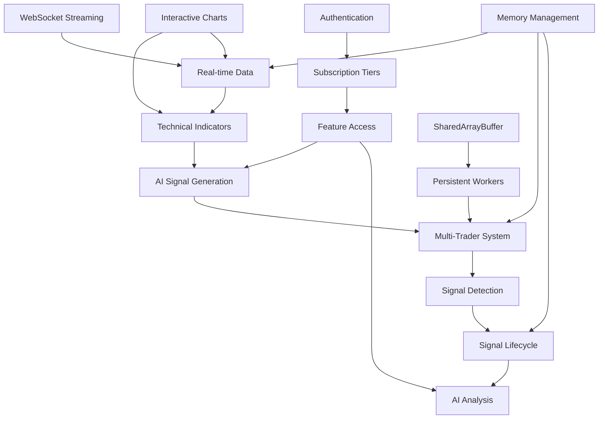

# Feature Registry

## Feature Status Legend
- 🟢 **Stable**: Do not modify without approval
- 🟡 **Beta**: In testing, changes allowed
- 🔴 **Development**: Active development
- ⚫ **Deprecated**: To be removed
- 🔒 **Frozen**: No modifications allowed

## Current Features

| Feature | Status | Owner | Spec | Implementation | Last Modified |
|---------|--------|-------|------|----------------|---------------|
| WebSocket Streaming | 🟢 | Core | Real-time market data | /apps/app/src/services/binanceService.ts | 2025-01-08 |
| AI Signal Generation | 🟢 | AI Team | Natural language filters | /apps/app/src/services/geminiService.ts | 2025-01-08 |
| SharedArrayBuffer Workers | 🟢 | Performance | Zero-copy optimization | /apps/app/hooks/useSharedTraderIntervals.ts | 2025-01-08 |
| Multi-Trader System | 🟢 | Core | Parallel signal detection | /apps/app/src/services/traderManager.ts | 2025-01-07 |
| Interactive Charts | 🟢 | UI | Financial charting | /apps/app/src/components/TradingViewChart.tsx | 2025-01-06 |
| Subscription Tiers | 🟢 | Business | Access control | /apps/app/src/contexts/SubscriptionContext.tsx | 2025-01-05 |
| AI Analysis Engine | 🟡 | AI Team | Elite tier analysis | /apps/app/src/services/browserAnalysisEngine.ts | 2025-01-07 |
| Signal Lifecycle | 🟢 | Core | Signal management | /apps/app/hooks/useSignalLifecycle.ts | 2025-01-07 |
| Technical Indicators | 🟢 | Analysis | 15+ indicators | /apps/app/lib/screenerHelpers.ts | 2025-01-06 |
| Authentication Flow | 🟢 | Auth | Magic link + OAuth | /apps/app/src/contexts/AuthContext.tsx | 2025-01-05 |
| Memory Management | 🟢 | Performance | Worker memory leak fixed | /apps/app/src/utils/DifferentialTracker.ts | 2025-01-08 |
| Workflow Automation | 🔴 | Trading | Auto-trading flows | /apps/app/src/services/workflowManager.ts | 2025-01-06 |
| Demo Trading | 🔴 | Trading | Paper trading | /apps/app/src/services/tradingManager.ts | 2025-01-06 |
| Historical Scanner | 🟡 | Analysis | Past data analysis | /apps/app/workers/historicalScannerWorker.ts | 2025-01-05 |
| Persistent Workers | 🟢 | Performance | Long-lived workers | /apps/app/workers/persistentTraderWorker.ts | 2025-01-08 |
| Unified Card System | 🔴 | UI | Signal/trader cards | /apps/app/src/components/cards/ | 2025-01-08 |

## Feature Dependencies


## Integration Points

### Service Layer
- `binanceService` ← → `WebSocket API`: Real-time market data
- `geminiService` ← → `Firebase AI Logic`: Filter generation
- `traderManager` → `Worker Threads`: Parallel execution
- `signalManager` → `browserAnalysisEngine`: AI analysis

### State Management
- `AuthContext` → `SubscriptionContext`: User tier determination
- `StrategyContext` → `TraderForm`: Strategy state
- `App.tsx` → All Components: Global state distribution

### Worker Communication
- `Main Thread` → `Workers`: Market data serialization
- `Workers` → `Main Thread`: Signal results
- `SharedArrayBuffer` ← → `Persistent Workers`: Zero-copy data

### Database
- `Supabase Auth` ← → `AuthContext`: User sessions
- `Supabase Database` ← → `Services`: Data persistence
- `Row-Level Security` → All Tables: Data isolation

## Protected Features
These features have additional protection and require approval to modify:

### Critical Infrastructure
- **WebSocket Connection Management**: Core data pipeline
- **Authentication Flow**: Security-critical
- **Subscription Tier Enforcement**: Revenue protection
- **AI API Integration**: Cost management

### Performance-Critical
- **SharedArrayBuffer Implementation**: Complex memory management
- **Worker Thread Pool**: Parallel processing core
- **Batch Update System**: UI responsiveness

### User-Facing Core
- **Signal Generation**: Primary user value
- **Real-time Screening**: Core functionality
- **Chart Rendering**: Visual experience

## Feature Configuration

### Environment Variables
```javascript
// Performance mode selection
localStorage.setItem('performanceMode', 'shared'); // 'individual' | 'batched' | 'shared'

// Debug features
window.debugSharedMemory() // SharedArrayBuffer diagnostics
window.debugSignals() // Signal system diagnostics

// Feature flags (planned)
VITE_FEATURE_BACKTESTING=false
VITE_FEATURE_SOCIAL=false
VITE_FEATURE_API=false
```

### Tier-Based Feature Matrix

| Feature | Anonymous | Free | Pro | Elite |
|---------|-----------|------|-----|-------|
| View Signals | ✅ | ✅ | ✅ | ✅ |
| View Charts | ✅ | ✅ | ✅ | ✅ |
| Signal History | ❌ | ✅ | ✅ | ✅ |
| Favorites | ❌ | ✅ | ✅ | ✅ |
| Create Signals | ❌ | ❌ | ✅ (10) | ✅ (∞) |
| AI Analysis | ❌ | ❌ | ❌ | ✅ |
| Auto-Monitoring | ❌ | ❌ | ❌ | ✅ |
| Auto-Trading | ❌ | ❌ | ❌ | ✅ |
| API Access | ❌ | ❌ | ❌ | ✅ |

## Upcoming Features

### Q1 2025 (Current)
- ✅ SharedArrayBuffer optimization
- 🔄 Improve AI prompt accuracy
- 📋 Add Bollinger Bands indicator
- 📋 Mobile responsive improvements

### Q2 2025 (Planned)
- 📋 Backtesting engine
- 📋 Performance analytics
- 📋 Social signal sharing
- 📋 REST API
- 📋 Bybit exchange support

### Future Considerations
- Machine learning optimization
- Copy trading
- Cross-exchange arbitrage
- Sentiment analysis
- Portfolio management

## Feature Metrics

### Performance Targets
- Signal Detection: <50ms
- Chart Update: <100ms
- Worker Execution: <100ms
- Memory Usage: <500MB
- WebSocket Latency: <100ms

### Quality Metrics
- Signal Accuracy: >70%
- AI Generation Success: >90%
- Worker Stability: >99.9%
- WebSocket Uptime: >99.9%

## Feature Rollout Process

1. **Development** (🔴): Active development branch
2. **Beta** (🟡): Feature flag enabled for testing
3. **Stable** (🟢): Rolled out to all users
4. **Frozen** (🔒): Critical features, changes need review
5. **Deprecated** (⚫): Scheduled for removal

## Feature Documentation

Each feature should have:
- Technical specification in `/specs/features/`
- User documentation in `/docs/`
- Test coverage in `/tests/`
- Performance benchmarks
- Rollback plan