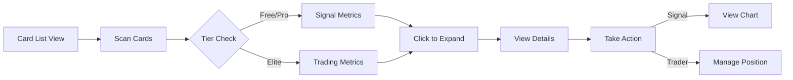

# UI/UX Design: Signal/Trader Card Standardization

## Design Overview
A unified card system that adapts content based on user tier while maintaining visual consistency. The design follows the "Neon Terminal" theme with electric accents, providing dense information display for traders while avoiding cognitive overload through progressive disclosure and smart visual hierarchy.

## User Flow


## Component Structure

### Desktop Layout (Primary)
```
┌────────────────────────────────────────────────────┐
│  Card List Container (virtual scroll)              │
├────────────────────────────────────────────────────┤
│  ┌──────────────────────────────────────────────┐ │
│  │ SignalCard (Collapsed - 88px)                │ │
│  └──────────────────────────────────────────────┘ │
│  ┌──────────────────────────────────────────────┐ │
│  │ SignalCard (Expanded - 280px)                │ │
│  │  ├─ Trigger History                          │ │
│  │  ├─ Symbol Distribution                      │ │
│  │  └─ Quick Actions                            │ │
│  └──────────────────────────────────────────────┘ │
│  ┌──────────────────────────────────────────────┐ │
│  │ TraderCard (Elite Only)                      │ │
│  │  ├─ P&L Metrics                              │ │
│  │  ├─ Position Status                          │ │
│  │  └─ AI Confidence                            │ │
│  └──────────────────────────────────────────────┘ │
└────────────────────────────────────────────────────┘
```

### Mobile Layout
```
┌──────────────┐
│    Header    │
├──────────────┤
│              │
│  Card Stack  │
│   (Full      │
│   Width)     │
│              │
├──────────────┤
│ Swipe Actions│
└──────────────┘
```

## Visual Specifications

### Typography
Following Neon Terminal Design System:
- **Card Title**: Inter 16px/600 - `#FAFAF9` (primary text)
- **Metrics**: JetBrains Mono 14px/500 - `#C4C4C0` (data)
- **Labels**: Inter 12px/400 - `#8A8A86` (muted)
- **Badge Text**: Inter 11px/500 - contrast color
- **Timestamp**: Inter 12px/400 - `#5A5A57` (subtle)

### Color Palette
Neon Terminal Theme:
- **Background**: `#1A1A1C` (card surface)
- **Hover Background**: `#1F1F22` (elevated)
- **Border**: `rgba(90, 90, 87, 0.3)` (subtle)
- **Primary Accent**: `#C6FF00` (electric lime - new triggers)
- **Success**: `#00FF88` (profits/positive)
- **Danger**: `#FF0040` (losses/negative)
- **Info**: `#00F0FF` (cyan - AI features)
- **Warning**: `#FFD700` (alerts)

### Spacing
Using CSS custom properties:
- **Card Padding**: `var(--nt-space-4)` (16px)
- **Section Gap**: `var(--nt-space-3)` (12px)  
- **Metric Gap**: `var(--nt-space-2)` (8px)
- **Icon Margin**: `var(--nt-space-1)` (4px)
- **List Gap**: `var(--nt-space-2)` (8px)

## Component Designs

### Unified Card Base (All Tiers)
**Purpose**: Consistent container for all card types
**Location**: Main content area, list view

**Visual Design - Collapsed State (88px)**:
```
┌─────────────────────────────────────────────────┐
│ [●] Signal Name                    [★] [⋮] [▼] │ 16px/600
├─────────────────────────────────────────────────┤
│ Triggered: 12 today | 47 total          15m    │ 14px mono
│ Last: BTCUSDT 2m ago                    +2.4%  │ 12px/400
└─────────────────────────────────────────────────┘
   ↑                                         ↑
Status dot                           Expand indicator
(pulsing if active)                  (rotates on click)
```

**Elite Tier Variant - Collapsed (88px)**:
```
┌─────────────────────────────────────────────────┐
│ [●] Trader Name                    [★] [⋮] [▼] │
├─────────────────────────────────────────────────┤
│ Win: 67% | P&L: +12.4% | Pos: 3         [AI]  │
│ ▲ BTCUSDT  +$247.50  (2.4%)            Live   │
└─────────────────────────────────────────────────┘
   ↑                      ↑                 ↑
Green dot            Real-time P&L     AI confidence
(active position)     (color coded)      badge
```

**States**:
- **Default**: Background `#1A1A1C`, border `rgba(90, 90, 87, 0.3)`
- **Hover**: Background `#1F1F22`, border `rgba(90, 90, 87, 0.5)`, scale(1.01)
- **Active/Selected**: Border `#C6FF00` (2px), subtle glow
- **Triggered**: Lime pulse animation (3s fade to white)
- **Loading**: Skeleton shimmer effect
- **Disabled**: Opacity 0.5, no hover effects

### Expanded Card Content

**Signal Card Expansion (Free/Pro) - Additional 192px**:
```
┌─────────────────────────────────────────────────┐
│ Recent Triggers                          View All│
├─────────────────────────────────────────────────┤
│ • BTCUSDT  ↗  2m ago   $67,234  +2.4%         │
│ • ETHUSDT  ↗  5m ago   $3,421   +1.8%         │
│ • SOLUSDT  ↗  8m ago   $142.50  +3.2%         │
│ • BNBUSDT  ↗  12m ago  $589.30  +1.1%         │
│ • ADAUSDT  ↗  18m ago  $0.6234  +2.7%         │
├─────────────────────────────────────────────────┤
│ Top Symbols:  BTC (8)  ETH (6)  SOL (4)        │
├─────────────────────────────────────────────────┤
│ [📊 Chart] [⚙️ Edit] [📋 Clone] [🗑️ Delete]    │
└─────────────────────────────────────────────────┘
```

**Trader Card Expansion (Elite) - Additional 240px**:
```
┌─────────────────────────────────────────────────┐
│ Performance                              30 days │
├─────────────────────────────────────────────────┤
│ ┌───────────────────────────────────────────┐  │
│ │     P&L Curve Chart (mini sparkline)      │  │
│ │     ▲ +12.4% ($2,475)                     │  │
│ └───────────────────────────────────────────┘  │
├─────────────────────────────────────────────────┤
│ Active Positions                                │
│ • BTCUSDT  Long  +$247  ▲2.4%  SL: $66,500    │
│ • ETHUSDT  Long  +$142  ▲1.8%  TP: $3,500     │
│ • SOLUSDT  Short -$28   ▼0.8%  SL: $145       │
├─────────────────────────────────────────────────┤
│ AI Analysis: 85% confidence on BTC setup       │
├─────────────────────────────────────────────────┤
│ [Analyze] [Execute Trade] [Adjust Risk]        │
└─────────────────────────────────────────────────┘
```

### Activity Indicators

**Signal Activity States**:
```css
/* Just Triggered - Lime pulse */
@keyframes triggerPulse {
  0% { border-color: #C6FF00; background: rgba(198, 255, 0, 0.1); }
  100% { border-color: rgba(90, 90, 87, 0.3); background: transparent; }
}

/* High Activity - Orange accent */
.high-activity {
  border-left: 3px solid #FF8C00;
}

/* Idle - Muted appearance */
.idle {
  opacity: 0.7;
}
```

**Trader Performance States**:
```css
/* Profitable - Green accent */
.profitable {
  border-left: 3px solid #00FF88;
}

/* Losing - Red accent */
.losing {
  border-left: 3px solid #FF0040;
  animation: attentionPulse 2s infinite;
}

/* AI High Confidence - Cyan badge */
.ai-badge {
  background: #00F0FF;
  color: #0A0A0B;
}
```

## Data Visualization

### Mini Charts
- **Type**: Sparkline for P&L curve
- **Library**: Recharts (lightweight)
- **Update**: Real-time for active positions
- **Colors**: Green (#00FF88) for profit, Red (#FF0040) for loss
- **Height**: 60px in expanded view

### Status Dots
- **Active**: Pulsing green (#00FF88)
- **Triggered**: Lime flash (#C6FF00)
- **Idle**: Static gray (#5A5A57)
- **Error**: Red (#FF0040)

### Progress Indicators
- **Win Rate**: Circular progress (67% = 241° arc)
- **P&L Bar**: Horizontal bar with gradient
- **Position Count**: Badge with number

## Responsive Behavior

### Breakpoints
- **Desktop**: > 1200px (3-column grid)
- **Tablet**: 768px - 1200px (2-column grid)
- **Mobile**: < 768px (single column, full width)

### Mobile Adaptations
```
┌────────────────────┐
│ [●] Signal Name    │ <- Smaller font (14px)
│ ──────────────────│
│ Trig: 12 | Tot: 47│ <- Abbreviated labels
│ 2m ago | BTCUSDT  │ <- Essential info only
│ ──────────────────│
│ [Swipe for actions]│ <- Gesture hint
└────────────────────┘
```

### Touch Interactions
- **Tap**: Expand/collapse
- **Swipe Left**: Reveal actions (edit, delete)
- **Swipe Right**: Favorite toggle
- **Long Press**: Multi-select mode

## Accessibility

### Keyboard Navigation
- **Tab**: Navigate between cards
- **Space/Enter**: Expand/collapse
- **Arrow Keys**: Navigate within expanded content
- **Esc**: Collapse expanded card
- **Shift+F**: Toggle favorite
- **Delete**: Remove (with confirmation)

### Screen Readers
```html
<div role="article" aria-label="Signal: Momentum Breakout">
  <div role="status" aria-live="polite">
    12 triggers today, last 2 minutes ago
  </div>
  <button aria-expanded="false" aria-label="Expand for details">
    <!-- Expand icon -->
  </button>
</div>
```

### Color Blind Support
- Icons accompany all color indicators
- Patterns for profit (▲) vs loss (▼)
- Text labels for all states
- Contrast ratio > 4.5:1 for all text

## Animation & Transitions

### Micro-interactions
```css
/* Expand/Collapse */
.card-expand {
  transition: height 200ms cubic-bezier(0.4, 0, 0.2, 1);
}

/* Hover Effects */
.card:hover {
  transform: scale(1.01);
  transition: all 150ms ease-out;
}

/* Trigger Flash */
@keyframes triggerFlash {
  0% { background: rgba(198, 255, 0, 0.2); }
  100% { background: transparent; }
}

/* Loading Skeleton */
@keyframes shimmer {
  0% { background-position: -200% 0; }
  100% { background-position: 200% 0; }
}
```

### Performance Animations
- **P&L Update**: Color transition (300ms)
- **Position Change**: Slide in from right (200ms)
- **Confidence Badge**: Fade in (150ms)
- **Error State**: Shake (300ms)

## Error States

### Connection Lost
```
┌─────────────────────────┐
│ ⚠️ Connection Lost      │
│ Reconnecting...         │
│ [Retry Now]             │
└─────────────────────────┘
```

### No Data
```
┌─────────────────────────┐
│        📊               │
│  No signals yet         │
│ [Create First Signal]   │
└─────────────────────────┘
```

### Failed Load
```
┌─────────────────────────┐
│ ❌ Failed to load       │
│ [Try Again]             │
└─────────────────────────┘
```

## Performance Considerations

### Optimization Strategies
- **Virtual Scrolling**: React-window for >50 cards
- **Memoization**: React.memo with areEqual comparison
- **Lazy Loading**: Expand content loaded on demand
- **Debouncing**: Search/filter inputs (300ms)
- **Batching**: WebSocket updates (500ms window)

### Loading States
```
┌─────────────────────────┐
│ ████████████░░░░░░░     │ <- Skeleton loader
│ ██████░░░░░░░░░░░░░     │ <- Animated shimmer
│ ████████████░░░░░░░     │
└─────────────────────────┘
```

## Implementation Notes

### Component Structure
```tsx
// Base component with tier adaptation
<CardBase 
  tier={userTier}
  type="signal|trader"
  data={cardData}
  expanded={isExpanded}
  onToggle={handleToggle}
>
  <CardHeader />
  <CardMetrics tier={userTier} />
  {isExpanded && <CardDetails tier={userTier} />}
  <CardActions tier={userTier} />
</CardBase>
```

### CSS Architecture
```css
/* Using CSS custom properties for theming */
.nt-card {
  --card-bg: var(--nt-color-bg-secondary);
  --card-border: var(--nt-color-border);
  --card-shadow: var(--nt-shadow-sm);
  
  background: var(--card-bg);
  border: 1px solid var(--card-border);
  border-radius: var(--nt-radius-xl);
  padding: var(--nt-space-4);
  transition: var(--nt-transition-base);
}

/* Tier-specific styles */
.nt-card[data-tier="elite"] {
  --card-accent: var(--nt-color-info);
}

.nt-card[data-tier="pro"] {
  --card-accent: var(--nt-color-primary);
}
```

### State Management
```tsx
// Card expansion state
const [expandedCards, setExpandedCards] = useState<Set<string>>(new Set());

// Optimistic updates for real-time data
const optimisticUpdate = (cardId: string, update: Partial<CardData>) => {
  // Update UI immediately
  // Queue actual update
};
```

## Design Tokens
```javascript
const cardTokens = {
  colors: {
    background: 'var(--nt-color-bg-secondary)',
    backgroundHover: 'var(--nt-color-bg-tertiary)',
    border: 'var(--nt-color-border)',
    borderActive: 'var(--nt-color-primary)',
    textPrimary: 'var(--nt-color-text-primary)',
    textSecondary: 'var(--nt-color-text-secondary)',
    profit: 'var(--nt-color-success)',
    loss: 'var(--nt-color-danger)',
  },
  spacing: {
    cardPadding: 'var(--nt-space-4)',
    sectionGap: 'var(--nt-space-3)',
    itemGap: 'var(--nt-space-2)',
  },
  animation: {
    expand: '200ms cubic-bezier(0.4, 0, 0.2, 1)',
    hover: '150ms ease-out',
    flash: '3000ms ease-out',
  },
  dimensions: {
    collapsedHeight: '88px',
    expandedHeightSignal: '280px',
    expandedHeightTrader: '328px',
    mobileCardWidth: '100%',
    desktopMinWidth: '380px',
  }
};
```

## Design Validation Checklist

- [x] Follows Neon Terminal design system
- [x] Consistent with existing UI patterns
- [x] Mobile responsive with touch gestures
- [x] Accessible (WCAG 2.1 AA compliant)
- [x] Performance optimized for 100+ cards
- [x] Error states clearly defined
- [x] Loading states with skeletons
- [x] Empty states with clear CTAs
- [x] Dark theme optimized (primary)
- [x] Cross-browser compatible

## Handoff to Engineering

### Assets Needed
- [x] Expand/collapse icons (ChevronDown/ChevronRight from Lucide)
- [x] Status dot animations (CSS only)
- [x] Skeleton loader patterns (CSS)

### Component Specifications
1. **CardBase**: Container with tier adaptation
2. **CardHeader**: Title, status, primary actions
3. **CardMetrics**: Tier-specific metric display
4. **CardDetails**: Expandable content area
5. **CardActions**: Context-appropriate buttons

### Performance Requirements
- Initial render: <50ms per card
- Expand animation: 200ms smooth
- Virtual scroll: 60fps with 100+ cards
- Memory: <2MB for 100 cards
- Real-time updates: <1s latency

### Questions for Engineering
- Can we use react-window for virtual scrolling?
- Is framer-motion acceptable for animations?
- Should expanded state persist in localStorage?
- Can WebSocket batching handle 500ms windows?

## References
- Style Guide: Neon Terminal Design System
- Existing Pattern: EnhancedSignalsTable expansion
- Inspiration: Bloomberg Terminal card widgets
- Animation Reference: TradingView strategy cards