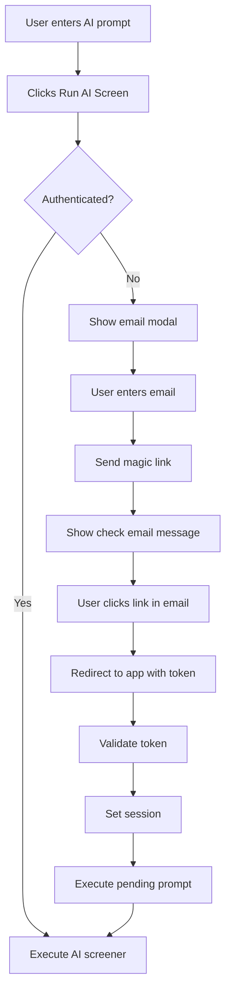
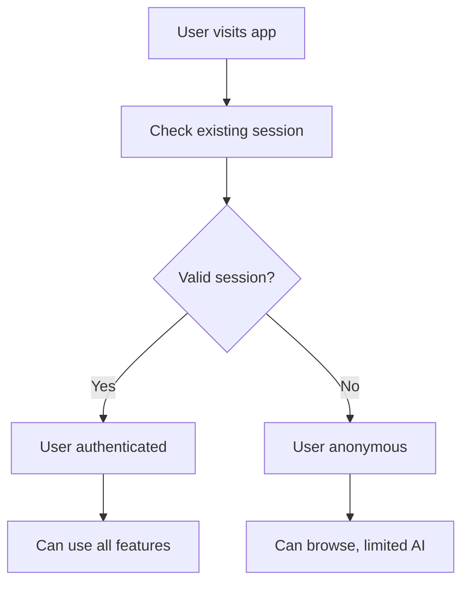
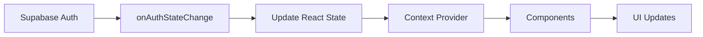
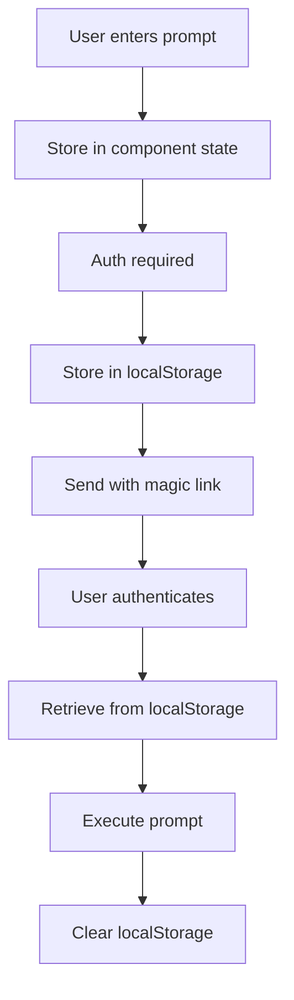

# Supabase Magic Link Authentication Architecture

## Overview

This document outlines the architecture and design for implementing Supabase magic link authentication in the AI-powered Binance crypto screener application. The implementation focuses on gating AI features behind authentication while maintaining a frictionless user experience.

## Table of Contents

1. [Architecture Overview](#architecture-overview)
2. [User Flow](#user-flow)
3. [Technical Architecture](#technical-architecture)
4. [Component Design](#component-design)
5. [Data Flow](#data-flow)
6. [Security Model](#security-model)
7. [Implementation Plan](#implementation-plan)
8. [Testing Strategy](#testing-strategy)

## Architecture Overview

### Goals
- Gate AI screener features behind authentication
- Maintain seamless user experience with magic link (passwordless) login
- Preserve user context (AI prompts) through authentication flow
- Enable future user-specific features (saved screeners, preferences)

### Non-Goals
- Social authentication (Google, GitHub) - future enhancement
- User profile management - future enhancement
- Payment/subscription handling - future enhancement

### Key Design Decisions
1. **Magic Link Only**: No password-based authentication for simplicity
2. **Non-Blocking Browse**: Users can view real-time data without authentication
3. **Progressive Enhancement**: Features unlock with authentication
4. **Stateless Auth Check**: Authentication verified at action time, not session-based UI

## User Flow

### Primary Flow: First-Time User



### Secondary Flow: Returning User



## Technical Architecture

### Component Hierarchy

```
App.tsx
├── AuthContext (new)
│   ├── Supabase client
│   ├── User state
│   └── Auth helpers
├── Sidebar
│   ├── AI Prompt Input
│   ├── Run AI Screen button
│   └── User status (new)
├── MainContent
│   ├── SignalTable
│   ├── CryptoTable
│   └── ChartDisplay
└── EmailAuthModal (new)
    ├── Email input
    ├── Loading states
    └── Success/Error messages
```

### File Structure

```
/src
├── config/
│   ├── firebase.ts (existing)
│   └── supabase.ts (new)
├── contexts/
│   └── AuthContext.tsx (new)
├── components/
│   ├── auth/
│   │   └── EmailAuthModal.tsx (new)
│   └── ... (existing components)
├── hooks/
│   └── useAuth.ts (new)
└── types/
    └── auth.types.ts (new)
```

### Dependencies

```json
{
  "dependencies": {
    "@supabase/supabase-js": "^2.39.0"
  }
}
```

## Component Design

### 1. Supabase Configuration

```typescript
// src/config/supabase.ts
import { createClient } from '@supabase/supabase-js';

const supabaseUrl = import.meta.env.VITE_SUPABASE_URL;
const supabaseAnonKey = import.meta.env.VITE_SUPABASE_ANON_KEY;

export const supabase = createClient(supabaseUrl, supabaseAnonKey, {
  auth: {
    autoRefreshToken: true,
    persistSession: true,
    detectSessionInUrl: true
  }
});
```

### 2. Auth Context

```typescript
// src/contexts/AuthContext.tsx
interface AuthContextType {
  user: User | null;
  loading: boolean;
  signInWithEmail: (email: string) => Promise<void>;
  signOut: () => Promise<void>;
  checkSession: () => Promise<User | null>;
}
```

### 3. Email Auth Modal

```typescript
// src/components/auth/EmailAuthModal.tsx
interface EmailAuthModalProps {
  isOpen: boolean;
  onClose: () => void;
  onAuthSuccess: () => void;
  pendingPrompt: string;
}
```

Key features:
- Email validation
- Loading states
- Error handling
- Success confirmation
- Resend capability

### 4. Integration Points

#### App.tsx Modifications

```typescript
// Add auth state
const [user, setUser] = useState<User | null>(null);
const [showAuthModal, setShowAuthModal] = useState(false);
const [pendingPrompt, setPendingPrompt] = useState('');

// Modify handleRunAiScreener
const handleRunAiScreener = useCallback(async () => {
  if (!user) {
    setPendingPrompt(aiPrompt);
    setShowAuthModal(true);
    return;
  }
  // ... existing logic
}, [user, aiPrompt, ...deps]);
```

#### Sidebar Modifications

```typescript
// Show user status
{user && (
  <div className="text-sm text-gray-400">
    Signed in as {user.email}
    <button onClick={signOut}>Sign out</button>
  </div>
)}
```

## Data Flow

### Authentication State Flow



### Prompt Preservation Flow



## Security Model

### Authentication Security

1. **Magic Link Security**
   - One-time use tokens
   - 24-hour expiration
   - Secure random generation
   - HTTPS-only transmission

2. **Session Management**
   - JWT-based sessions
   - Secure httpOnly cookies
   - Automatic refresh
   - 30-day max lifetime

3. **API Security**
   - Row Level Security (RLS) on all tables
   - Authenticated requests only for user data
   - Rate limiting per user

### Data Security

```sql
-- RLS Policies Example
CREATE POLICY "Users can only see own data" ON user_screeners
  FOR ALL USING (auth.uid() = user_id);
```

### Environment Variables

```env
# .env.local (safe to commit example)
VITE_SUPABASE_URL=https://xxx.supabase.co
VITE_SUPABASE_ANON_KEY=xxx  # Safe for client-side

# Never commit:
SUPABASE_SERVICE_KEY=xxx     # Server-side only
```

## Implementation Plan

### Phase 1: Core Authentication (Day 1)
- [ ] Set up Supabase project
- [ ] Configure email provider
- [ ] Install dependencies
- [ ] Create auth configuration
- [ ] Implement AuthContext

### Phase 2: UI Integration (Day 2)
- [ ] Create EmailAuthModal component
- [ ] Integrate auth check in AI screener
- [ ] Add user status display
- [ ] Implement sign out

### Phase 3: Polish & Edge Cases (Day 3)
- [ ] Add loading states
- [ ] Implement error handling
- [ ] Add email resend functionality
- [ ] Test authentication flow
- [ ] Handle edge cases

### Phase 4: Testing & Deployment (Day 4)
- [ ] Unit tests for auth components
- [ ] Integration tests for auth flow
- [ ] Update environment configurations
- [ ] Deploy and monitor

## Testing Strategy

### Unit Tests

```typescript
// EmailAuthModal.test.tsx
describe('EmailAuthModal', () => {
  it('validates email format');
  it('shows loading state during submission');
  it('displays success message after sending');
  it('handles API errors gracefully');
  it('preserves pending prompt');
});
```

### Integration Tests

```typescript
// AuthFlow.test.tsx
describe('Authentication Flow', () => {
  it('blocks AI features for unauthenticated users');
  it('preserves prompt through auth flow');
  it('handles magic link callback');
  it('maintains session across refreshes');
});
```

### E2E Tests

```typescript
// e2e/auth.spec.ts
test('Complete auth flow', async ({ page }) => {
  // 1. Navigate to app
  // 2. Enter AI prompt
  // 3. Attempt to submit
  // 4. Enter email
  // 5. Check email sent
  // 6. Simulate magic link click
  // 7. Verify prompt executes
});
```

### Performance Testing

- Measure auth modal load time
- Test concurrent authentication requests
- Verify WebSocket persistence through auth
- Monitor session refresh impact

## Monitoring & Analytics

### Key Metrics

1. **Conversion Funnel**
   ```
   Prompt Entered → Auth Modal Shown → Email Submitted → Link Clicked → Auth Success
   ```

2. **Performance Metrics**
   - Time to auth modal display: < 100ms
   - Magic link email delivery: < 30s
   - Session validation: < 50ms

3. **Error Tracking**
   - Failed email deliveries
   - Invalid magic links
   - Session refresh failures

### Implementation

```typescript
// Analytics helper
const trackAuthEvent = (event: string, properties?: any) => {
  // Send to analytics service
  console.log('Auth Event:', event, properties);
};
```

## Future Enhancements

### Phase 2 Features
- Social authentication (Google, GitHub)
- User profiles and preferences
- Saved screeners with database
- Team collaboration

### Phase 3 Features
- API key management
- Usage analytics dashboard
- Subscription management
- Advanced security (2FA)

## Rollback Plan

If authentication causes issues:

1. **Feature Flag**: Add `VITE_AUTH_ENABLED` flag
2. **Quick Disable**: Set flag to false
3. **Gradual Rollout**: Enable for % of users
4. **Data Preservation**: Keep auth data for re-enable

## Conclusion

This architecture provides a secure, user-friendly authentication system that:
- Minimizes friction with magic links
- Preserves user context through auth flow
- Scales for future features
- Maintains app performance
- Follows security best practices

The implementation is designed to be completed in 4 days with minimal disruption to existing functionality.