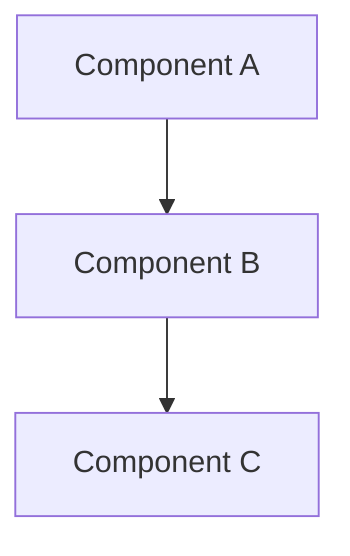

# Engineering Review: [Feature/Enhancement Name]

**Date:** [YYYY-MM-DD]
**Reviewer:** [Your Name]
**PRD/Spec:** [Link to specification]
**Review Status:** In Progress | Complete | Blocked

## Executive Summary

### Feasibility
- [ ] **Feasible as specified**
- [ ] **Feasible with modifications**
- [ ] **Not feasible**

### Recommendation
[1-2 sentences on whether to proceed and any major concerns]

## Technical Analysis

### Architecture Impact

#### Components Affected
- **Frontend:** [Components/Pages affected]
- **Backend:** [Services/APIs affected]
- **Database:** [Tables/Schema changes]
- **Infrastructure:** [Deployment/Scaling impacts]

#### System Design

### Implementation Approach

#### High-Level Plan
1. [Phase 1]: [Description]
2. [Phase 2]: [Description]
3. [Phase 3]: [Description]

#### Technical Details
[Detailed technical approach]

### Code Impact Analysis

| Area | Files | Complexity | Risk |
|------|-------|------------|------|
| [Area 1] | ~[X] files | High/Medium/Low | High/Medium/Low |
| [Area 2] | ~[X] files | High/Medium/Low | High/Medium/Low |

## Resource Requirements

### Team Allocation
- **Frontend:** [X engineers for Y days]
- **Backend:** [X engineers for Y days]
- **DevOps:** [X engineers for Y days]
- **QA:** [X engineers for Y days]

### Timeline Estimate

| Phase | Duration | Dependencies |
|-------|----------|--------------|
| Design/Planning | [X days] | [Dependencies] |
| Implementation | [X days] | [Dependencies] |
| Testing | [X days] | [Dependencies] |
| Deployment | [X days] | [Dependencies] |
| **Total** | **[X days]** | |

### Infrastructure Needs
- **Compute:** [Requirements]
- **Storage:** [Requirements]
- **Network:** [Requirements]
- **Third-party Services:** [Requirements]

## Technical Risks

### Identified Risks

| Risk | Probability | Impact | Mitigation |
|------|------------|--------|------------|
| [Risk 1] | High/Medium/Low | High/Medium/Low | [Mitigation plan] |
| [Risk 2] | High/Medium/Low | High/Medium/Low | [Mitigation plan] |
| [Risk 3] | High/Medium/Low | High/Medium/Low | [Mitigation plan] |

### Technical Debt
- **Created:** [New debt introduced]
- **Addressed:** [Existing debt resolved]
- **Deferred:** [Debt to address later]

## Dependencies

### Internal Dependencies
- [ ] [System/Component 1]
- [ ] [System/Component 2]

### External Dependencies
- [ ] [Library/Service 1] - Version [X]
- [ ] [Library/Service 2] - Version [X]

### Blocking Dependencies
[Dependencies that must be resolved before starting]

## Performance Considerations

### Expected Impact
| Metric | Current | Expected | Acceptable |
|--------|---------|----------|------------|
| Response Time | [X ms] | [Y ms] | [Z ms] |
| Memory Usage | [X MB] | [Y MB] | [Z MB] |
| CPU Usage | [X%] | [Y%] | [Z%] |

### Optimization Opportunities
- [Optimization 1]
- [Optimization 2]

## Security Review

### Security Considerations
- **Authentication:** [Impact/Requirements]
- **Authorization:** [Impact/Requirements]
- **Data Privacy:** [Impact/Requirements]
- **Encryption:** [Impact/Requirements]

### Compliance
- [ ] GDPR compliant
- [ ] SOC2 requirements met
- [ ] Other: [Specify]

## Testing Strategy

### Test Coverage
- **Unit Tests:** [Approach and coverage target]
- **Integration Tests:** [Approach and coverage target]
- **E2E Tests:** [Approach and coverage target]
- **Performance Tests:** [Approach and metrics]

### Test Environments
- [ ] Local development
- [ ] CI/CD pipeline
- [ ] Staging environment
- [ ] Production monitoring

## Alternatives Considered

### Alternative 1: [Name]
**Pros:** [List pros]
**Cons:** [List cons]
**Why not chosen:** [Reasoning]

### Alternative 2: [Name]
**Pros:** [List pros]
**Cons:** [List cons]
**Why not chosen:** [Reasoning]

## Migration/Rollback Plan

### Migration Steps
1. [Step 1]
2. [Step 2]
3. [Step 3]

### Rollback Strategy
[How to rollback if issues arise]

### Data Migration
- [ ] Required
- [ ] Not Required

If required:
- **Data Volume:** [Amount]
- **Migration Time:** [Estimate]
- **Downtime:** [Required/Not required]

## Monitoring and Observability

### Metrics to Track
- [Metric 1]: [How to measure]
- [Metric 2]: [How to measure]

### Alerts to Configure
- [Alert 1]: [Threshold and action]
- [Alert 2]: [Threshold and action]

### Logging Requirements
- [What to log]
- [Log retention policy]

## Recommendations

### Must Have Before Starting
1. [Requirement 1]
2. [Requirement 2]

### Should Consider
1. [Consideration 1]
2. [Consideration 2]

### Future Improvements
1. [Improvement 1]
2. [Improvement 2]

## Questions for Product

1. [Question 1]
2. [Question 2]

## Approval

### Engineering Sign-off

| Role | Name | Date | Approved |
|------|------|------|----------|
| Tech Lead | | | ☐ |
| Backend Lead | | | ☐ |
| Frontend Lead | | | ☐ |
| DevOps Lead | | | ☐ |
| Security Lead | | | ☐ |

## Appendix

### Reference Materials
- [Technical documentation]
- [Architecture diagrams]
- [Previous similar implementations]

### Glossary
- **Term 1:** [Definition]
- **Term 2:** [Definition]