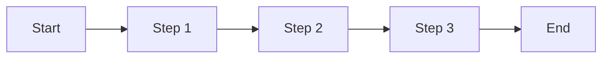

# Feature PRD: [Feature Name]

**Date:** [YYYY-MM-DD]
**Author:** [Your Name]
**Status:** Draft | Review | Approved | Implemented
**Target Release:** [Version/Date]

## Executive Summary

[2-3 sentence overview of the feature and its value proposition]

## Problem Statement

### Current State
[Describe the current situation and pain points]

### User Problems
- [Problem 1]
- [Problem 2]
- [Problem 3]

### Business Impact
[How this problem affects the business]

## Solution Overview

### Proposed Solution
[High-level description of the proposed feature]

### Key Benefits
- **For Users:** [User benefit]
- **For Business:** [Business benefit]
- **Technical:** [Technical benefit]

## User Stories

### Primary User Story
**As a** [user type]
**I want to** [action]
**So that** [benefit]

### Additional Stories
1. **As a** [user type], **I want to** [action], **So that** [benefit]
2. **As a** [user type], **I want to** [action], **So that** [benefit]

## Requirements

### Functional Requirements

#### Must Have (P0)
- [ ] [Requirement 1]
- [ ] [Requirement 2]
- [ ] [Requirement 3]

#### Should Have (P1)
- [ ] [Requirement 1]
- [ ] [Requirement 2]

#### Nice to Have (P2)
- [ ] [Requirement 1]
- [ ] [Requirement 2]

### Non-Functional Requirements

#### Performance
- [Metric 1]: [Target value]
- [Metric 2]: [Target value]

#### Security
- [Security requirement 1]
- [Security requirement 2]

#### Accessibility
- [Accessibility requirement 1]
- [Accessibility requirement 2]

## User Experience

### User Flow

### Wireframes/Mockups
[Link to designs or embed images]

### UI Components
- [Component 1]: [Description]
- [Component 2]: [Description]

## Technical Considerations

### Architecture
[High-level technical approach]

### Dependencies
- **Internal:** [Dependency 1]
- **External:** [Dependency 2]

### API Changes
[Any API additions or modifications]

### Database Changes
[Any schema changes required]

## Success Criteria

### Launch Criteria
- [ ] [Criterion 1]
- [ ] [Criterion 2]
- [ ] [Criterion 3]

### Success Metrics
| Metric | Current | Target | Measurement |
|--------|---------|--------|-------------|
| [Metric 1] | [Current value] | [Target value] | [How to measure] |
| [Metric 2] | [Current value] | [Target value] | [How to measure] |

### User Acceptance
- [Acceptance criterion 1]
- [Acceptance criterion 2]

## Scope and Constraints

### In Scope
- [What's included 1]
- [What's included 2]

### Out of Scope
- [What's not included 1]
- [What's not included 2]

### Constraints
- **Timeline:** [Constraint]
- **Resources:** [Constraint]
- **Technical:** [Constraint]

## Risks and Mitigations

| Risk | Probability | Impact | Mitigation |
|------|------------|--------|------------|
| [Risk 1] | High/Medium/Low | High/Medium/Low | [Mitigation strategy] |
| [Risk 2] | High/Medium/Low | High/Medium/Low | [Mitigation strategy] |

## Timeline

### Milestones
| Milestone | Date | Description |
|-----------|------|-------------|
| Spec Approval | [Date] | PRD approved by stakeholders |
| Design Complete | [Date] | UI/UX designs finalized |
| Development Start | [Date] | Engineering begins |
| Alpha Release | [Date] | Internal testing |
| Beta Release | [Date] | Limited user testing |
| GA Release | [Date] | General availability |

### Resource Allocation
- **Product:** [X days]
- **Design:** [X days]
- **Engineering:** [X days]
- **QA:** [X days]

## Open Questions

1. [Question 1]
   - **Context:** [Why this is important]
   - **Options:** [Possible answers]
   - **Decision by:** [Date]

2. [Question 2]
   - **Context:** [Why this is important]
   - **Options:** [Possible answers]
   - **Decision by:** [Date]

## References

- [Related PRD 1]
- [Technical Documentation]
- [User Research]
- [Competitive Analysis]

## Approval

| Role | Name | Date | Signature |
|------|------|------|-----------|
| Product Manager | | | |
| Engineering Lead | | | |
| Design Lead | | | |
| QA Lead | | | |

## Revision History

| Version | Date | Author | Changes |
|---------|------|--------|---------|
| 1.0 | [Date] | [Author] | Initial draft |
| 1.1 | [Date] | [Author] | [Changes made] |