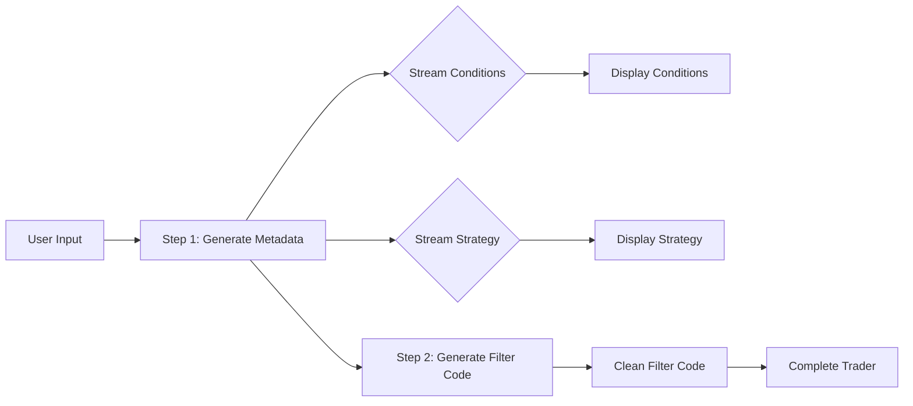

# Two-Step Trader Generation Architecture

## Overview

This document outlines the architectural refactoring of the trader generation workflow from a single-step process to a two-step process with streaming capabilities for improved user experience and code consistency.

## Current State Analysis

### Existing Flow
1. **Single Step Generation**
   - `generateTrader()` creates everything in one API call
   - Returns complete trader including filter code
   - Uses persona enhancement throughout
   - Filter code generation is coupled with trader metadata

### Issues with Current Approach
- Filter code includes unnecessary persona narrative
- No streaming feedback during generation
- Inconsistent code style between new and edited traders
- Long wait times with no visual feedback

## Proposed Architecture

### Two-Step Generation Flow



### Step 1: Metadata Generation
- **Function**: `generateTraderMetadata()`
- **Returns**: 
  ```typescript
  interface TraderMetadata {
    suggestedName: string;
    description: string;
    filterConditions: string[]; // Human-readable conditions
    strategyInstructions: string;
    indicators: CustomIndicatorConfig[];
    riskParameters: RiskManagement;
  }
  ```
- **Uses**: Persona enhancement for creativity
- **Streaming**: Yes, for conditions and strategy

### Step 2: Filter Code Generation
- **Function**: `generateFilterCode()` (renamed from `regenerateFilterCode`)
- **Input**: Conditions array from Step 1
- **Returns**:
  ```typescript
  interface FilterCodeResult {
    filterCode: string;
    requiredTimeframes: string[];
  }
  ```
- **Uses**: Clean code prompt (no persona)
- **Streaming**: No (code generation should be atomic)

## Component Relationships

### Service Layer Changes

```typescript
// geminiService.ts
export async function generateTraderMetadata(
  userPrompt: string,
  modelName: string = 'gemini-2.5-pro',
  onStream?: (update: StreamingUpdate) => void
): Promise<TraderMetadata>

export async function generateFilterCode(
  conditions: string[],
  modelName: string = 'gemini-2.5-pro',
  klineInterval: string = '1h'
): Promise<FilterCodeResult>
```

### UI Component Flow

```typescript
// TraderForm.tsx
const handleGenerate = async () => {
  // Step 1: Generate metadata with streaming
  const metadata = await generateTraderMetadata(prompt, model, (update) => {
    // Handle streaming updates
    if (update.type === 'condition') {
      setConditions(prev => [...prev, update.condition]);
    } else if (update.type === 'strategy') {
      setStrategy(prev => prev + update.text);
    }
  });

  // Step 2: Generate filter code
  try {
    const { filterCode, requiredTimeframes } = await generateFilterCode(
      metadata.filterConditions,
      model,
      interval
    );
    
    // Combine results
    const completeTrader = {
      ...metadata,
      filter: {
        code: filterCode,
        description: metadata.filterConditions,
        requiredTimeframes
      }
    };
  } catch (error) {
    showError('Failed to generate filter code');
  }
};
```

## Streaming Implementation Strategy

### Firebase AI Logic Streaming Support

```typescript
// Check if Firebase AI supports streaming
const model = getGenerativeModel(ai, { 
  model: modelName,
  generationConfig: {
    responseMimeType: "text/plain", // For streaming
  }
});

// Use generateContentStream if available
const result = await model.generateContentStream({
  systemInstruction: enhancedPrompt,
  contents: [{ role: 'user', parts: [{ text: prompt }] }]
});

// Process stream
for await (const chunk of result.stream) {
  const text = chunk.text();
  // Parse and emit updates
}
```

### Streaming Update Types

```typescript
export interface StreamingUpdate {
  type: 'progress' | 'condition' | 'strategy' | 'complete' | 'error';
  condition?: string;     // For individual conditions
  text?: string;         // For strategy text
  progress?: number;     // Progress percentage
  error?: Error;
}
```

### Fallback for Non-Streaming

If Firebase AI doesn't support streaming:
1. Use progress indicators between steps
2. Show "Generating conditions..." → "Generating strategy..." → "Creating filter code..."
3. Consider chunked responses with multiple API calls

## Performance Considerations

### Parallel Processing
- Step 1 and Step 2 can't be parallelized (Step 2 depends on Step 1)
- But within Step 1, we could potentially stream different parts concurrently

### Caching Strategy
- Cache generated filter code for identical conditions
- Use condition hash as cache key
- Implement TTL for cache entries

### Response Time Optimization
1. **Smaller Prompts**: Split reduces prompt size for each step
2. **Focused Models**: Could use lighter models for Step 2
3. **Early Display**: Show results as they stream in

## Migration Strategy

### Phase 1: Backend Changes
1. Rename `regenerateFilterCode` to `generateFilterCode`
2. Create new `generateTraderMetadata` function
3. Update prompts to support split generation
4. Implement streaming if supported

### Phase 2: Frontend Integration
1. Update TraderForm to use two-step flow
2. Add streaming UI components
3. Implement progress indicators
4. Add error handling for partial failures

### Phase 3: Optimization
1. Add caching layer
2. Implement condition deduplication
3. Add analytics for generation times

## Risk Assessment

### Technical Risks
1. **Streaming Support**: Firebase AI might not support streaming
   - Mitigation: Implement polling or chunked responses
2. **Latency**: Two API calls instead of one
   - Mitigation: Optimize prompts, use caching
3. **Partial Failures**: Step 1 succeeds but Step 2 fails
   - Mitigation: Show partial results, allow retry

### UX Risks
1. **Complexity**: Two-step process might confuse users
   - Mitigation: Clear progress indicators
2. **Perceived Speed**: Might feel slower despite streaming
   - Mitigation: Immediate feedback with streaming

## Implementation Priority

1. **High Priority**
   - Rename and refactor filter code generation
   - Implement two-step generation flow
   - Basic error handling

2. **Medium Priority**
   - Streaming implementation
   - Progress indicators
   - Caching layer

3. **Low Priority**
   - Advanced streaming UI
   - Analytics
   - Performance optimizations

## Alternative Approaches Considered

### WebSocket Streaming
- Pros: Real-time updates, bidirectional
- Cons: Complex infrastructure, overkill for this use case

### Server-Sent Events (SSE)
- Pros: Simple, unidirectional streaming
- Cons: Requires backend changes, not supported by Firebase Functions

### Chunked JSON Responses
- Pros: Works with existing infrastructure
- Cons: Not true streaming, higher latency

## Conclusion

The two-step generation approach with streaming provides:
1. **Consistency**: Same clean code for new and edited traders
2. **Transparency**: Users see progress in real-time
3. **Modularity**: Separated concerns for better maintenance
4. **Performance**: Faster perceived performance with streaming

The architecture supports future enhancements like:
- Different models for different steps
- Parallel generation of multiple traders
- A/B testing different generation strategies