# System Architecture Diagram

## Complete Data Layer Architecture with Hosting Locations

```mermaid
graph TB
    subgraph "External Services"
        BINANCE[("🔴 Binance API<br/>External")]
    end

    subgraph "Data Collection Layer - VPS/Cloud"
        DC["📊 Data Collector Service<br/>Node.js App<br/>━━━━━━━━━━<br/>📍 VPS/Cloud VM<br/>(Hetzner/DigitalOcean)"]
    end

    subgraph "Data Storage - Upstash Cloud"
        REDIS[("🗄️ Upstash Redis<br/>Managed Redis<br/>━━━━━━━━━━<br/>📍 Upstash Cloud<br/>(Global Edge)")]
    end

    subgraph "Server Execution Layer - Supabase Cloud"
        subgraph "Edge Functions - Deno Deploy"
            EF1["⚡ execute-trader<br/>Trader Logic Execution"]
            EF2["⚡ get-klines<br/>Fetch Market Data"]
            EF3["⚡ trigger-executions<br/>Cron Scheduler"]
        end

        subgraph "Realtime - Supabase Infrastructure"
            RT["📡 Supabase Realtime<br/>WebSocket Server<br/>━━━━━━━━━━<br/>📍 Supabase Cloud"]
        end

        subgraph "Database - Supabase PostgreSQL"
            DB[("💾 PostgreSQL<br/>Traders, Signals, Users<br/>━━━━━━━━━━<br/>📍 Supabase Cloud")]
        end
    end

    subgraph "Client Layer - User Browser"
        subgraph "React Application"
            APP["🖥️ React App<br/>━━━━━━━━━━<br/>📍 Vercel CDN<br/>(Static Hosting)"]

            subgraph "Services"
                KDS["📈 KlineDataService<br/>LRU Cache + Dedup"]
                SES["🔄 ServerExecutionService<br/>Signal Subscriptions"]
            end

            subgraph "Components"
                CHART["📊 ChartDisplay"]
                SIGNALS["📋 SignalTable"]
                CONN["🟢 ConnectionStatus"]
            end
        end
    end

    %% Data Flow
    BINANCE -->|"WebSocket<br/>Klines & Tickers"| DC
    DC -->|"Write klines<br/>ZADD sorted sets"| REDIS

    %% Server Execution Flow
    EF3 -->|"Cron trigger<br/>Every interval"| EF1
    EF1 -->|"Read klines"| REDIS
    EF1 -->|"Store signals"| DB
    EF1 -->|"Broadcast"| RT

    %% Client Data Flow
    APP -->|"Fetch klines<br/>HTTP POST"| EF2
    EF2 -->|"Read data"| REDIS

    %% Real-time Flow
    RT -->|"WebSocket<br/>Signal updates"| SES
    SES --> SIGNALS

    %% Chart Data Flow
    KDS -->|"Request data"| EF2
    KDS -->|"Cached data"| CHART

    %% Connection Monitoring
    SES -->|"Status"| CONN

    style BINANCE fill:#ff6b6b,color:#fff
    style DC fill:#4ecdc4,color:#fff
    style REDIS fill:#dc2626,color:#fff
    style EF1 fill:#8b5cf6,color:#fff
    style EF2 fill:#8b5cf6,color:#fff
    style EF3 fill:#8b5cf6,color:#fff
    style RT fill:#10b981,color:#fff
    style DB fill:#3b82f6,color:#fff
    style APP fill:#f59e0b,color:#fff
    style KDS fill:#64748b,color:#fff
    style SES fill:#64748b,color:#fff
```



## Detailed Hosting Breakdown

### 1. **Data Collection Layer**
**📍 Location: VPS or Cloud VM**
- **Service:** Data Collector (Node.js)
- **Hosting Options:**
  - Hetzner Cloud (€5-20/month)
  - DigitalOcean Droplet ($6-24/month)
  - AWS EC2 t3.small
- **Why:** Needs persistent connection to Binance WebSocket
- **Resources:** 2GB RAM, 1 vCPU minimum

### 2. **Data Storage Layer**
**📍 Location: Upstash Cloud (Managed Redis)**
- **Service:** Redis Database
- **Hosting:** Upstash Global Edge Network
- **Regions:** Auto-replicated globally
- **Cost:** Pay-per-request (~$0.20 per 100k commands)
- **Why:** Serverless Redis, no infrastructure management

### 3. **Server Execution Layer**
**📍 Location: Supabase Cloud**

#### Edge Functions (Deno Deploy)
- **Runtime:** Deno isolates
- **Hosting:** Supabase Edge Network (29 regions)
- **Functions:**
  - `execute-trader` - Runs trader logic
  - `get-klines` - Fetches market data
  - `trigger-executions` - Scheduled triggers
- **Cost:** Included in Supabase plan

#### PostgreSQL Database
- **Hosting:** Supabase managed PostgreSQL
- **Location:** User-selected region (e.g., us-east-1)
- **Storage:** Traders, signals, user data
- **Backup:** Daily automatic backups

#### Realtime Service
- **Hosting:** Supabase infrastructure
- **Protocol:** WebSocket
- **Purpose:** Signal broadcasting
- **Scalability:** Auto-scaling

### 4. **Client Application Layer**
**📍 Location: Vercel CDN**
- **Service:** Static React App
- **Hosting:** Vercel Edge Network (Global CDN)
- **Deployment:** Automatic from GitHub
- **Cost:** Free tier (100GB bandwidth)
- **Why:** Fast global delivery, automatic scaling

### 5. **Client Browser Runtime**
**📍 Location: User's Device**
- **Components Running Locally:**
  - KlineDataService (with LRU cache)
  - ServerExecutionService
  - React components and UI
  - Chart rendering (Chart.js)
  - Indicator calculations (indicatorWorker)

## Data Flow Paths

### Path 1: Market Data Collection
```
Binance WebSocket (External)
    ↓ (1 msg/sec per symbol)
Data Collector (VPS)
    ↓ (Batch writes)
Upstash Redis (Cloud)
```

### Path 2: Client Data Fetch
```
React App (Browser)
    ↓ (HTTP Request)
Vercel CDN
    ↓ (Proxy to Supabase)
get-klines Edge Function (Supabase)
    ↓ (Redis read)
Upstash Redis
    ↓ (Response)
Back to Browser (with caching)
```

### Path 3: Signal Execution
```
trigger-executions (Cron)
    ↓ (Every interval)
execute-trader (Edge Function)
    ↓ (Read klines)
Upstash Redis
    ↓ (Process)
PostgreSQL (Store signal)
    ↓ (Broadcast)
Supabase Realtime
    ↓ (WebSocket)
React App (Browser)
```

## Network Latency Considerations

### Optimal Regional Deployment
For best performance, deploy in same region:
- **Primary Region:** US East (Virginia)
  - Supabase: us-east-1
  - Upstash: us-east-1
  - VPS: US East location

### Latency Expectations
- **Redis Access:** <10ms (same region)
- **Edge Function Execution:** <50ms
- **Client to CDN:** <30ms (global edge)
- **Total Data Fetch:** <200ms target

## Cost Breakdown (Monthly Estimate)

| Service | Hosting | Estimated Cost |
|---------|---------|----------------|
| Data Collector | VPS (Hetzner/DO) | $10-20 |
| Redis Storage | Upstash | $20-50 |
| Edge Functions | Supabase | $25 (Pro plan) |
| PostgreSQL | Supabase | Included |
| Realtime | Supabase | Included |
| React App | Vercel | Free-$20 |
| **Total** | **Mixed Cloud** | **$55-115/month** |

## Scaling Considerations

### Current Architecture Supports:
- 1,000 concurrent users
- 100 symbols tracked
- 10 updates/second per symbol
- 100MB client memory limit

### Future Scaling Options:
1. **Redis:** Upstash auto-scales
2. **Edge Functions:** Auto-scale to millions of requests
3. **CDN:** Vercel handles any traffic
4. **Bottleneck:** Data Collector (needs horizontal scaling at >500 symbols)

## Security Boundaries

```
🔒 Public Access:
- Static React App (CDN)
- Public market data endpoints

🔐 Authenticated Access:
- User-specific traders
- Signal history
- Custom configurations

🚫 Internal Only:
- Redis direct access
- PostgreSQL direct access
- Data Collector admin
```

## Disaster Recovery

### Failure Scenarios:
1. **Redis Down:** Serve stale cache from browser
2. **Edge Functions Down:** Fallback to client-side indicators
3. **Data Collector Down:** Last 60s of data remains valid
4. **CDN Down:** Multiple edge locations provide redundancy

### Backup Strategy:
- **PostgreSQL:** Daily automatic backups (Supabase)
- **Redis:** Ephemeral data, rebuilds from Binance
- **Code:** Git repository (GitHub)
- **Secrets:** Encrypted in Supabase vault

---

*This architecture provides a cost-effective, scalable solution using managed services to minimize operational overhead while maintaining high performance and reliability.*