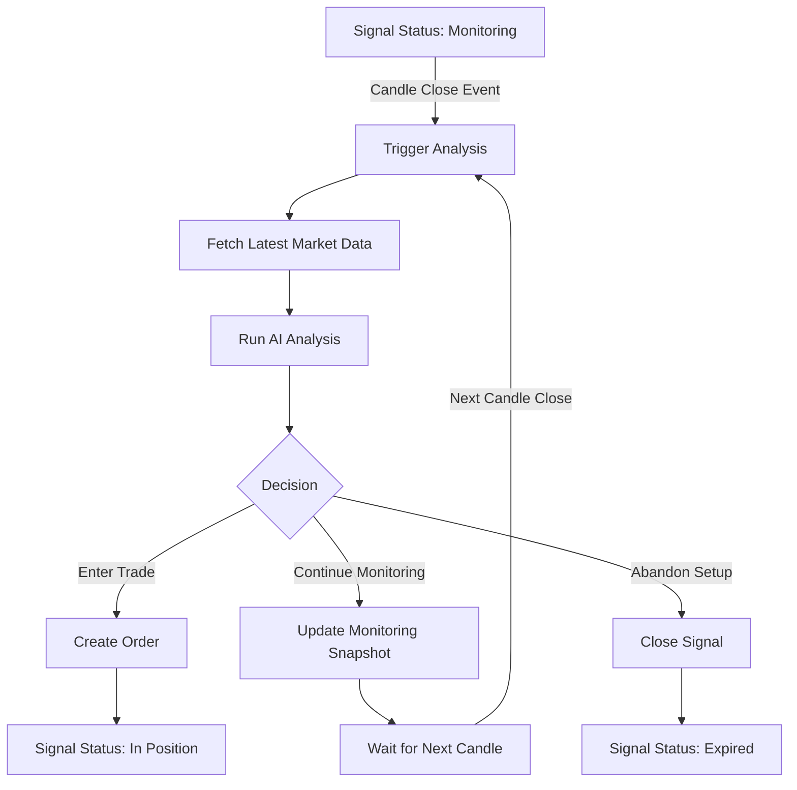
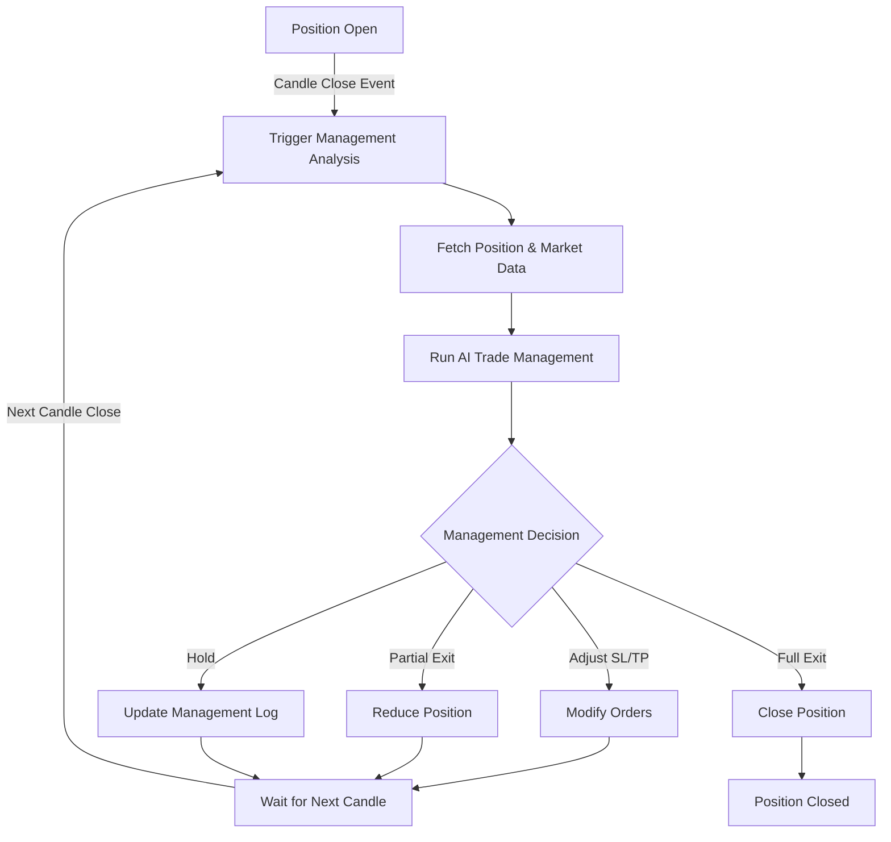

# Automated Trading Workflows

## Overview

This document defines the automated workflows for continuous signal monitoring and position management. These workflows ensure that AI traders analyze setups at each candle close and actively manage positions until closure.

## Core Workflows

### 1. Setup Monitoring Workflow

When a signal enters "monitoring" state, the system automatically analyzes it **exactly at each candle close** based on the trader's configured interval. Analysis is triggered by candle close events, not time-based intervals.



### 2. Position Management Workflow

When a position is open, the system manages it **at every candle close** based on the trader's interval until the position is fully closed. Management decisions are synchronized with candle completions.



## Database Schema Additions

### 1. Workflow Schedules Table
```sql
CREATE TABLE workflow_schedules (
  id UUID PRIMARY KEY DEFAULT gen_random_uuid(),
  workflow_type TEXT NOT NULL CHECK (workflow_type IN ('signal_monitoring', 'position_management')),
  entity_id UUID NOT NULL, -- signal_id or position_id
  trader_id UUID REFERENCES traders(id) ON DELETE CASCADE,
  
  -- Candle config
  interval TEXT NOT NULL, -- '1m', '5m', '15m', etc. - which candle closes trigger this workflow
  symbol TEXT NOT NULL, -- Symbol being monitored (denormalized for performance)
  
  -- Execution tracking
  last_run_at TIMESTAMPTZ,
  last_candle_time BIGINT, -- Timestamp of last processed candle to prevent duplicates
  consecutive_errors INTEGER DEFAULT 0,
  is_active BOOLEAN DEFAULT true,
  
  created_at TIMESTAMPTZ DEFAULT NOW(),
  updated_at TIMESTAMPTZ DEFAULT NOW()
);

CREATE INDEX idx_workflow_schedules_active ON workflow_schedules(symbol, interval) WHERE is_active = true;
CREATE INDEX idx_workflow_schedules_entity ON workflow_schedules(workflow_type, entity_id);
```

### 2. Monitoring Decisions Table
```sql
CREATE TABLE monitoring_decisions (
  id UUID PRIMARY KEY DEFAULT gen_random_uuid(),
  signal_id UUID REFERENCES signals(id) ON DELETE CASCADE,
  
  -- Market snapshot at decision time
  timestamp TIMESTAMPTZ NOT NULL,
  price DECIMAL NOT NULL,
  volume DECIMAL,
  
  -- AI Analysis
  decision TEXT NOT NULL CHECK (decision IN ('enter', 'continue', 'abandon')),
  confidence DECIMAL NOT NULL,
  reasoning TEXT NOT NULL,
  
  -- Trade plan (if entering)
  trade_plan JSONB, -- {entry, stopLoss, takeProfit, positionSize, timeframe}
  
  -- Technical context
  indicators JSONB NOT NULL, -- All indicator values at time
  market_conditions JSONB, -- Trend, volatility, etc.
  
  created_at TIMESTAMPTZ DEFAULT NOW()
);

CREATE INDEX idx_monitoring_decisions_signal ON monitoring_decisions(signal_id, timestamp DESC);
```

### 3. Position Management Decisions Table
```sql
CREATE TABLE position_management_decisions (
  id UUID PRIMARY KEY DEFAULT gen_random_uuid(),
  position_id UUID NOT NULL, -- References positions in CCXT schema
  signal_id UUID REFERENCES signals(id) ON DELETE SET NULL,
  
  -- Position state at decision
  timestamp TIMESTAMPTZ NOT NULL,
  current_pnl DECIMAL NOT NULL,
  current_pnl_pct DECIMAL NOT NULL,
  position_size DECIMAL NOT NULL,
  
  -- Management decision
  action TEXT NOT NULL CHECK (action IN ('hold', 'adjust_sl', 'adjust_tp', 'add', 'reduce', 'close')),
  confidence DECIMAL NOT NULL,
  reasoning TEXT NOT NULL,
  
  -- Action details
  action_details JSONB, -- {newStopLoss, newTakeProfit, reduceAmount, etc.}
  
  -- Market context
  market_price DECIMAL NOT NULL,
  indicators JSONB NOT NULL,
  risk_assessment JSONB, -- {marketRisk, positionRisk, correlationRisk}
  
  created_at TIMESTAMPTZ DEFAULT NOW()
);

CREATE INDEX idx_position_mgmt_position ON position_management_decisions(position_id, timestamp DESC);
CREATE INDEX idx_position_mgmt_signal ON position_management_decisions(signal_id) WHERE signal_id IS NOT NULL;
```

## Service Implementation

### 1. Candle Close Event-Driven Workflow Service
```typescript
class CandleCloseWorkflowService {
  private activeWorkflows: Map<string, WorkflowConfig> = new Map();
  
  constructor(
    private eventEmitter: EventEmitter,
    private signalService: SignalService,
    private exchangeService: ExchangeService,
    private aiService: AIAnalysisService
  ) {
    this.setupCandleCloseListeners();
  }
  
  private setupCandleCloseListeners() {
    // Listen for candle close events from WebSocket
    this.eventEmitter.on('kline:closed', async (event: KlineCloseEvent) => {
      await this.processCandleClose(event);
    });
  }
  
  async processCandleClose(event: KlineCloseEvent) {
    const { symbol, interval, kline, timestamp } = event;
    
    // Find all workflows that need processing for this symbol/interval
    const workflows = await this.db.workflowSchedules.findMany({
      where: {
        is_active: true,
        interval: interval,
        OR: [
          // Monitoring workflows for this symbol
          {
            workflow_type: 'signal_monitoring',
            entity_id: {
              in: await this.getMonitoringSignalIds(symbol)
            }
          },
          // Position management workflows for this symbol
          {
            workflow_type: 'position_management',
            entity_id: {
              in: await this.getOpenPositionIds(symbol)
            }
          }
        ]
      }
    });
    
    // Process workflows in parallel
    await Promise.all(
      workflows.map(workflow => this.executeWorkflowOnCandle(workflow, kline))
    );
  }
  
  private async getMonitoringSignalIds(symbol: string): Promise<string[]> {
    const signals = await this.db.signals.findMany({
      where: {
        symbol,
        status: 'monitoring'
      },
      select: { id: true }
    });
    return signals.map(s => s.id);
  }
  
  private async getOpenPositionIds(symbol: string): Promise<string[]> {
    const positions = await this.db.positions.findMany({
      where: {
        symbol,
        status: 'open'
      },
      select: { id: true }
    });
    return positions.map(p => p.id);
  }
  
  async executeWorkflowOnCandle(workflow: WorkflowSchedule, kline: Kline) {
    try {
      // Record that we're processing this candle
      await this.db.workflowSchedules.update(workflow.id, {
        last_run_at: new Date(),
        consecutive_errors: 0 // Reset on successful start
      });
      
      switch (workflow.workflow_type) {
        case 'signal_monitoring':
          await this.executeSignalMonitoring(workflow, kline);
          break;
        case 'position_management':
          await this.executePositionManagement(workflow, kline);
          break;
      }
      
    } catch (error) {
      await this.handleWorkflowError(workflow, error);
    }
  }
  
  async executeSignalMonitoring(workflow: WorkflowSchedule, kline: Kline) {
    // 1. Get signal and trader config
    const signal = await this.signalService.getSignal(workflow.entity_id);
    const trader = await this.traderService.getTrader(workflow.trader_id);
    
    // 2. Get market data including the just-closed candle
    const marketData = await this.getMarketDataWithCandle(signal.symbol, trader.indicators, kline);
    
    // 3. Run AI analysis with candle close data
    const analysis = await this.aiService.analyzeMonitoringSetup({
      signal,
      trader,
      marketData,
      closedCandle: kline,
      candleCloseTime: new Date(kline[6]), // Close time
      previousDecisions: await this.getRecentDecisions(signal.id, 5)
    });
    
    // 4. Record decision
    await this.recordMonitoringDecision(signal.id, analysis);
    
    // 5. Execute decision
    switch (analysis.decision) {
      case 'enter':
        await this.signalTradingBridge.executeSignalTrade(
          signal.id,
          trader.default_exchange_account_id
        );
        await this.deactivateWorkflow(workflow.id);
        break;
        
      case 'abandon':
        await this.signalService.updateSignal(signal.id, {
          status: 'expired',
          closed_at: new Date()
        });
        await this.deactivateWorkflow(workflow.id);
        break;
        
      case 'continue':
        // Just continue monitoring
        break;
    }
  }
  
  async executePositionManagement(workflow: WorkflowSchedule, kline: Kline) {
    // 1. Get position and related data
    const position = await this.exchangeService.getPosition(workflow.entity_id);
    const signal = await this.getSignalForPosition(position.id);
    const trader = await this.traderService.getTrader(workflow.trader_id);
    
    // 2. Get market data with the closed candle
    const marketData = await this.getMarketDataWithCandle(position.symbol, trader.indicators, kline);
    
    // 3. Run AI trade management at candle close
    const management = await this.aiService.analyzePositionManagement({
      position,
      signal,
      trader,
      marketData,
      closedCandle: kline,
      candleCloseTime: new Date(kline[6]),
      previousDecisions: await this.getRecentManagementDecisions(position.id, 5)
    });
    
    // 4. Record decision
    await this.recordManagementDecision(position.id, signal?.id, management);
    
    // 5. Execute management action
    await this.executeManagementAction(position, management);
    
    // 6. Check if position is closed
    if (position.status === 'closed') {
      await this.deactivateWorkflow(workflow.id);
    }
  }
  
  async executeManagementAction(position: Position, decision: ManagementDecision) {
    switch (decision.action) {
      case 'adjust_sl':
        await this.exchangeService.modifyStopLoss(
          position.exchange_account_id,
          position.stop_loss_order_id,
          decision.action_details.newStopLoss
        );
        break;
        
      case 'adjust_tp':
        await this.exchangeService.modifyTakeProfit(
          position.exchange_account_id,
          position.take_profit_order_id,
          decision.action_details.newTakeProfit
        );
        break;
        
      case 'reduce':
        await this.exchangeService.reducePosition(
          position.exchange_account_id,
          position.id,
          decision.action_details.reduceAmount
        );
        break;
        
      case 'close':
        await this.exchangeService.closePosition(
          position.exchange_account_id,
          position.id
        );
        break;
    }
  }
  
}

### 2. WebSocket Candle Close Detection
```typescript
// Enhancement to existing WebSocket handler
class EnhancedKlineHandler {
  constructor(private eventEmitter: EventEmitter) {}
  
  handleKlineUpdate(symbol: string, interval: KlineInterval, kline: Kline, isClosed: boolean) {
    // Existing kline update logic...
    
    // Emit candle close event for workflow processing
    if (isClosed) {
      this.eventEmitter.emit('kline:closed', {
        symbol,
        interval,
        kline,
        timestamp: new Date()
      });
    }
  }
}

// Integration with existing WebSocket connection
const handleKlineUpdate = (symbol: string, interval: KlineInterval, kline: Kline, isClosed: boolean) => {
  // Update historical data
  handleKlineUpdateStable(symbol, interval, kline, isClosed);
  
  // Trigger workflows on candle close
  if (isClosed) {
    eventEmitter.emit('kline:closed', {
      symbol,
      interval,
      kline,
      timestamp: new Date()
    });
  }
};
```

### 3. AI Analysis Service Integration
```typescript
interface MonitoringAnalysisRequest {
  signal: Signal;
  trader: Trader;
  marketData: MarketData;
  closedCandle: Kline; // The candle that just closed
  candleCloseTime: Date; // Exact time of candle close
  previousDecisions: MonitoringDecision[];
}

interface MonitoringAnalysisResponse {
  decision: 'enter' | 'continue' | 'abandon';
  confidence: number;
  reasoning: string;
  tradePlan?: {
    entry: number;
    stopLoss: number;
    takeProfit: number;
    positionSize: number;
    timeframe: string;
  };
  indicators: Record<string, number>;
}

class AIAnalysisService {
  async analyzeMonitoringSetup(request: MonitoringAnalysisRequest): Promise<MonitoringAnalysisResponse> {
    const prompt = this.buildMonitoringPrompt(request);
    
    const response = await this.geminiService.analyze(prompt, {
      model: request.trader.ai_model || 'gemini-2.5-flash',
      responseSchema: MonitoringAnalysisResponseSchema
    });
    
    return response;
  }
  
  private buildMonitoringPrompt(request: MonitoringAnalysisRequest): string {
    return `
You are monitoring a trading setup AT CANDLE CLOSE. A ${request.trader.filter.interval} candle has just closed.

Original Signal:
- Symbol: ${request.signal.symbol}
- Initial Price: ${request.signal.initial_price}
- Time Elapsed: ${this.getTimeElapsed(request.signal.created_at)}
- Matched Conditions: ${request.signal.matched_conditions.join(', ')}

Just Closed Candle (${request.trader.filter.interval}):
- Open: ${request.closedCandle[1]}
- High: ${request.closedCandle[2]}
- Low: ${request.closedCandle[3]}
- Close: ${request.closedCandle[4]}
- Volume: ${request.closedCandle[5]}
- Close Time: ${request.candleCloseTime}

Current Market Data (calculated at candle close):
${JSON.stringify(request.marketData, null, 2)}

Your Trading Strategy:
${request.trader.strategy}

Previous Monitoring Decisions (latest first):
${request.previousDecisions.map(d => `
- ${d.timestamp}: ${d.decision} (${d.confidence}% confidence)
  Reasoning: ${d.reasoning}
`).join('\n')}

Analyze the current state of this setup and decide:
1. ENTER: The setup is now ready for entry
2. CONTINUE: Keep monitoring, conditions not yet optimal
3. ABANDON: The setup is no longer valid

Provide detailed reasoning for your decision.
If deciding to ENTER, provide a complete trade plan.
`;
  }
  
  async analyzePositionManagement(request: PositionManagementRequest): Promise<ManagementDecision> {
    const prompt = this.buildManagementPrompt(request);
    
    const response = await this.geminiService.analyze(prompt, {
      model: request.trader.ai_model || 'gemini-2.5-flash',
      responseSchema: ManagementDecisionSchema
    });
    
    return response;
  }
  
  private buildManagementPrompt(request: PositionManagementRequest): string {
    return `
You are managing an open trading position AT CANDLE CLOSE. A ${request.trader.filter.interval} candle has just closed.

Position Details:
- Symbol: ${request.position.symbol}
- Side: ${request.position.side}
- Entry Price: ${request.position.entry_price}
- Position Size: ${request.position.contracts}
- Unrealized P&L: ${request.position.unrealized_pnl} (${request.position.pnl_percentage}%)
- Current SL: ${request.position.stop_loss}
- Current TP: ${request.position.take_profit}

Just Closed Candle (${request.trader.filter.interval}):
- Open: ${request.closedCandle[1]}
- High: ${request.closedCandle[2]}
- Low: ${request.closedCandle[3]}
- Close: ${request.closedCandle[4]}
- Volume: ${request.closedCandle[5]}

Market Conditions (at candle close):
${JSON.stringify(request.marketData, null, 2)}

Your Trading Strategy:
${request.trader.strategy}

Previous Management Decisions:
${request.previousDecisions.map(d => `
- ${d.timestamp}: ${d.action} (${d.confidence}% confidence)
  Reasoning: ${d.reasoning}
`).join('\n')}

Analyze the position and decide on management action:
1. HOLD: Maintain current position and orders
2. ADJUST_SL: Move stop loss (specify new level)
3. ADJUST_TP: Move take profit (specify new level)
4. REDUCE: Take partial profits (specify amount)
5. CLOSE: Exit entire position

Consider:
- Risk/reward ratio
- Market momentum
- Support/resistance levels
- Overall market conditions
- Your strategy rules

Provide detailed reasoning for your decision.
`;
  }
}
```

### 4. Workflow Creation Triggers
```typescript
class WorkflowTriggerService {
  constructor(
    private eventEmitter: EventEmitter,
    private workflowScheduler: WorkflowSchedulerService
  ) {
    this.setupEventListeners();
  }
  
  private setupEventListeners() {
    // Create monitoring workflow when signal enters monitoring state
    this.eventEmitter.on('signal:status_changed', async (event) => {
      if (event.newStatus === 'monitoring') {
        await this.createMonitoringWorkflow(event.signalId);
      }
    });
    
    // Create position management workflow when position opens
    this.eventEmitter.on('position:opened', async (event) => {
      await this.createPositionManagementWorkflow(event.positionId, event.signalId);
    });
    
    // Cancel workflows when appropriate
    this.eventEmitter.on('signal:closed', async (event) => {
      await this.cancelWorkflow('signal_monitoring', event.signalId);
    });
    
    this.eventEmitter.on('position:closed', async (event) => {
      await this.cancelWorkflow('position_management', event.positionId);
    });
  }
  
  async createMonitoringWorkflow(signalId: string) {
    const signal = await this.signalService.getSignal(signalId);
    const trader = await this.traderService.getTrader(signal.trader_id);
    
    // Create workflow that will be triggered by candle close events
    await this.db.workflowSchedules.create({
      workflow_type: 'signal_monitoring',
      entity_id: signalId,
      trader_id: trader.id,
      interval: trader.filter.interval || '1m', // Determines which candle closes trigger this workflow
      is_active: true
    });
    
    console.log(`Created monitoring workflow for ${signal.symbol} on ${trader.filter.interval} candles`);
  }
  
  async createPositionManagementWorkflow(positionId: string, signalId?: string) {
    if (!signalId) return; // Only manage positions from signals
    
    const signal = await this.signalService.getSignal(signalId);
    const trader = await this.traderService.getTrader(signal.trader_id);
    
    // Create workflow that will be triggered by candle close events
    await this.db.workflowSchedules.create({
      workflow_type: 'position_management',
      entity_id: positionId,
      trader_id: trader.id,
      interval: trader.filter.interval || '1m', // Determines which candle closes trigger this workflow
      is_active: true
    });
    
    console.log(`Created position management workflow for ${signal.symbol} on ${trader.filter.interval} candles`);
  }
}
```

## Monitoring Decision Flow

### Setup Monitoring Decision Tree
```
Market Analysis
├── Entry Conditions Met?
│   ├── Yes → Check Risk/Reward
│   │   ├── Favorable → ENTER with trade plan
│   │   └── Unfavorable → CONTINUE monitoring
│   └── No → Check Invalidation
│       ├── Setup Invalid → ABANDON
│       └── Still Valid → CONTINUE monitoring
```

### Position Management Decision Tree
```
Position Analysis
├── In Profit?
│   ├── Yes → Check Target
│   │   ├── Target Reached → CLOSE position
│   │   ├── Partial Target → Consider REDUCE
│   │   └── Momentum Strong → ADJUST_TP higher
│   └── No → Check Risk
│       ├── Risk Increasing → ADJUST_SL closer
│       ├── Setup Invalid → CLOSE position
│       └── Setup Valid → HOLD position
```

## Configuration

### Trader-Specific Settings
```typescript
interface TraderWorkflowConfig {
  // Monitoring settings
  max_monitoring_duration: string; // '24h', '48h', etc.
  monitoring_interval: string; // Must match kline interval
  min_confidence_to_enter: number; // 0.7 = 70%
  
  // Position management
  management_interval: string; // Can differ from entry interval
  use_trailing_stop: boolean;
  trailing_stop_distance: number; // In percentage
  partial_take_profit_levels: number[]; // [25, 50, 75] = take 25% at first target
  
  // Risk limits
  max_loss_per_position: number; // Percentage
  max_consecutive_losses: number; // Before pausing trader
}
```

## Event Recording

Every workflow execution generates detailed events:

```typescript
// Monitoring Decision Event
{
  event_type: 'monitoring_decision',
  event_data: {
    decision: 'continue',
    confidence: 0.65,
    reasoning: 'RSI improving but volume still below threshold',
    price_at_decision: 45200,
    indicators: {
      rsi: 35,
      volume_ratio: 0.8,
      macd_histogram: -0.02
    },
    time_in_monitoring: '2h 15m'
  }
}

// Management Action Event
{
  event_type: 'management_action',
  event_data: {
    action: 'adjust_sl',
    previous_sl: 44000,
    new_sl: 44500,
    reasoning: 'Price showing strength, protecting profits',
    current_pnl: 250,
    current_pnl_pct: 1.2
  }
}
```

## Performance Tracking

### Monitoring Effectiveness Metrics
```sql
-- How often monitoring leads to successful trades
CREATE VIEW monitoring_effectiveness AS
SELECT 
  t.id as trader_id,
  t.name as trader_name,
  COUNT(DISTINCT s.id) as total_monitored,
  COUNT(DISTINCT s.id) FILTER (WHERE s.status = 'in_position') as entered_trades,
  COUNT(DISTINCT s.id) FILTER (WHERE s.status = 'expired') as abandoned_setups,
  AVG(EXTRACT(EPOCH FROM (s.position_opened_at - s.monitoring_started_at))/3600) as avg_hours_to_entry,
  
  -- Success rate of monitored->entered trades
  (SELECT COUNT(*) FROM signals s2 
   JOIN positions p ON p.signal_id = s2.id 
   WHERE s2.trader_id = t.id 
   AND s2.status = 'closed' 
   AND p.realized_pnl > 0) * 100.0 / 
  NULLIF(COUNT(DISTINCT s.id) FILTER (WHERE s.status IN ('in_position', 'closed')), 0) as win_rate_after_monitoring
  
FROM traders t
LEFT JOIN signals s ON s.trader_id = t.id AND s.status != 'new'
GROUP BY t.id;
```

### Management Effectiveness Metrics
```sql
-- How well positions are managed
CREATE VIEW management_effectiveness AS
WITH position_stats AS (
  SELECT 
    p.signal_id,
    p.id as position_id,
    COUNT(pmd.*) as total_decisions,
    COUNT(pmd.*) FILTER (WHERE pmd.action = 'adjust_sl') as sl_adjustments,
    COUNT(pmd.*) FILTER (WHERE pmd.action = 'adjust_tp') as tp_adjustments,
    COUNT(pmd.*) FILTER (WHERE pmd.action = 'reduce') as partial_exits,
    MAX(p.unrealized_pnl + p.realized_pnl) as max_pnl,
    p.realized_pnl as final_pnl
  FROM positions p
  LEFT JOIN position_management_decisions pmd ON pmd.position_id = p.id
  WHERE p.status = 'closed'
  GROUP BY p.id
)
SELECT 
  t.id as trader_id,
  t.name as trader_name,
  AVG(ps.total_decisions) as avg_decisions_per_trade,
  AVG(ps.sl_adjustments) as avg_sl_adjustments,
  AVG(ps.tp_adjustments) as avg_tp_adjustments,
  
  -- Profit protection effectiveness
  AVG(CASE 
    WHEN ps.max_pnl > 0 THEN ps.final_pnl / ps.max_pnl 
    ELSE NULL 
  END) as profit_retention_ratio,
  
  -- Win rate
  COUNT(*) FILTER (WHERE ps.final_pnl > 0) * 100.0 / COUNT(*) as managed_win_rate
  
FROM traders t
JOIN signals s ON s.trader_id = t.id
JOIN position_stats ps ON ps.signal_id = s.id
GROUP BY t.id;
```

## Error Handling

### Workflow Failure Recovery
```typescript
class WorkflowErrorHandler {
  async handleWorkflowError(workflow: WorkflowSchedule, error: Error) {
    // Log error
    await this.logger.error('Workflow execution failed', {
      workflow_id: workflow.id,
      workflow_type: workflow.workflow_type,
      entity_id: workflow.entity_id,
      error: error.message,
      stack: error.stack
    });
    
    // Update error count
    await this.db.workflowSchedules.update(workflow.id, {
      consecutive_errors: workflow.consecutive_errors + 1,
      updated_at: new Date()
    });
    
    // Disable after too many errors
    if (workflow.consecutive_errors >= 5) {
      await this.db.workflowSchedules.update(workflow.id, {
        is_active: false
      });
      
      // Notify user
      await this.notificationService.send({
        user_id: workflow.trader.user_id,
        type: 'workflow_disabled',
        message: `Workflow disabled after repeated errors for ${workflow.workflow_type}`
      });
    }
  }
}
```

## Integration with Existing Systems

### Signal Lifecycle Enhancement
```typescript
// Current: new → analyzing → monitoring → ready → in_position → closed
// Enhanced: Automated analysis at each stage

class EnhancedSignalLifecycle {
  async transitionToMonitoring(signalId: string) {
    // Update signal status
    await this.signalService.updateStatus(signalId, 'monitoring');
    
    // Create monitoring workflow
    await this.workflowTriggerService.createMonitoringWorkflow(signalId);
    
    // Record event
    await this.eventService.record({
      signal_id: signalId,
      event_type: 'monitoring_started',
      event_data: {
        monitoring_interval: trader.filter.interval,
        max_monitoring_duration: trader.workflow_config.max_monitoring_duration
      }
    });
  }
}
```

## Key Implementation Notes

### Candle Close Precision
- All monitoring and management decisions happen **exactly at candle close**, not on time intervals
- The system listens for `isClosed = true` events from the WebSocket kline stream
- Each workflow is associated with a specific candle interval (1m, 5m, 15m, etc.)
- Only closed candles trigger analysis - never analyze on incomplete candles

### Event-Driven vs Time-Based
Unlike time-based schedulers, this system:
- **Does NOT** use cron jobs or interval timers
- **Does NOT** poll for updates
- **DOES** react to candle close events from the exchange
- **DOES** ensure analysis happens with complete candle data

### Preventing Duplicate Processing
```typescript
// Track last processed candle to prevent duplicates
if (kline[0] <= workflow.last_candle_time) {
  return; // Already processed this candle
}

// Update after successful processing
await db.workflowSchedules.update(workflow.id, {
  last_candle_time: kline[0],
  last_run_at: new Date()
});
```

## Summary

This workflow architecture ensures:

1. **Candle-Aligned Analysis**: All decisions happen exactly at candle close with complete data
2. **Event-Driven Execution**: Triggered by exchange events, not timers
3. **Continuous Monitoring**: Every candle close triggers analysis for active setups
4. **Active Position Management**: Positions managed at each candle close until exit
5. **Structured Decisions**: Every analysis produces reasoning and action plans
6. **Full Auditability**: All decisions tied to specific candles and timestamps
7. **Exchange Synchronization**: Analysis aligned with exchange data, not local time