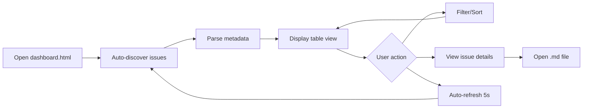

# Issue Tracker Dashboard

## Metadata
- **Status:** 🎨 design
- **Created:** 2025-09-20 08:00:00
- **Updated:** 2025-09-20 08:10:00
- **Priority:** Medium
- **Type:** enhancement
- **Progress:** [          ] 0%

---

## Idea Review
*Stage: idea | Date: 2025-09-20 08:00:00*

### Original Idea
Create a dashboard HTML file in `/issues` that can be served from a local server (using VS Code's Live Server extension) to automatically parse and display all issue files without maintaining a separate index.

### Enhanced Concept
Build an interactive, real-time issue tracking dashboard that automatically discovers and parses all markdown files in the `/issues` directory, providing a sophisticated project management interface specifically tailored for AI-assisted development workflows in a cryptocurrency trading application.

### Target Users
- **Primary:** Development team members tracking implementation progress
- **Secondary:** Product managers monitoring feature delivery
- **Edge Case:** AI agents needing structured issue data for context

### Domain Context
In cryptocurrency trading applications, development velocity and issue tracking are critical due to:
- Market volatility requiring rapid feature deployment
- Real-time performance issues needing immediate visibility
- Complex technical debt from WebSocket/worker optimizations
- Multiple parallel workstreams (UI, performance, AI features)

### Suggestions for Improvement
1. **Real-time Updates:** Use file system watching to auto-refresh when issues change
2. **Performance Metrics:** Track issue resolution velocity and bottlenecks
3. **AI Integration:** Expose structured data endpoint for AI agents to query
4. **Dependency Mapping:** Visualize relationships between blocked/dependent issues

### Critical Questions

#### Domain Workflow
1. How will this integrate with the AI workflow commands (`/spec`, `/implement`, etc.)?
   - **Why it matters:** The dashboard should reflect the unique 9-stage workflow
   - **Recommendation:** Parse stage-specific sections and show workflow progression

#### User Needs
2. Should the dashboard support inline editing of issue metadata?
   - **Why it matters:** Reduce context switching during rapid development
   - **Recommendation:** Start read-only, add edit capability in v2

#### Technical Requirements
3. What's the expected scale (number of issues over time)?
   - **Why it matters:** Performance considerations for parsing/rendering
   - **Recommendation:** Implement virtual scrolling if >100 issues expected

#### Integration
4. Should this integrate with git commits/PR tracking?
   - **Why it matters:** Complete visibility of issue → implementation → deployment
   - **Recommendation:** Parse commit messages for issue references

#### Compliance/Standards
5. Any security concerns with exposing issue data via local server?
   - **Why it matters:** May contain sensitive architecture decisions
   - **Recommendation:** Ensure localhost-only access, no external dependencies

### Success Criteria
- [ ] Auto-discovers all `.md` files in `/issues` without configuration
- [ ] Updates within 2 seconds of file changes
- [ ] Loads dashboard in <500ms with 100+ issues
- [ ] Provides filtering by status, priority, type, and date range
- [ ] Shows real-time progress for implementing issues

### Risks & Mitigations
| Risk | Impact | Mitigation |
|------|--------|------------|
| File parsing errors from inconsistent metadata | High | Implement robust error handling with graceful degradation |
| Performance with large issue counts | Medium | Implement pagination and lazy loading |
| Browser compatibility for local file access | Medium | Use standard HTTP serving, not file:// protocol |

### Recommended Next Steps
1. Answer critical questions above
2. Define MVP scope (read-only dashboard with filtering)
3. Create detailed spec with `/spec`
4. Build proof-of-concept with 5-10 test issues

### Priority Assessment
**Urgency:** Medium (improves development workflow but not critical)
**Impact:** High (saves time on manual index maintenance)
**Effort:** Small (1-2 days for MVP)
**Recommendation:** Proceed - high value/effort ratio

---
*[End of idea review. Next: /spec issues/2025-09-20-issue-tracker-dashboard.md]*

---

## Enhancement Specification
*Stage: spec | Date: 2025-09-20 08:05:00*

### Overview
**Current:** Manual maintenance of `index.md` file with static issue status that quickly becomes outdated, requiring constant updates and providing no real-time visibility into the AI-assisted development workflow.

**Enhanced:** Auto-generated HTML dashboard that dynamically parses all markdown issues, provides real-time status updates via Live Server, and visualizes the unique 9-stage AI workflow with filtering, sorting, and progress tracking capabilities.

**Impact:** Development team gains immediate visibility into issue status, PM can track feature velocity without manual updates, and AI agents can reference structured issue data for context-aware assistance.

### Motivation
In a fast-paced cryptocurrency trading application where market opportunities require rapid feature deployment, manually maintaining issue tracking creates friction. The current `index.md` requires constant updates, lacks real-time status, and doesn't reflect the sophisticated AI-assisted workflow stages that drive development velocity.

### Changes Required

#### Functional Changes
- [ ] Create `dashboard.html` in `/issues` directory with self-contained JavaScript
- [ ] Implement markdown parser to extract metadata from all `.md` files
- [ ] Add real-time file watching via periodic fetch when served through Live Server
- [ ] Parse and display 9-stage workflow progress (idea → spec → design → review → architect → plan → implement → update → complete)
- [ ] Implement filtering by status, priority, type, and date range
- [ ] Add sorting by created/updated dates, priority levels
- [ ] Display progress bars for issues in "implementing" stage
- [ ] Generate summary statistics (total issues, distribution by status/type)

#### Technical Changes
- [ ] Client-side JavaScript with no build process required
- [ ] Fetch API to read `.md` files when served via HTTP
- [ ] Markdown front-matter parser for metadata extraction
- [ ] Local storage for user preferences (sort order, filters)
- [ ] Responsive CSS Grid/Flexbox layout
- [ ] Dark/light mode matching VS Code theme preference

### Implementation Details

#### File Discovery & Parsing
```javascript
// Discover all issue files via directory listing
async function discoverIssues() {
  const response = await fetch('./');
  const html = await response.text();
  const parser = new DOMParser();
  const doc = parser.parseFromString(html, 'text/html');
  const links = [...doc.querySelectorAll('a[href$=".md"]')];
  return links.map(link => link.href);
}

// Parse metadata and progress from markdown
function parseIssueMetadata(markdown) {
  const metadata = {};
  // Extract from ## Metadata section
  // Parse workflow stages from section headers
  // Calculate progress from checkboxes
  return metadata;
}
```

#### Dashboard Layout
```
+----------------------------------------------------------+
| Issue Tracker Dashboard            [Refresh] [Settings]  |
+----------------------------------------------------------+
| Stats: 12 Total | 3 Active | 5 Planning | 4 Complete    |
+----------------------------------------------------------+
| Filters: [Status ▼] [Priority ▼] [Type ▼] [Date Range] |
+----------------------------------------------------------+
| Issue Title          | Status | Priority | Updated | %  |
| Performance Fix      | 🚧     | Critical | 2h ago  | 85%|
| Custom Signals       | 📋     | High     | 1d ago  | 20%|
| Dashboard Feature    | 🎯     | Medium   | Just now| 0% |
+----------------------------------------------------------+
```

#### Auto-Refresh Strategy
- Poll for changes every 5 seconds when Live Server detected
- Compare file modification times to detect updates
- Highlight recently changed issues (within last hour)
- Show notification badge for new issues since last view

### Acceptance Criteria
- [ ] Dashboard loads and displays all issues within 500ms
- [ ] Existing `index.md` functionality fully replaced
- [ ] All 9 workflow stages properly detected and displayed
- [ ] Progress calculation accurate based on checkbox completion
- [ ] Filters work independently and in combination
- [ ] Works seamlessly with VS Code Live Server extension
- [ ] No external dependencies or CDN requirements
- [ ] Responsive design works on 1080p to 4K displays
- [ ] No regression in issue discovery or status accuracy

### Testing Requirements
- **Regression:** Ensure all existing issues display correctly
- **New tests:**
  - Parse issues with incomplete metadata
  - Handle malformed markdown gracefully
  - Test with 100+ issues for performance
  - Verify auto-refresh detects file changes
- **Performance:** Dashboard loads in <500ms with 50 issues

### Security Considerations
- Dashboard only accessible via localhost (Live Server default)
- No external API calls or data transmission
- XSS protection for rendered markdown content
- Sanitize any user-generated content display

### Rollback Plan
The existing `index.md` remains untouched. If dashboard fails, team can immediately revert to manual index maintenance with zero downtime.

### Timeline
- Implementation: 4-6 hours
- Testing: 2 hours
- Documentation: 1 hour
- **Total: 7-9 hours**

### Success Metrics
| Metric | Target | Measurement |
|--------|--------|-------------|
| Time to find issue | <5 seconds | User testing |
| Manual index updates | 0 per week | Git commit history |
| Dashboard load time | <500ms | Performance API |
| Issue discovery accuracy | 100% | Automated testing |

---
*[End of specification. Next: /design-issue issues/2025-09-20-issue-tracker-dashboard.md]*

---

## UI/UX Design
*Stage: design | Date: 2025-09-20 08:10:00*

### Design Overview
A developer-focused issue tracking dashboard that embraces the dark theme aesthetic of the cryptocurrency trading application while providing instant visual feedback on development workflow progress. The design prioritizes information density, scanability, and real-time updates - critical for fast-paced trading application development.

### User Flow


### Component Structure

#### Desktop Layout (Primary)
```
┌─────────────────────────────────────────────────────────────────┐
│  🎯 Issue Tracker Dashboard                    [↻] [⚙] [🌙/☀]   │
├─────────────────────────────────────────────────────────────────┤
│  Last sync: 2 seconds ago · Next: in 3s · 7 issues found        │
├─────────────────────────────────────────────────────────────────┤
│ ┌──────────────────────────────────────────────────────────┐    │
│ │ 📊 Quick Stats                                            │    │
│ │ ● Total: 7  ● Active: 2  ● Planning: 3  ● Complete: 2   │    │
│ │ ● Critical: 1  ● High: 2  ● Medium: 3  ● Low: 1         │    │
│ └──────────────────────────────────────────────────────────┘    │
├─────────────────────────────────────────────────────────────────┤
│ Filters: [All Status ▼] [All Priority ▼] [All Type ▼] [🔍    ] │
├─────────────────────────────────────────────────────────────────┤
│ ┌─────────────────────────────────────────────────────────┐    │
│ │ Issue                     │St│Pri │Type │Updated  │Prog│    │
│ ├─────────────────────────────────────────────────────────┤    │
│ │ Performance Degradation   │🚧│🔴 C│perf │2h ago   │85% │    │
│ │ ├─ Phase 4: Complete optimization                  ████│    │
│ │ Custom Signals Filtering │📋│🟡 H│bug  │1d ago   │20% │    │
│ │ ├─ Spec created, awaiting design                   ██  │    │
│ │ Issue Tracker Dashboard  │🎨│🟢 M│feat │just now │0%  │    │
│ │ ├─ Design phase in progress                        ·   │    │
│ │ Indicator Chart Race     │✅│🟡 H│bug  │3d ago   │100%│    │
│ │ ├─ Completed and deployed                          ████│    │
│ └─────────────────────────────────────────────────────────┘    │
│  Showing 4 of 7 issues · Page 1 of 2 · [←][1][2][→]            │
└─────────────────────────────────────────────────────────────────┘
```

#### Mobile Layout
```
┌──────────────────┐
│ 🎯 Dashboard [↻] │
├──────────────────┤
│ 7 issues · 2 act │
├──────────────────┤
│ [Filter] [Sort]  │
├──────────────────┤
│ ┌──────────────┐ │
│ │🚧 Perf Fix   │ │
│ │Critical·2h   │ │
│ │████████ 85%  │ │
│ └──────────────┘ │
│ ┌──────────────┐ │
│ │📋 Signals    │ │
│ │High·1d       │ │
│ │██       20%  │ │
│ └──────────────┘ │
└──────────────────┘
```

### Visual Specifications

#### Typography
- **Headers**: Inter 600, 18px (dashboard title)
- **Subheaders**: Inter 500, 14px (section titles)
- **Body**: Inter 400, 13px (issue titles, descriptions)
- **Data**: JetBrains Mono 400, 12px (dates, percentages)
- **Labels**: Inter 400, 11px, uppercase (column headers)

#### Color Palette
Following neon-terminal design system:
- **Background**: #0a0a0a (pure dark)
- **Surface**: #1a1a1a (card backgrounds)
- **Border**: #2a2a2a (subtle dividers)
- **Primary**: #00ff88 (success, complete)
- **Danger**: #ff3366 (critical priority)
- **Warning**: #ffaa00 (high priority)
- **Info**: #00aaff (medium priority)
- **Text**: #ffffff (primary), #888888 (muted)

#### Spacing
- **Grid**: 8px base unit
- **Row height**: 48px (comfortable clicking)
- **Card padding**: 16px
- **Section margins**: 24px
- **Compact mode**: 36px rows for 100+ issues

### Component Designs

#### Issue Table Row
**Purpose**: Display individual issue with all metadata
**Location**: Main content area

**Visual Design**:
```
┌─────────────────────────────────────────────────────────────┐
│ [🚧] Performance Degradation Fix     🔴 Critical  perf      │
│      Phase 4: Worker optimization    2 hours ago            │
│      [████████████████████░░░░░] 85%                       │
└─────────────────────────────────────────────────────────────┘
```

**States**:
- Default: Dark background (#1a1a1a)
- Hover: Subtle highlight (#222222) + cursor pointer
- Active/Selected: Border highlight (#00ff88)
- Recently updated: Pulse animation (fade from #00ff88)
- Stale (>7 days): Reduced opacity (0.6)

**Interactions**:
- Click: Open issue .md file in VS Code
- Double-click: Expand inline preview
- Right-click: Context menu (copy link, open in browser)
- Keyboard: Arrow keys navigate, Enter opens

#### Status Indicators
**Visual Mapping**:
- 🎯 idea - Gray background
- 📋 spec - Blue background
- 🎨 design - Purple background
- 🔍 review - Yellow background
- 🏗️ architect - Orange background
- 📊 planning - Cyan background
- 🚧 implementing - Animated stripes
- ✅ complete - Green background
- 🚫 blocked - Red with diagonal lines

#### Progress Bar
**Purpose**: Show implementation progress
**Visual Design**:
```
Not started:  [··········] 0%
In progress:  [████░░░░░░] 40%
Near done:    [████████░░] 80%
Complete:     [██████████] 100%
```

**Animation**: Smooth transition on percentage change
**Colors**:
- 0-33%: Red (#ff3366)
- 34-66%: Yellow (#ffaa00)
- 67-99%: Blue (#00aaff)
- 100%: Green (#00ff88)

### Data Visualization

#### Statistics Panel
```
┌────────────────────────────────────────┐
│ Total    Active   Planning   Complete  │
│  12       3         5          4       │
│  ████     ██        ███        ██      │
└────────────────────────────────────────┘
```

#### Workflow Timeline
Show 9-stage progression horizontally:
```
idea → spec → design → review → architect → plan → implement → update → complete
 ●------●------●------○------○------○------○------○------○
        └─ Current stage highlighted
```

### Responsive Behavior

#### Breakpoints
- Desktop: >1280px (full table with all columns)
- Tablet: 768-1280px (hide type column, abbreviate)
- Mobile: <768px (card view, stack vertically)

#### Progressive Disclosure
- Desktop: All metadata visible
- Tablet: Priority/status as badges
- Mobile: Expandable cards for details

### Accessibility

#### WCAG 2.1 AA Compliance
- Color contrast: 7:1 for body text
- Focus indicators: 2px solid #00ff88 outline
- Screen reader: Semantic HTML with ARIA labels
- Keyboard: Full navigation with shortcuts

#### Developer-Specific
- Monospace for technical data
- High contrast status indicators
- Clear visual hierarchy
- No reliance on color alone

### Animation & Transitions

#### Performance First
- CSS transforms only (no layout recalc)
- 60fps minimum on all animations
- Debounced refresh (5s minimum)
- RequestAnimationFrame for smooth updates

#### Meaningful Motion
- New issues: Slide in from top
- Updated issues: Brief green pulse
- Deleted issues: Fade out
- Progress changes: Smooth bar fill

### Dark/Light Theme

#### Dark Theme (Default)
```css
--bg-primary: #0a0a0a;
--bg-secondary: #1a1a1a;
--text-primary: #ffffff;
--text-muted: #888888;
--border: #2a2a2a;
```

#### Light Theme (Optional)
```css
--bg-primary: #ffffff;
--bg-secondary: #f5f5f5;
--text-primary: #000000;
--text-muted: #666666;
--border: #e0e0e0;
```

### Implementation Notes

#### HTML Structure
```html
<!DOCTYPE html>
<html data-theme="dark">
<head>
  <meta charset="UTF-8">
  <title>Issue Tracker Dashboard</title>
  <style>/* Embedded CSS */</style>
</head>
<body>
  <header><!-- Title, sync status, controls --></header>
  <section class="stats"><!-- Quick statistics --></section>
  <section class="filters"><!-- Filter controls --></section>
  <main class="issues-table"><!-- Issue rows --></main>
  <footer><!-- Pagination, counts --></footer>
  <script>/* Embedded JavaScript */</script>
</body>
</html>
```

#### Technical Constraints
- Single HTML file (no external dependencies)
- Works offline after initial load
- LocalStorage for preferences (<5MB)
- No framework required (vanilla JS)

### Design Validation

#### Usability Testing
- [ ] Find specific issue in <5 seconds
- [ ] Filter by status with 1 click
- [ ] Progress clearly visible at glance
- [ ] Mobile experience acceptable

#### Performance Metrics
- [ ] Initial render <100ms
- [ ] Refresh cycle <50ms
- [ ] Smooth 60fps scrolling
- [ ] No layout shifts on update

---
*[End of design. Next: /engineering-review-issue issues/2025-09-20-issue-tracker-dashboard.md]*