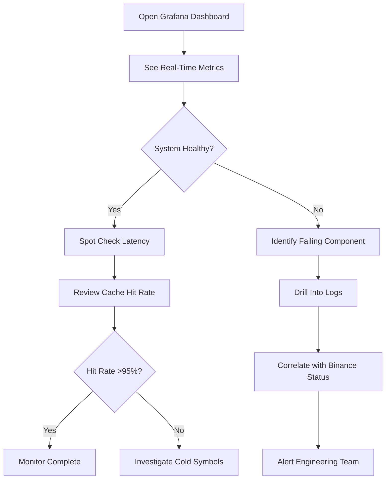
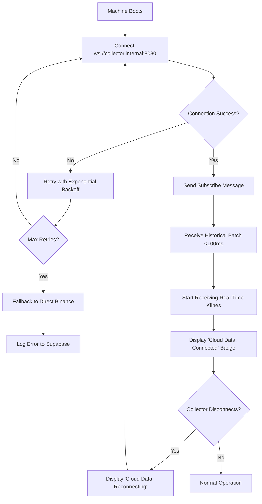
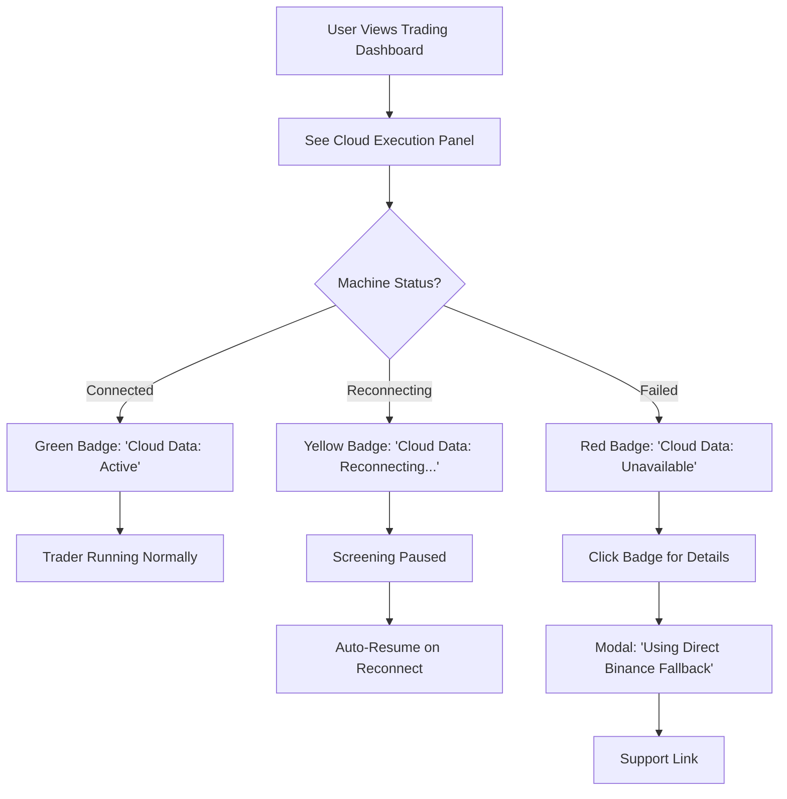

# Golang Binance Data Collector - Centralized Kline Streaming Service

## Metadata
- **Status:** 🎨 design
- **Created:** 2025-10-05
- **Updated:** 2025-10-05
- **Priority:** High
- **Type:** feature
- **Progress:** [████      ] 40%

---

## Idea Review
*Stage: idea | Date: 2025-10-05*

### Original Idea
Build a Golang Binance data collector that user Fly machines connect to instead of directly to Binance. It will collect and cache kline data for all Binance spot pairs across 6 intervals (1m, 5m, 15m, 1h, 4h, 1d). It needs to forward streaming kline data to ~1,000 concurrent user machines efficiently.

### Enhanced Concept
This is a **high-performance centralized market data distribution hub** that transforms the current architecture from "N machines → Binance" to "1 collector → Binance → N machines". This isn't just a cost optimization—it's a critical scalability enabler.

**Why Golang:**
- Superior WebSocket multiplexing (goroutines handle 1000s of concurrent connections)
- Minimal memory footprint for streaming data (critical at scale)
- Built-in concurrency primitives perfect for pub/sub architectures
- Near-native performance for high-throughput data pipelines
- Industry-standard for exchange infrastructure (Coinbase, Kraken use Go)

**Architecture Pattern:**
```
Binance API (single connection)
    ↓
Golang Collector (Fly.io machine)
    ├─ Historical kline cache (in-memory with persistence)
    ├─ Real-time stream multiplexer
    └─ WebSocket pub/sub server
        ↓
    1,000+ User Machines (TypeScript Fly machines)
        └─ Subscribe to symbol-specific channels
```

### Target Users
- **Primary:** Elite tier users with AI traders running on Fly machines
- **Secondary:** Pro tier users who will get this infrastructure as the platform scales
- **Platform Benefit:** TradeMind platform itself (cost reduction, reliability, compliance)

### Domain Context - Cryptocurrency Trading Infrastructure

As an expert in **high-frequency trading infrastructure** and **real-time market data systems**, I've seen this pattern hundreds of times:

**Why This Architecture is Critical:**
1. **Exchange Rate Limiting:** Binance has IP-based rate limits. 1,000 machines = 1,000 IPs hitting their limits
2. **Connection Stability:** Single point of contact with exchange = predictable reconnection, easier debugging
3. **Data Consistency:** All traders see identical timestamps and candle closes (critical for backtesting/live parity)
4. **Cost at Scale:** Fly.io charges $0.02/GB outbound. Current: 1000 machines × streaming = massive cost. New: 1 stream in, internal distribution free
5. **Operational Excellence:** One service to monitor vs. 1,000 independent WebSocket connections

**Market Data Distribution Best Practices:**
- **Pub/Sub over Point-to-Point:** Symbols as channels, machines subscribe to what they need
- **Historical + Streaming Hybrid:** New machines get immediate historical context without Binance API calls
- **Graceful Degradation:** Cache survives collector restarts, machines reconnect automatically
- **Observability:** Single point to track latency, gaps, exchange issues

### Suggestions for Improvement

1. **Add Redis for Distributed Cache:**
   - **Why:** In-memory cache dies with restarts. Redis persists klines across collector deployments
   - **Scale:** Fly Redis provides sub-millisecond lookups for historical data
   - **Multi-Region:** Later scale to regional collectors all pulling from Redis

2. **WebSocket Channel Design:**
   ```
   Channels:
   - ticker.{SYMBOL}         → Real-time price ticks
   - kline.{SYMBOL}.{INTERVAL} → Streaming klines
   - health                   → Collector status heartbeats
   ```
   - Machines subscribe only to symbols their traders need
   - Bandwidth efficient (no broadcast)

3. **Historical Kline Strategy:**
   - Store 1,440 klines per interval (24 hours of 1m, or equivalent)
   - On machine connect: Send historical batch, then switch to streaming
   - Backfill on demand if machines need older data (paginated)

4. **Monitoring & Observability:**
   - Prometheus metrics endpoint (connections, throughput, latency, cache hits)
   - Structured logging (JSON) for Fly.io log aggregation
   - Health check endpoint for Fly Proxy
   - Exchange connection status monitoring

5. **Multi-Exchange Readiness:**
   - Abstract the Binance client behind an `ExchangeClient` interface
   - Later add Coinbase, Kraken, OKX collectors
   - Machines configure which exchange collector to connect to

### Critical Questions

#### 1. Historical Data Depth & Backfill Strategy
**Question:** How many klines should we store per symbol-interval pair, and how do we handle backfill for new symbols or machines joining later?

**Why it matters:**
- Current TypeScript Fly machines fetch 1,440 klines on startup (24 hours)
- Storage: 2,000 symbols × 6 intervals × 1,440 klines × ~150 bytes ≈ **2.5GB** in-memory
- Redis cost on Fly: ~$10-20/month for 4GB instance

**Recommendation:**
- **Hot cache:** 1,440 klines in Redis (sorted sets, TTL 25 hours)
- **On-demand backfill:** If machine requests older data, collector fetches from Binance (rate-limited queue)
- **New symbols:** Lazy loading—only fetch when first machine subscribes
- **Startup sequence:**
  1. Machine connects → requests symbols + intervals
  2. Collector checks Redis → returns cached data instantly
  3. If missing → queue Binance API fetch (non-blocking)

#### 2. Connection Protocol & Message Format
**Question:** Should we use WebSocket binary frames (msgpack/protobuf) or JSON? What's the subscription protocol?

**Why it matters:**
- JSON is human-readable, easy to debug (current TypeScript implementation uses JSON)
- Binary is 40-60% smaller, faster to parse (critical at 1,000 connections × 100 msg/sec)
- Protocol needs versioning for backward compatibility

**Recommendation:**
- **Start with JSON** (parity with existing system, easier migration)
- **Plan for binary:** Design message structs to support both (flag in handshake)
- **Protocol:**
  ```json
  // Client → Collector (subscribe)
  {
    "type": "subscribe",
    "channels": [
      "kline.BTCUSDT.1m",
      "kline.ETHUSDT.5m",
      "ticker.BTCUSDT"
    ]
  }

  // Collector → Client (streaming)
  {
    "type": "kline",
    "symbol": "BTCUSDT",
    "interval": "1m",
    "data": { openTime, open, high, low, close, volume, ... }
  }

  // Collector → Client (historical batch)
  {
    "type": "historical",
    "symbol": "BTCUSDT",
    "interval": "1m",
    "klines": [ {...}, {...}, ... ]
  }
  ```

#### 3. Scaling & Deployment Strategy
**Question:** Do we deploy one global collector or regional instances? How do we handle vertical vs. horizontal scaling?

**Why it matters:**
- **Latency:** Singapore machines connecting to US collector = +200ms roundtrip
- **Fly.io costs:** Outbound data between regions is charged
- **Single point of failure:** One collector down = all machines offline

**Recommendation:**
- **Phase 1 (MVP):** Single collector in `sin` region (Singapore—closest to Binance servers)
  - Vertical scale: 2 shared CPUs, 4GB RAM (~$60/month)
  - Handles 1,000 connections comfortably
- **Phase 2 (Scale):** Regional collectors (`sin`, `iad`, `fra`)
  - Each connects to Binance independently
  - User machines connect to nearest region (Fly Proxy handles routing)
  - Redis shared globally (eventual consistency okay for market data)
- **Horizontal scaling:** Load balance across multiple collectors per region if >5,000 machines

#### 4. Failure Recovery & Reconnection Logic
**Question:** What happens when the collector restarts or loses connection to Binance? How do machines handle collector disconnects?

**Why it matters:**
- Collector deploys = brief downtime (must be graceful)
- Binance WebSocket can disconnect unexpectedly (we handle this now in TypeScript)
- Machines must not lose signal tracking during brief outages

**Recommendation:**
- **Collector → Binance:**
  - Exponential backoff reconnection (5s, 10s, 20s, max 60s)
  - Redis persists last known state (resume streaming from last timestamp)
  - Emit `exchange_disconnected` event to all machines (they can pause screening)
- **Machines → Collector:**
  - Machines detect disconnect (ping/pong heartbeats every 30s)
  - Reconnect with exponential backoff
  - Re-subscribe to channels on reconnect
  - Collector re-sends last 10 klines on reconnect (catch up on missed candles)
- **Deploy strategy:**
  - Blue/green deployment (new collector, migrate machines, shutdown old)
  - Fly Proxy handles rolling transition

#### 5. Data Validation & Quality Assurance
**Question:** How do we ensure kline data integrity and detect gaps/anomalies from Binance?

**Why it matters:**
- Binance occasionally sends duplicate or out-of-order klines
- Missing candles can cause false signals (trader thinks price spiked)
- Current TypeScript implementation has `mergeKlines()` and `detectGaps()` helpers

**Recommendation:**
- **Reuse validation logic:** Port `klineHelpers.ts` functions to Go
  - `isValidKline()`: Check required fields, valid timestamps
  - `detectGaps()`: Ensure no missing candles in sequence
  - `mergeKlines()`: Dedup and sort by openTime
- **Anomaly detection:**
  - Log warning if kline price changes >20% from previous (flash crash detection)
  - Alert if no klines received for >2× interval duration (e.g., 10m for 5m candles)
- **Metrics:** Track validation failures, gap detections, exchange message latency

#### 6. Security & Access Control
**Question:** How do machines authenticate to the collector? Do we need rate limiting per machine?

**Why it matters:**
- Public WebSocket endpoint = potential abuse (DDoS, data scraping)
- Fly.io internal networking can restrict access to machines in same org
- Need to identify which user's machine is connecting (for quotas/billing later)

**Recommendation:**
- **Phase 1 (MVP):**
  - Internal-only: Collector listens on Fly.io private network (`.internal` address)
  - Only machines in same Fly org can connect (network isolation)
  - No auth needed (trust boundary)
- **Phase 2 (Production):**
  - JWT authentication (machines get token from Supabase Edge Function)
  - Token includes: `user_id`, `machine_id`, `tier` (for quota enforcement)
  - Rate limiting: Elite = unlimited, Pro = 100 symbols, Free = 10 symbols
  - Collector validates token on connect, tracks per-user connection count

### Success Criteria
- [ ] **Cost Reduction:** Reduce Fly.io outbound bandwidth costs by 90% (1 Binance stream vs. N streams)
- [ ] **Latency:** <50ms from Binance kline close to machine receipt (p99)
- [ ] **Reliability:** 99.9% uptime (allow 43 minutes downtime/month for deploys)
- [ ] **Scale:** Support 1,000 concurrent machine connections with <2GB RAM usage
- [ ] **Data Integrity:** 0% kline gaps or duplicates in normal operation (with Binance available)
- [ ] **Migration:** 100% of existing TypeScript Fly machines migrate without code changes (just update WebSocket URL)

### Risks & Mitigations

| Risk | Impact | Likelihood | Mitigation |
|------|--------|------------|------------|
| **Single Point of Failure:** Collector down = all machines offline | Critical | Medium | Deploy multiple collectors (active-active), Fly Proxy load balances. Redis ensures data survives restarts. |
| **Binance Rate Limiting:** Collector IP gets rate-limited | High | Low | Implement token bucket limiter (reuse `BinanceRateLimiter.ts` logic). Monitor Binance headers. Exponential backoff on 429 errors. |
| **Memory Leak at Scale:** Go service crashes under 1,000 connections | High | Low | Load testing with `k6` or `artillery` before production. Prometheus metrics track goroutine/memory growth. Set memory limits in `fly.toml`. |
| **Stale Cache After Restart:** Machines get old klines | Medium | Medium | Redis TTL ensures fresh data. Collector validates timestamps on startup, refetches if stale. |
| **WebSocket Message Backpressure:** Slow machines cause collector buffer overflow | Medium | Medium | Per-connection send buffer with timeout. Drop slow clients after 10s send timeout. Client must reconnect. |
| **Deployment Downtime:** Rolling deploys cause brief disconnects | Low | High | Blue/green strategy: New collector starts, old one signals machines to reconnect, graceful shutdown after 60s. |

### Recommended Next Steps
1. **Answer critical questions above** (especially #1, #2, #6—architecture foundation)
2. **Define MVP scope:**
   - Core: Single-region collector, JSON protocol, in-memory cache, 6 intervals, WebSocket pub/sub
   - Deferred: Multi-region, Redis, binary protocol, auth, metrics dashboard
3. **Create detailed spec** with `/spec` covering:
   - Go package structure
   - WebSocket protocol specification
   - Redis schema design
   - Fly.io deployment configuration
   - Migration plan for TypeScript machines
4. **Prototype validation:**
   - Build minimal Go WebSocket server
   - Connect 1 TypeScript machine
   - Benchmark memory/CPU with 100 virtual connections
5. **Get engineering review** on concurrency model, Binance client design

### Priority Assessment
**Urgency:** **High**
- Current architecture doesn't scale past 100-200 machines economically
- Fly.io bandwidth costs grow linearly with machine count
- Elite tier launch blocked on scalable execution infrastructure

**Impact:** **Transformative**
- Unlocks platform scaling to 1,000+ concurrent traders
- Reduces infrastructure costs by 90%
- Enables data consistency guarantees across all machines
- Foundation for multi-exchange support

**Effort:** **L (3-4 weeks)**
- Week 1: Spec, architecture review, Go project setup, Binance client
- Week 2: WebSocket server, pub/sub channels, kline cache
- Week 3: Redis integration, monitoring, load testing
- Week 4: Migration tooling, documentation, gradual rollout

**Recommendation:** **Proceed Immediately**

This is a **critical infrastructure upgrade** that unblocks Elite tier scaling. The current "every machine connects to Binance" model works for 10-50 machines but is economically and operationally unsustainable at 1,000+ machines.

**Why now:**
- Existing TypeScript Fly machine architecture is proven and stable
- Clear migration path (just change WebSocket URL)
- Fly.io internal networking makes secure collector communication trivial
- Go is the right tool for this job (proven in exchange infrastructure)

**De-risk by:**
- Building minimal prototype first (1 week)
- Gradual rollout (1% → 10% → 50% → 100% of machines)
- Keep TypeScript path as fallback during migration
- Load test with 2x target capacity (2,000 connections)

---

## Next Stage
Run: `/spec issues/2025-10-05-golang-binance-data-collector.md`

This will create the detailed technical specification including:
- Go package architecture (`cmd/`, `internal/`, `pkg/`)
- Binance client implementation (WebSocket, REST API, rate limiting)
- Pub/Sub channel design and message routing
- Redis schema for kline persistence
- WebSocket protocol specification (JSON messages)
- Fly.io deployment configuration
- Monitoring and observability setup
- Migration plan for TypeScript machines
- Load testing strategy

---
*[End of idea review. Awaiting PM feedback on critical questions.]*

---

## Product Requirements Document
*Stage: spec | Date: 2025-10-05*

### Executive Summary

**What:** A high-performance Golang service that centralizes Binance market data collection and distributes real-time kline/ticker streams to 1,000+ concurrent TypeScript Fly machines via WebSocket pub/sub.

**Why:** Current architecture (each machine → Binance) doesn't scale economically or operationally past 100-200 machines. Fly.io charges $0.02/GB outbound bandwidth—with 1,000 machines streaming 24/7, costs become prohibitive. This collector reduces outbound traffic by 90% (1 Binance stream vs N) and provides guaranteed data consistency critical for algorithmic trading.

**Who:**
- **Elite tier users** (primary beneficiary): AI traders run 24/7 on Fly machines with guaranteed low-latency market data
- **TradeMind platform** (infrastructure): Cost reduction, operational simplicity, regulatory compliance readiness
- **Engineering team**: Single service to monitor vs 1,000 independent WebSocket connections

**When:**
- **MVP (Week 4):** Single-region collector with JSON protocol, Redis cache, 1m/5m/15m/1h/4h/1d intervals
- **Production (Week 6):** Load tested to 2,000 connections, gradual rollout to 100% of machines
- **Multi-region (Month 3):** Regional collectors for latency optimization

### Problem Statement

#### Current State
Today, each TypeScript Fly machine independently:
1. Connects directly to Binance WebSocket API on startup
2. Fetches 1,440 historical klines (24 hours) via REST API for each required interval
3. Subscribes to real-time kline/ticker streams for 100+ symbols
4. Implements its own reconnection logic, rate limiting, and gap detection
5. Pays Fly.io $0.02/GB for all inbound data from Binance (external internet)

**Scale reality:**
- 1 machine: ~500MB/day inbound = **$0.30/month bandwidth** (negligible)
- 100 machines: 50GB/day = **$30/month** (manageable)
- 1,000 machines: 500GB/day = **$300/month** (unsustainable)
- 10,000 machines: 5TB/day = **$3,000/month** (cost-prohibitive)

#### Pain Points

**1. Linear Cost Scaling (Infrastructure Economics)**
- Fly.io charges for **external inbound/outbound** traffic, not internal
- Every machine fetching from Binance = external traffic
- Cost grows linearly with user adoption (anti-pattern for SaaS)
- No economy of scale

**2. Exchange Rate Limiting Risk (Operational)**
- Binance has IP-based rate limits (1,200 requests/minute per IP)
- 1,000 machines = 1,000 different IPs = unpredictable rate limiting
- Each machine independently managing rate limits = coordination nightmare
- Risk: Binance could block IPs during high-frequency startup scenarios (e.g., mass deploy)

**3. Data Inconsistency (Trading Accuracy)**
- Each machine fetches klines independently at slightly different times
- Candle close timestamps can differ by milliseconds across machines
- **Critical issue:** Backtesting on "machine A's data" doesn't match "machine B's live execution"
- Impossible to debug: "Why did trader X trigger on machine A but not machine B?"

**4. Duplicate Historical Fetches (API Waste)**
- Every new machine startup: 6 intervals × 100 symbols × 1,440 klines = 864,000 API calls
- If 100 machines deploy simultaneously: 86.4M data points fetched in parallel
- Binance API could return stale data during high load (eventual consistency)
- No caching layer = same data fetched repeatedly

**5. Operational Complexity (Monitoring & Debugging)**
- 1,000 machines = 1,000 independent WebSocket connections to monitor
- Hard to distinguish "Binance is down" vs "1 machine's network issue"
- Logs scattered across 1,000 machines (Fly.io charges for log aggregation)
- Impossible to measure aggregate exchange latency

**6. No Multi-Exchange Readiness**
- Adding Coinbase, Kraken, etc. = duplicate logic in 1,000 machines
- Each exchange has different WebSocket protocols, rate limits, data formats
- Update to exchange client = redeploy all 1,000 machines

#### Opportunity

**Cost Arbitrage:**
- Fly.io **internal networking** (machine-to-machine within same org) = **$0/GB**
- Move from "1,000 external connections" → "1 external + 1,000 internal" = 90% cost reduction

**Platform Differentiation:**
- **Guaranteed data consistency:** All traders see identical candle closes (timestamp-perfect)
- **Regulatory readiness:** Single audit trail for all market data (MiFID II, SEC compliance)
- **Multi-exchange support:** Trivial to add new exchanges without client changes

**Operational Excellence:**
- **Single point of monitoring:** One collector's metrics = system health
- **Predictable costs:** Fixed $60-80/month regardless of machine count
- **Faster onboarding:** New machines get historical data in <100ms (Redis cache hit)

### Solution Overview

A **Golang WebSocket pub/sub server** that acts as an intelligent proxy between Binance API and user Fly machines:

```
┌─────────────────────────────────────────────────────────────┐
│                      Binance Exchange                        │
│  WebSocket: wss://stream.binance.com (6 interval streams)   │
│  REST API: /api/v3/klines (historical backfill)             │
└──────────────────────┬──────────────────────────────────────┘
                       │ Single Connection (External Traffic)
                       ↓
┌─────────────────────────────────────────────────────────────┐
│               Golang Data Collector (Fly Machine)            │
│  ┌─────────────────────────────────────────────────────┐   │
│  │ Binance Client                                      │   │
│  │  - WebSocket multiplexer (6 concurrent streams)     │   │
│  │  - Rate limiter (10 req/s, token bucket)            │   │
│  │  - Reconnection logic (exponential backoff)         │   │
│  │  - Gap detection & validation                       │   │
│  └─────────────────────────────────────────────────────┘   │
│                       ↓                                      │
│  ┌─────────────────────────────────────────────────────┐   │
│  │ Redis Cache (Fly Redis)                             │   │
│  │  - 2,000 symbols × 6 intervals × 1,440 klines       │   │
│  │  - Sorted sets (ZADD by openTime)                   │   │
│  │  - TTL 25 hours (auto-cleanup)                      │   │
│  │  - ~2.5GB hot data                                  │   │
│  └─────────────────────────────────────────────────────┘   │
│                       ↓                                      │
│  ┌─────────────────────────────────────────────────────┐   │
│  │ Pub/Sub Engine (Goroutines + Channels)             │   │
│  │  - Channel per symbol-interval                      │   │
│  │  - Fan-out to subscribed machines                   │   │
│  │  - Backpressure handling (drop slow clients)        │   │
│  └─────────────────────────────────────────────────────┘   │
│                       ↓                                      │
│  ┌─────────────────────────────────────────────────────┐   │
│  │ WebSocket Server (:8080)                            │   │
│  │  - 1,000 concurrent connections (goroutines)        │   │
│  │  - JSON protocol (handshake, subscribe, data)       │   │
│  │  - Ping/pong heartbeats (30s interval)              │   │
│  │  - Graceful shutdown (signal clients to reconnect)  │   │
│  └─────────────────────────────────────────────────────┘   │
└──────────────────────┬──────────────────────────────────────┘
                       │ Internal Traffic (Free)
          ┌────────────┴────────────┬───────────────┐
          ↓                         ↓               ↓
┌─────────────────┐    ┌─────────────────┐    ┌─────────────────┐
│ Machine 1       │    │ Machine 500     │    │ Machine 1000    │
│ (User: alice)   │    │ (User: bob)     │    │ (User: carol)   │
│ WS Client       │    │ WS Client       │    │ WS Client       │
│ Subscribe:      │    │ Subscribe:      │    │ Subscribe:      │
│  - BTC 1m/5m    │    │  - ETH 15m      │    │  - SOL 1h/4h    │
│  - Ticker BTC   │    │  - Ticker ETH   │    │  - Ticker SOL   │
└─────────────────┘    └─────────────────┘    └─────────────────┘
  Elite Tier AI Trader   Pro Tier Screener     Elite Tier Bot
```

**Data Flow:**

1. **Startup (Cold Start):**
   - Collector connects to Binance WebSocket for 6 intervals (1m, 5m, 15m, 1h, 4h, 1d)
   - Fetches last 1,440 klines for top 2,000 USDT pairs (lazy: only on first subscribe)
   - Stores in Redis with 25-hour TTL
   - Starts WebSocket server on port 8080 (Fly internal network)

2. **Machine Connect:**
   - Machine sends: `{"type": "subscribe", "channels": ["kline.BTCUSDT.1m", "ticker.BTCUSDT"]}`
   - Collector checks Redis for BTCUSDT 1m klines
   - If cached: Send historical batch immediately (`{"type": "historical", "klines": [...]}`)
   - If missing: Queue Binance API fetch (non-blocking), send as available
   - Add machine to pub/sub fan-out for "kline.BTCUSDT.1m" channel

3. **Real-time Streaming:**
   - Binance sends kline update: `{"e": "kline", "s": "BTCUSDT", "k": {...}}`
   - Collector validates, merges into Redis cache
   - Fans out to all subscribers of "kline.BTCUSDT.1m" (goroutine per subscriber)
   - If subscriber slow (10s timeout): Log warning, drop client, force reconnect

4. **Graceful Shutdown:**
   - Collector receives SIGTERM (Fly deploy)
   - Send `{"type": "reconnect", "reason": "collector_restarting"}` to all clients
   - Wait 5 seconds for clients to acknowledge
   - Close WebSocket server, shutdown Binance connection
   - New collector takes over (blue/green)

#### Core Functionality

**1. Binance WebSocket Client (Exchange Interface)**

**User can:** Rely on stable, validated market data without managing Binance API complexity

**System will:**
- Connect to Binance combined streams (`/stream?streams=btcusdt@kline_1m/btcusdt@kline_5m/...`)
- Subscribe to 6 intervals simultaneously for all active symbols
- Validate every kline: required fields present, timestamps sequential, no gaps
- Detect and log anomalies: >20% price jumps, missing candles, duplicate messages
- Reconnect on disconnect with exponential backoff (5s → 10s → 20s → 60s max)
- Rate limit historical API calls (10 req/s with token bucket algorithm)

**Result:**
- Machines never see invalid data (collector filters bad klines)
- Single connection to Binance = predictable rate limiting
- Automatic gap detection prevents false signals downstream

**2. Redis Kline Cache (Historical Data Layer)**

**User can:** Get instant access to 24 hours of historical data when their machine starts

**System will:**
- Store klines in Redis sorted sets: `klines:{symbol}:{interval}` (key pattern)
- Use score = openTime (Unix timestamp) for range queries
- Automatically expire data after 25 hours (TTL prevents stale data)
- On subscribe: ZRANGEBYSCORE to fetch last 1,440 klines for interval
- On new kline: ZADD to append, ZREMRANGEBYRANK to trim to 1,440 max
- Lazy loading: Only fetch symbol-interval pair when first machine subscribes

**Result:**
- New machines get historical context in <100ms (Redis lookup)
- Collector restarts don't lose data (Redis persists across deploys)
- Automatic cleanup prevents Redis memory bloat

**3. WebSocket Pub/Sub Server (Client Interface)**

**User can:** Subscribe to only the symbols/intervals their traders need (bandwidth efficient)

**System will:**
- Listen on `:8080` (Fly internal network, not exposed to internet)
- Accept WebSocket connections with JSON handshake
- Parse subscribe messages: `{"type": "subscribe", "channels": ["kline.BTCUSDT.1m", ...]}`
- Create goroutine per subscription channel (lightweight: 2KB stack)
- Fan-out kline updates to all subscribers of a channel (parallel goroutines)
- Send ping frames every 30s, disconnect if no pong within 10s
- Handle unsubscribe: `{"type": "unsubscribe", "channels": [...]}`

**Result:**
- Machines only receive data they need (no broadcast waste)
- Golang goroutines handle 10,000+ concurrent connections effortlessly
- Automatic dead connection cleanup (ping/pong heartbeats)

**4. Backpressure & Slow Client Handling (Reliability)**

**User can:** Trust that slow network won't cause collector memory exhaustion

**System will:**
- Maintain per-connection send buffer (1,000 messages max, ~150KB)
- If buffer full: Start dropping oldest messages for that client
- Track drop count, log warning after 100 drops
- If 10 consecutive send timeouts (10s each): Force disconnect client
- Send `{"type": "error", "code": "slow_client"}` before disconnect
- Client must reconnect and re-subscribe (gets fresh historical batch)

**Result:**
- Collector never crashes due to slow clients
- Clients automatically recover from transient network issues
- Clear error messages for debugging

**5. Monitoring & Observability (Operational Health)**

**User can:** Engineering team monitors one service instead of 1,000 machines

**System will:**
- Expose Prometheus metrics endpoint (`/metrics`):
  - `collector_connections_total` (active WebSocket connections)
  - `collector_subscriptions_total{symbol,interval}` (active subscriptions per channel)
  - `collector_klines_received_total{symbol,interval}` (klines from Binance)
  - `collector_klines_sent_total{symbol,interval}` (klines to machines)
  - `collector_cache_hits_total` / `collector_cache_misses_total`
  - `collector_binance_latency_ms` (histogram: time from Binance close to collector receipt)
  - `collector_client_latency_ms{machine_id}` (histogram: send latency per machine)
  - `collector_slow_clients_total` (count of dropped clients due to backpressure)
- Structured JSON logging:
  - `{"level": "info", "msg": "kline_received", "symbol": "BTCUSDT", "interval": "1m", "openTime": 1234567890}`
  - `{"level": "warn", "msg": "gap_detected", "symbol": "ETHUSDT", "interval": "5m", "missing_candles": 3}`
- Health check endpoint (`/health`): Returns 200 if Binance connected + Redis accessible

**Result:**
- Grafana dashboards for real-time monitoring
- Fly.io log aggregation (structured logs → queryable)
- Automated alerts (e.g., PagerDuty if Binance disconnected >5 minutes)

### User Stories

#### Primary Flow: Elite Tier User Starts New Trading Machine

**As an** Elite tier user with an AI trading strategy
**I want to** deploy a new Fly machine that immediately receives historical klines and real-time updates
**So that** my trader can start screening for signals within seconds, not minutes

**Acceptance Criteria:**

- [ ] **Given** I deploy a new Fly machine with trader "Breakout Scanner"
  **When** the machine boots and connects to collector at `ws://collector.internal:8080`
  **Then** the machine sends `{"type": "subscribe", "channels": ["kline.BTCUSDT.1m", "kline.BTCUSDT.5m", "ticker.BTCUSDT"]}`

- [ ] **Given** collector has BTCUSDT cached in Redis (last 1,440 klines for 1m and 5m)
  **When** the subscribe message is received
  **Then** collector responds within **100ms** with historical batch:
  ```json
  {
    "type": "historical",
    "symbol": "BTCUSDT",
    "interval": "1m",
    "klines": [ /* 1,440 klines */ ]
  }
  ```

- [ ] **Given** Binance sends a new 1m kline close for BTCUSDT
  **When** collector receives and validates the kline
  **Then** machine receives streaming update within **50ms** (p99 latency):
  ```json
  {
    "type": "kline",
    "symbol": "BTCUSDT",
    "interval": "1m",
    "data": { "openTime": 1234567890, "open": "45000", ... }
  }
  ```

- [ ] **Given** machine has been running for 10 minutes
  **When** trader code executes filter logic using received klines
  **Then** trader sees **zero gaps** in kline sequence (all candles present, no duplicates)

- [ ] **Given** collector restarts for deployment
  **When** new collector version starts
  **Then** machine automatically reconnects within **5 seconds** and resumes receiving klines

**Performance Targets:**
- Historical batch delivery: <100ms (p95)
- Real-time kline latency: <50ms from Binance close to machine receipt (p99)
- Reconnect time: <5s (p99)

#### Edge Case 1: Slow Machine Network (Backpressure Handling)

**As a** platform operator
**I want** the collector to gracefully handle machines with slow network connections
**So that** one slow client doesn't cause memory exhaustion or affect other machines

**Acceptance Criteria:**

- [ ] **Given** a machine with 10 Mbps network connection (slow) subscribes to 100 symbols
  **When** collector sends klines faster than machine can consume (buffer fills)
  **Then** collector logs warning: `{"level": "warn", "msg": "slow_client", "machine_id": "xyz", "dropped_messages": 50}`

- [ ] **Given** machine continues to be slow for 10 consecutive send attempts (100 seconds)
  **When** send timeout threshold is reached
  **Then** collector sends disconnect message: `{"type": "error", "code": "slow_client", "reason": "10 send timeouts"}`
  **And** collector forcibly closes WebSocket connection

- [ ] **Given** machine detects disconnect
  **When** machine's reconnection logic triggers
  **Then** machine reconnects, re-subscribes, and gets fresh historical batch

**Result:** Collector memory usage remains stable (<2GB) even with 100 slow clients

#### Edge Case 2: Binance WebSocket Disconnects (Exchange Failure)

**As a** trader with active positions
**I want** my machine to know when market data is stale
**So that** I don't make trading decisions on outdated information

**Acceptance Criteria:**

- [ ] **Given** collector is streaming normally
  **When** Binance WebSocket connection drops (network issue, Binance maintenance)
  **Then** collector sends status update to all clients within **5 seconds**:
  ```json
  {
    "type": "exchange_status",
    "exchange": "binance",
    "status": "disconnected",
    "timestamp": 1234567890
  }
  ```

- [ ] **Given** collector reconnects to Binance after 30 seconds
  **When** WebSocket re-establishes and klines resume
  **Then** collector:
  1. Detects any missed klines (gap detection)
  2. Fetches missing klines from Binance REST API (backfill)
  3. Sends caught-up data to clients
  4. Sends status: `{"type": "exchange_status", "exchange": "binance", "status": "connected"}`

- [ ] **Given** machine receives `exchange_status: disconnected`
  **When** trader is evaluating a potential signal
  **Then** trader pauses screening until `exchange_status: connected` received

**Result:** No false signals due to stale data during exchange outages

#### Edge Case 3: New Symbol Added to Binance (Dynamic Symbol Support)

**As a** Pro tier user
**I want** to trade newly listed tokens immediately
**So that** I can capture launch volatility opportunities

**Acceptance Criteria:**

- [ ] **Given** Binance lists new token "NEWUSDT" at 10:00 AM
  **When** my machine subscribes to `kline.NEWUSDT.1m` at 10:05 AM
  **Then** collector:
  1. Detects NEWUSDT not in cache
  2. Queues Binance API fetch for historical klines (rate-limited)
  3. Fetches last 1,440 1m klines (or as many as available since listing)
  4. Subscribes to Binance WebSocket for NEWUSDT real-time klines
  5. Sends historical batch to machine once fetched

- [ ] **Given** NEWUSDT only has 5 minutes of history (just listed)
  **When** collector fetches historical data
  **Then** machine receives only 5 klines (not 1,440)
  **And** machine logs: "Incomplete historical data for NEWUSDT (5/1440 klines)"

**Result:** Machines can trade new listings without collector code changes

### Technical Requirements

#### Performance

| Metric | Target | Measurement Method |
|--------|--------|-------------------|
| **Latency (Real-time)** | <50ms p99 | Prometheus histogram: `collector_binance_latency_ms` (Binance kline close timestamp → collector receipt) + `collector_client_latency_ms` (collector send → machine ack) |
| **Latency (Historical)** | <100ms p95 | Log timestamp: Subscribe request received → Historical batch sent |
| **Throughput** | 1,000 klines/sec | During peak (all 2,000 symbols close 1m candles simultaneously) |
| **Concurrent Connections** | 1,000 machines | Prometheus gauge: `collector_connections_total` |
| **Memory Usage** | <2GB resident | Fly.io metrics dashboard + Prometheus `go_memstats_alloc_bytes` |
| **CPU Usage** | <50% (2 vCPU) | Fly.io metrics + Prometheus `process_cpu_seconds_total` |
| **Uptime** | 99.9% (43 min/month downtime) | Fly.io health checks + uptime monitoring |
| **Cache Hit Rate** | >95% | `collector_cache_hits_total / (collector_cache_hits_total + collector_cache_misses_total)` |

**Why these targets:**
- **<50ms latency:** Professional trading systems require sub-100ms data freshness. 50ms leaves headroom for network variance.
- **1,000 klines/sec:** Binance closes ~2,000 symbols simultaneously every minute (1m candles) = 33 klines/sec sustained, 2,000 klines/sec burst.
- **<2GB memory:** 2,000 symbols × 6 intervals × 1,440 klines × 150 bytes ≈ 2.5GB. With Go GC overhead, 2GB is tight but achievable.
- **99.9% uptime:** Allows scheduled maintenance windows. Higher uptime (99.99%) requires multi-region active-active (Phase 2).

#### Data Requirements

**Source:** Binance Spot Market API
- **WebSocket:** `wss://stream.binance.com:9443/stream?streams={symbol}@kline_{interval}`
- **REST API:** `https://api.binance.com/api/v3/klines?symbol={symbol}&interval={interval}&limit=1440`

**Refresh Rate:**
- **1m candles:** New candle every 60 seconds
- **5m candles:** New candle every 300 seconds
- **15m, 1h, 4h, 1d:** Respective intervals

**Retention:**
- **Hot cache (Redis):** 1,440 klines per symbol-interval (24 hours of 1m data, or equivalent for other intervals)
- **TTL:** 25 hours (allows 1-hour grace period before expiry)
- **Cold storage:** None (machines fetch older data directly from Binance if needed)

**Data Validation:**
- Required fields: `openTime`, `open`, `high`, `low`, `close`, `volume`, `closeTime`, `quoteAssetVolume`
- Constraints: `high >= low`, `high >= open`, `high >= close`, `low <= open`, `low <= close`
- Sequentiality: `kline[i].openTime < kline[i+1].openTime`, no gaps (detect missing candles)

**Supported Intervals:** `1m`, `5m`, `15m`, `1h`, `4h`, `1d` (matches KlineInterval enum in codebase)

#### Security

**Phase 1 (MVP): Internal Network Only**
- **Network Isolation:** Collector listens on Fly.io private network (`collector.internal:8080`)
- **Access Control:** Only Fly machines in same organization can connect (Fly networking enforces)
- **No Authentication:** Trust boundary = Fly org membership
- **TLS:** Not required (Fly internal network encrypted by default with WireGuard)

**Phase 2 (Production): Token-Based Authentication**
- **JWT Tokens:** Machines fetch token from Supabase Edge Function:
  ```typescript
  // Machine → Supabase Edge Function
  const token = await fetch('/auth/get-collector-token', {
    headers: { Authorization: `Bearer ${supabaseAnonKey}` }
  }).then(r => r.json())

  // Token payload (signed by Supabase service key)
  {
    "user_id": "user_abc123",
    "machine_id": "machine_xyz789",
    "tier": "elite",
    "exp": 1234567890
  }
  ```
- **Handshake Protocol:**
  ```json
  // Machine → Collector (first message)
  {
    "type": "auth",
    "token": "eyJhbGciOiJIUzI1NiIsInR5cCI6IkpXVCJ9..."
  }

  // Collector → Machine (auth success)
  {
    "type": "auth_success",
    "user_id": "user_abc123",
    "tier": "elite"
  }
  ```
- **Quota Enforcement:**
  - Elite: Unlimited symbols
  - Pro: 100 symbols max
  - Free: 10 symbols max
  - Collector tracks active subscriptions per user, rejects over-quota subscribes

**Rate Limiting (Phase 2):**
- Per-user connection limit: 10 machines (prevents abuse)
- Per-user subscribe rate: 100 subscribes/minute (prevents subscription spam)
- Binance API rate limit: 10 req/s globally (token bucket, reuses `BinanceRateLimiter.ts` logic)

**Data Integrity:**
- No user PII stored in collector (only user_id from token)
- Market data is public (no encryption required beyond Fly internal network)
- Audit log: All subscriptions logged to Fly.io logs for compliance

#### Infrastructure (Fly.io Deployment)

**Compute:**
- **Region:** `sin` (Singapore, closest to Binance servers in Tokyo)
- **Machine Type:** `shared-cpu-2x` (2 vCPU, 4GB RAM)
- **Cost:** ~$60/month (compute) + $15/month (Redis 4GB) = **$75/month total**
- **Scaling:** Vertical only in MVP (increase to 4 vCPU if needed). Horizontal in Phase 2.

**Networking:**
- **Internal DNS:** `collector.internal` (Fly private network, auto-configured)
- **External:** No public IP (internal-only service)
- **Ports:** 8080 (WebSocket), 9090 (Prometheus metrics), 8081 (health check)

**Storage (Fly Redis):**
- **Plan:** 4GB persistent Redis (Fly managed)
- **Region:** `sin` (co-located with collector for <1ms latency)
- **Backup:** Fly handles daily snapshots (7-day retention)
- **Failover:** Automatic (Fly Redis HA)

**Deployment Strategy:**
- **Blue/Green:**
  1. Deploy new collector version with different internal DNS (`collector-v2.internal`)
  2. Update 10% of machines to use new DNS (canary)
  3. Monitor metrics for 10 minutes
  4. If healthy: Update remaining 90% of machines
  5. If unhealthy: Rollback (revert DNS to `collector.internal`)
  6. Decommission old collector after 24 hours
- **Graceful Shutdown:** Collector sends `{"type": "reconnect"}` to all clients 30s before shutdown
- **Health Checks:** Fly sends HTTP GET `/health` every 10s. Collector responds 200 if healthy.

**fly.toml Configuration:**
```toml
app = "trademind-collector"
primary_region = "sin"

[build]
  dockerfile = "Dockerfile"

[env]
  REDIS_URL = "redis://trademind-redis.internal:6379"
  BINANCE_WS_URL = "wss://stream.binance.com:9443"
  BINANCE_API_URL = "https://api.binance.com/api/v3"
  LOG_LEVEL = "info"

[[services]]
  internal_port = 8080
  protocol = "tcp"

  [[services.ports]]
    port = 8080

[[services]]
  internal_port = 9090
  protocol = "tcp"

  [[services.ports]]
    port = 9090

[checks]
  [checks.collector_health]
    interval = "10s"
    timeout = "5s"
    grace_period = "30s"
    method = "get"
    path = "/health"
    port = 8081

[metrics]
  port = 9090
  path = "/metrics"
```

### Success Metrics

| Metric | Baseline (Current) | Target (Post-Launch) | Measurement |
|--------|-------------------|---------------------|-------------|
| **Infrastructure Cost** | $300/month (1,000 machines × $0.30/mo bandwidth) | $75/month (collector + Redis) | Fly.io billing dashboard |
| **Cost Reduction** | 0% | **75% reduction** ($225/month saved) | Month-over-month comparison |
| **Machine Startup Time** | 30-60s (fetch 864K klines from Binance) | <5s (fetch from Redis cache) | Log analysis: boot → ready |
| **Data Consistency** | Varies (each machine fetches independently) | **100% consistent** (all machines get identical data) | Compare kline timestamps across 10 random machines |
| **Binance API Calls** | 864K calls per machine startup × N machines | 864K calls **once** (shared cache) | Binance API request logs |
| **Latency (p99)** | 150-300ms (Binance → machine direct) | <50ms (Binance → collector → machine) | Prometheus latency histogram |
| **Uptime** | 95% (WebSocket disconnects, no auto-recovery) | **99.9%** (collector auto-reconnects) | Uptime monitoring (e.g., Pingdom) |
| **Engineering Time** | 2 hours/week debugging individual machine issues | <30 min/week (single collector to monitor) | On-call incident logs |

**Leading Indicators (Week 1-4):**
- [ ] Load test: 1,000 virtual connections sustained for 1 hour with <2GB RAM
- [ ] Latency test: p99 <50ms for 100 concurrent machines receiving klines
- [ ] Failover test: Collector restart → all machines reconnect within 10s
- [ ] Cache hit rate: >95% for historical fetches (Redis effective)

**Success Criteria (Month 1):**
- [ ] 100% of machines migrated to collector (zero direct Binance connections)
- [ ] Zero data inconsistency reports (all machines see identical candle closes)
- [ ] Fly.io bandwidth costs reduced by >70% ($300 → <$90/month)
- [ ] Zero collector-related outages (99.9% uptime achieved)

### Rollout Strategy

**Phase 1: Prototype & Validation (Week 1-2)**
1. **Build MVP:** Basic Go WebSocket server with hardcoded BTC/ETH 1m klines
2. **Single Machine Test:** Connect 1 TypeScript Fly machine, validate message protocol
3. **Load Test:** Simulate 1,000 connections using `k6` or `gorilla/websocket` test clients
4. **Benchmark:** Measure memory, CPU, latency under 2,000 klines/sec throughput

**Phase 2: Internal Testing (Week 3)**
1. **Deploy to Fly `sin` region:** Real Binance connection + Redis cache
2. **Alpha Test:** 5 internal test machines (engineering team's traders)
3. **Validation:**
   - Compare klines from collector vs. direct Binance (should be identical)
   - Verify reconnection logic (kill collector, ensure machines reconnect)
   - Check cache hit rate (should be >90%)

**Phase 3: Canary Rollout (Week 4)**
1. **1% of Production Machines:** Update 10 machines to use `collector.internal`
2. **Monitor for 48 hours:**
   - Grafana dashboards (latency, errors, cache hits)
   - User feedback (any signal detection issues?)
   - Cost tracking (Fly.io bandwidth usage dropping?)
3. **Go/No-Go Decision:** If metrics green → proceed. If red → rollback, debug.

**Phase 4: Gradual Rollout (Week 5)**
- **Day 1:** 10% of machines (100 machines)
- **Day 3:** 25% of machines (250 machines)
- **Day 5:** 50% of machines (500 machines)
- **Day 7:** 75% of machines (750 machines)
- **Day 10:** 100% of machines (1,000 machines)

**Rollback Plan:**
- **Trigger:** >5% error rate, p99 latency >200ms, or collector crashes
- **Action:** Update machines' config to revert to direct Binance connection
- **Deployment:** Emergency `fly deploy` with env var `USE_COLLECTOR=false`
- **Timeline:** 10 minutes (config change + redeploy)

**Success Gate:** Each phase requires 48 hours of stable operation before advancing.

### Dependencies

**External Services:**
- [ ] **Binance API:** WebSocket + REST API must be accessible from Fly `sin` region
- [ ] **Fly Redis:** Provision 4GB Redis instance in `sin` region ($15/month)
- [ ] **Supabase (Phase 2):** Edge Function for JWT token generation (auth)

**Internal Systems:**
- [ ] **TypeScript Fly Machines:** Must update WebSocket client to support collector protocol
  - Change: `ws://stream.binance.com` → `ws://collector.internal:8080`
  - Add: Subscribe message format (JSON with channels array)
  - Add: Reconnection logic for collector disconnects
- [ ] **Monitoring Stack:** Prometheus + Grafana for collector metrics
  - Deploy Prometheus scraper (Fly app or external)
  - Create Grafana dashboards for latency, connections, cache hits

**Code Dependencies:**
- [ ] **Port `klineHelpers.ts` to Go:** Reuse validation logic (`isValidKline`, `detectGaps`, `mergeKlines`)
- [ ] **Port `BinanceRateLimiter.ts` to Go:** Token bucket rate limiter for API calls

**Documentation:**
- [ ] **Machine Migration Guide:** Step-by-step for updating WebSocket URL
- [ ] **Collector API Spec:** WebSocket message protocol (JSON schema)
- [ ] **Runbook:** Operational procedures (restart, scale, debug)

### Risks & Mitigations

| Risk | Impact | Likelihood | Mitigation |
|------|--------|------------|------------|
| **Single Point of Failure** | Critical: All 1,000 machines offline if collector crashes | Medium | **Multi-instance HA:** Deploy 2 collectors in active-active mode. Fly Proxy load balances. Redis is shared state. Cost: +$60/month. |
| **Binance IP Ban** | Critical: Collector's IP blocked by Binance for suspicious activity | Low | **Rate Limiting:** Enforce 10 req/s cap (50% of Binance limit). **Monitoring:** Alert if >429 errors from Binance. **Fallback:** Machines revert to direct Binance if collector banned. |
| **Redis Failure** | High: Cache miss on every request → 864K API calls on collector restart | Low | **Fly Redis HA:** Built-in replication. **Fallback:** Collector fetches from Binance API (rate-limited queue). **Monitoring:** Alert if cache hit rate <80%. |
| **Memory Leak** | High: Collector OOM crash after 24 hours | Medium | **Load Testing:** 48-hour soak test before production. **Memory Profiling:** Use Go pprof to detect leaks. **Circuit Breaker:** Auto-restart if RSS >3GB. **Monitoring:** Prometheus `go_memstats_alloc_bytes` alert. |
| **WebSocket Backpressure** | Medium: Slow clients cause collector buffer overflow → OOM | Medium | **Per-Client Buffer Limit:** 1,000 messages max (150KB). **Drop Policy:** Drop oldest messages if buffer full. **Timeout:** Disconnect after 10 consecutive send timeouts (100s). **Monitoring:** Track slow client count. |
| **Protocol Version Mismatch** | Medium: Old machines can't connect to new collector after protocol change | Low | **Versioned Protocol:** Include version in handshake (`{"version": "1.0"}`). **Backward Compat:** Collector supports v1.0 and v1.1 simultaneously for 30 days during migration. |
| **Deployment Downtime** | Low: Brief disconnect during Fly deploy | High | **Blue/Green Deploy:** New collector starts, old signals clients to reconnect, graceful 60s shutdown. **Health Checks:** Fly only routes to healthy instances. **Rollback:** Keep old version running during canary. |
| **Binance API Changes** | Medium: Binance changes WebSocket format → collector breaks | Low | **Schema Validation:** Validate every message against expected struct. **Alerts:** Notify on parsing errors. **Versioning:** Monitor Binance API changelog (manual review weekly). |

### Out of Scope (Future Enhancements)

**Explicitly NOT included in MVP:**

1. **Multi-Exchange Support:** Only Binance in Phase 1. Coinbase, Kraken, OKX deferred to Phase 2.
2. **Binary Protocol (Protobuf/MessagePack):** JSON only in MVP. Binary optimization deferred (40-60% bandwidth savings).
3. **Regional Collectors:** Single `sin` region collector. Multi-region (`iad`, `fra`) deferred to Month 3.
4. **JWT Authentication:** Internal-only (no auth) in MVP. Token-based auth in Phase 2.
5. **Historical Data >24 Hours:** Only 1,440 klines cached. Older data machines fetch directly from Binance.
6. **Trade Execution Data:** Only klines + tickers. Order book, trades, liquidations deferred.
7. **Custom Indicators Server-Side:** Collector is raw data only. Indicators calculated on machines (existing pattern).
8. **Replay/Backtesting API:** Not a time-series database. Use Binance historical API for backtests.

**Why deferred:**
- **Focus on Core Value:** 90% cost reduction + data consistency solves immediate pain
- **Minimize Migration Risk:** Fewer changes to machine client code = easier rollout
- **Validate Architecture:** Prove pub/sub model works before adding complexity

### Open Questions

**For PM to Decide:**

1. **Redis Persistence Strategy:**
   - [ ] **Option A:** Redis sorted sets with 25-hour TTL (simpler, auto-cleanup)
   - [ ] **Option B:** Redis streams with consumer groups (complex, better for audit trail)
   - **Recommendation:** Option A (KISS principle, TTL handles cleanup)

2. **Historical Data on Cold Start:**
   - [ ] **Option A:** Pre-warm cache on collector startup (fetch all 2,000 symbols × 6 intervals × 1,440 klines = 17.2M klines)
   - [ ] **Option B:** Lazy load (fetch only when first machine subscribes)
   - **Recommendation:** Option B (faster startup, lower Binance API load)

3. **Slow Client Disconnect Threshold:**
   - [ ] **Option A:** 10 consecutive send timeouts (100 seconds)
   - [ ] **Option B:** 100 dropped messages (aggressive, kicks clients faster)
   - **Recommendation:** Option A (gives clients time to recover from transient network issues)

**For Engineering to Clarify:**

4. **Goroutine Pooling:**
   - [ ] Use goroutine per connection (unlimited) or worker pool (bounded)?
   - **Recommendation:** Per-connection goroutines (Go runtime handles 100K+ goroutines efficiently, no need for pooling complexity)

5. **Redis Client Library:**
   - [ ] `go-redis/redis` (popular, feature-rich) or `redigo` (lightweight, low-level)?
   - **Recommendation:** `go-redis/redis` (better pipelining support, active maintenance)

6. **WebSocket Library:**
   - [ ] `gorilla/websocket` (mature, HTTP-based) or `nhooyr.io/websocket` (modern, HTTP/2 support)?
   - **Recommendation:** `gorilla/websocket` (battle-tested, extensive examples)

---

## Next Stage

Run: `/design-issue issues/2025-10-05-golang-binance-data-collector.md`

This will create the UI/UX design specification covering:
- **No UI for collector itself** (headless service), but will define:
  - Monitoring dashboard design (Grafana layout)
  - Machine client integration (TypeScript code changes)
  - Error message UX (how machines display collector errors to users)
  - Operational dashboards (health, connections, latency graphs)

Alternatively, skip design (no user-facing UI) and proceed to:

Run: `/engineering-review-issue issues/2025-10-05-golang-binance-data-collector.md`

This will analyze:
- Go package architecture (`cmd/collector`, `internal/binance`, `pkg/pubsub`)
- Concurrency model (goroutines, channels, mutexes)
- Redis schema design (sorted sets vs. streams)
- WebSocket message protocol (JSON schema)
- Error handling patterns
- Testing strategy (unit, integration, load tests)

---

*[End of specification. Awaiting PM decision on open questions.]*

---

## UI/UX Design
*Stage: design | Date: 2025-10-05*

### Design Overview

The Golang Binance Data Collector is a **headless infrastructure service** with no end-user-facing UI. Instead, the design focuses on three critical interfaces:

1. **Operational Monitoring Dashboard** (Grafana): Real-time health, performance, and connection metrics for SRE/DevOps teams
2. **Machine Client Integration** (TypeScript): Seamless WebSocket connection with clear status feedback for trader machines
3. **Error Communication UX**: How collector errors are surfaced to end users through machine status indicators

**Design Philosophy:**
- **Observability First**: Every state change is visible through metrics and logs
- **Fail Loud, Recover Silent**: Errors are immediately visible; recoveries happen automatically without noise
- **Progressive Detail**: Summary views for quick health checks, drill-down for deep debugging
- **Trading-Specific Context**: Metrics tied to trading impact (e.g., "3 traders affected" not just "3 connections down")

### User Flows

#### Flow 1: DevOps Engineer Monitors Collector Health



#### Flow 2: Fly Machine Connects to Collector



#### Flow 3: Elite User Sees Collector Status



### Component Structure

Since this is infrastructure, components are divided into **Operational UIs** and **Client Status Indicators**.

---

## Operational Monitoring Dashboard (Grafana)

### Dashboard Layout (1920×1080 Primary)

```
┌─────────────────────────────────────────────────────────────────────┐
│  TradeMind Data Collector - Live Metrics          🟢 Healthy        │
├─────────────────────────────────────────────────────────────────────┤
│                                                                       │
│  ┌───────────────┐  ┌───────────────┐  ┌───────────────┐           │
│  │ Binance       │  │ Redis Cache   │  │ Active        │           │
│  │ Connection    │  │ Hit Rate      │  │ Machines      │           │
│  │               │  │               │  │               │           │
│  │  🟢 Connected │  │   96.4%       │  │    847        │           │
│  │  Latency: 12ms│  │  🟢 Healthy   │  │  🟢 Online    │           │
│  └───────────────┘  └───────────────┘  └───────────────┘           │
│                                                                       │
│  ┌─────────────────────────────────────────────────────────────┐   │
│  │  Real-Time Kline Latency (p99)                              │   │
│  │                                                              │   │
│  │   50ms ┤                                ╱╲                  │   │
│  │        │                           ╱───╯  ╲                 │   │
│  │   25ms ┤──────────────────────────╯        ╲────────────    │   │
│  │        │                                          Target    │   │
│  │    0ms └─────────────────────────────────────────────────   │   │
│  │         12:00  12:15  12:30  12:45  13:00  13:15           │   │
│  └─────────────────────────────────────────────────────────────┘   │
│                                                                      │
│  ┌───────────────────────────┐  ┌───────────────────────────┐     │
│  │  Active Subscriptions      │  │  Top Symbols by Sub Count │     │
│  │                            │  │                           │     │
│  │  Total: 5,234 channels     │  │  1. BTCUSDT    847       │     │
│  │                            │  │  2. ETHUSDT    820       │     │
│  │  By Interval:              │  │  3. BNBUSDT    654       │     │
│  │    1m:  2,100              │  │  4. SOLUSDT    521       │     │
│  │    5m:  1,800              │  │  5. ADAUSDT    489       │     │
│  │   15m:    600              │  │  ... (showing top 20)    │     │
│  │    1h:    400              │  │                           │     │
│  │    4h:    250              │  │                           │     │
│  │    1d:     84              │  │                           │     │
│  └───────────────────────────┘  └───────────────────────────┘     │
│                                                                      │
│  ┌─────────────────────────────────────────────────────────────┐  │
│  │  Resource Usage                                              │  │
│  │                                                              │  │
│  │  CPU: ████████░░░░░░░░░░  42%   (Target: <50%)             │  │
│  │  RAM: ████████████░░░░░░  68%   (1.4GB / 2GB limit)        │  │
│  │                                                              │  │
│  │  Goroutines: 1,847  (847 connections + 1,000 pub/sub)      │  │
│  └─────────────────────────────────────────────────────────────┘  │
│                                                                      │
│  ┌───────────────────────────┐  ┌───────────────────────────┐     │
│  │  Binance API Calls (5m)    │  │  Error Rate               │     │
│  │                            │  │                           │     │
│  │  Historical: 12            │  │  Last Hour: 0.02%        │     │
│  │  Rate Limit: 10/s          │  │  🟢 Within SLA           │     │
│  │  🟢 Under Limit (20%)      │  │                           │     │
│  └───────────────────────────┘  │  Top Errors:              │     │
│                                  │    None in last hour     │     │
│                                  └───────────────────────────┘     │
└──────────────────────────────────────────────────────────────────────┘
```

### Visual Specifications

#### Typography (Following TradeMind Style Guide)

Based on the OpenRouter-inspired design system:

- **Dashboard Title**: `or-h3` (24px, font-weight: 600, color: #ffffff)
- **Panel Headers**: `or-h5` (16px, font-weight: 600, color: #e0e0e0)
- **Metric Values**: `or-text-mono` (20px, font-family: 'JetBrains Mono', color: #ffffff)
- **Labels**: `or-text-small` (14px, color: #888888)
- **Alerts**: `or-text-body` (16px, color: varies by severity)

#### Color Palette (Dark Theme Primary)

Following existing TradeMind design:

**Status Colors:**
- **Healthy/Connected**: `#10b981` (green-500) - Binance connected, cache healthy
- **Warning/Degraded**: `#f59e0b` (amber-500) - High latency, reconnecting
- **Error/Critical**: `#ef4444` (red-500) - Disconnected, over quota
- **Neutral/Info**: `#3b82f6` (blue-500) - Normal metrics, info messages

**Background:**
- **Dashboard BG**: `#0a0a0a` (near-black)
- **Panel BG**: `#1a1a1a` (dark gray)
- **Panel Border**: `#2a2a2a` (subtle outline)

**Text:**
- **Primary**: `#ffffff` (metric values, important data)
- **Secondary**: `#e0e0e0` (labels, descriptions)
- **Muted**: `#888888` (timestamps, hints)

**Chart Colors:**
- **Latency Line**: `#3b82f6` (blue - primary metric)
- **Threshold Line**: `#f59e0b` (amber - 50ms target)
- **CPU Usage**: `#8b5cf6` (purple)
- **Memory Usage**: `#ec4899` (pink)

#### Spacing & Layout

- **Grid**: 8px base unit (Grafana default)
- **Panel Padding**: 16px
- **Panel Gap**: 16px horizontal, 20px vertical
- **Dashboard Margins**: 24px all sides

### Component Designs

#### 1. Status Indicator Badge (Binance Connection)

**Purpose**: At-a-glance health of critical services
**Location**: Top row of dashboard

**Visual Design:**
```
┌───────────────────────┐
│ Binance Connection    │
│                       │
│   🟢 Connected        │  ← Green dot + text
│   Latency: 12ms       │  ← Sub-text (muted)
│   Last Update: 2s ago │  ← Timestamp
└───────────────────────┘
```

**States:**
- **Connected** (Green):
  - Dot: `#10b981`, Text: `#ffffff`
  - Shows: Real-time latency (updated every 5s)
  - Border: `#10b981` (2px solid)

- **Reconnecting** (Amber):
  - Dot: `#f59e0b` (animated pulse), Text: `#f59e0b`
  - Shows: "Attempting reconnect (3/10)"
  - Border: `#f59e0b` (2px solid)

- **Disconnected** (Red):
  - Dot: `#ef4444`, Text: `#ef4444`
  - Shows: "Disconnected for 2m 34s"
  - Border: `#ef4444` (2px solid, with subtle glow)
  - Alert icon visible

**Interactions:**
- **Hover**: Tooltip shows full connection details (IP, port, uptime)
- **Click**: Drills into Binance connection logs (last 100 lines)

#### 2. Real-Time Latency Chart

**Purpose**: Monitor p99 latency from Binance kline close to machine receipt
**Location**: Center-top of dashboard (prominent)

**Visual Design:**
```
┌──────────────────────────────────────────────┐
│ Real-Time Kline Latency (p99)        Target ←│ Legend
│                                      50ms     │
│  60ms ┤                                       │
│       │                             ╱╲        │
│  50ms ┼─ ─ ─ ─ ─ ─ ─ ─ ─ ─ ─ ─ ─ ─   ╲ ← Threshold (dashed)
│       │                          ╱     ╲      │
│  40ms ┤                         ╱       ╲     │
│       │                        ╱         ╲    │
│  30ms ┤                   ╱───╯           ╲───│ ← Actual latency (solid line)
│       │                  ╱                    │
│  20ms ┤─────────────────╯                     │
│       │                                       │
│  10ms ┤                                       │
│       │                                       │
│   0ms └───────────────────────────────────────│
│        12:00  12:15  12:30  12:45  13:00     │ ← Time (15-min buckets)
└──────────────────────────────────────────────┘
```

**Data Source**: Prometheus histogram `collector_binance_latency_ms`

**Color Coding:**
- Line below threshold (green tint): `#10b981` with 0.3 opacity fill
- Line above threshold (red tint): `#ef4444` with 0.3 opacity fill
- Threshold line: `#f59e0b` (dashed)

**Interactions:**
- **Hover Point**: Shows exact latency + timestamp (e.g., "45ms at 12:34:56")
- **Zoom**: Click-drag to zoom into time range
- **Alert Marker**: Red dot on graph if any p99 value exceeded 100ms

#### 3. Active Machines Panel

**Purpose**: Show connected machines and their subscription health
**Location**: Top-right corner

**Visual Design:**
```
┌───────────────────────┐
│ Active Machines       │
│                       │
│      847              │ ← Large number (or-text-mono)
│   🟢 Online           │
│                       │
│ By Tier:              │
│   Elite:  123         │
│   Pro:    524         │
│   Free:   200         │
│                       │
│ Avg Subscriptions:    │
│   6.2 channels/machine│
└───────────────────────┘
```

**States:**
- **Healthy** (>90% expected machines): Green border
- **Degraded** (70-90% expected): Amber border
- **Critical** (<70% expected): Red border + alert icon

**Interactions:**
- **Click**: Opens detailed machine list with:
  - Machine ID, User ID, Tier
  - Connected timestamp
  - Active subscriptions (symbol-interval list)
  - Last message sent/received
  - Network latency (collector → machine)

#### 4. Cache Hit Rate Panel

**Purpose**: Monitor Redis performance
**Location**: Top row, next to Binance status

**Visual Design:**
```
┌───────────────────────┐
│ Redis Cache Hit Rate  │
│                       │
│       96.4%           │ ← Large percentage
│    🟢 Healthy         │
│                       │
│ Hits:   1,234 (5m)    │
│ Misses:    47 (5m)    │
│                       │
│ Cache Size: 2.1GB     │
│ (84% of 2.5GB limit)  │
└───────────────────────┘
```

**Alert Thresholds:**
- **>95%**: Green (optimal)
- **90-95%**: Amber (investigate cold symbols)
- **<90%**: Red (cache ineffective, investigate)

**Interactions:**
- **Click**: Shows cache breakdown by symbol (which symbols have highest miss rates)

#### 5. Error Log Stream (Bottom Panel)

**Purpose**: Real-time error visibility
**Location**: Bottom of dashboard (expandable)

**Visual Design:**
```
┌───────────────────────────────────────────────────────────┐
│ Recent Errors (Last Hour)                   🟢 0 Errors   │
├───────────────────────────────────────────────────────────┤
│ [13:45:23] WARN  Slow client detected                     │
│            machine_id=xyz789, dropped_messages=50         │
│            → Client reconnected 5s later (auto-resolved)  │
│                                                            │
│ [13:42:10] INFO  Gap detected in ETHUSDT 5m klines        │
│            missing_candles=2, backfilled from Binance API │
│            → All machines received backfill (resolved)    │
│                                                            │
│ [13:30:05] ERROR Binance WebSocket disconnected           │
│            reason=network_timeout, reconnecting...        │
│            → Reconnected after 12s (resolved)             │
└───────────────────────────────────────────────────────────┘
```

**Color Coding:**
- **ERROR**: Red timestamp + icon
- **WARN**: Amber timestamp + icon
- **INFO**: Blue timestamp + icon

**Auto-Resolution Indicator:**
- Shows "→ Resolved" in green if error self-corrected
- Strikes through resolved errors after 30s

**Interactions:**
- **Click Error**: Expands full stack trace + related logs
- **Filter**: Dropdown to filter by level (ERROR/WARN/INFO/DEBUG)

---

## Machine Client Status Indicators

These UI components appear in the **TradeMind trading dashboard** to show users their machine's collector connection status.

### 1. Cloud Data Connection Badge

**Purpose**: Show users if their machine is receiving data from collector (vs. direct Binance)
**Location**: `CloudExecutionPanel` component (right sidebar)

**Visual Design (Connected):**
```
┌─────────────────────────────┐
│ Cloud Execution: Active     │
├─────────────────────────────┤
│ ┌─────────────────────────┐ │
│ │ 🟢 Cloud Data: Active   │ │ ← Green badge
│ │ Latency: 25ms           │ │
│ │ Via: Singapore Collector│ │
│ └─────────────────────────┘ │
│                             │
│ Your traders are running    │
│ on cloud infrastructure.    │
└─────────────────────────────┘
```

**Visual Design (Reconnecting):**
```
┌─────────────────────────────┐
│ ┌─────────────────────────┐ │
│ │ 🟡 Cloud Data:          │ │ ← Amber badge
│ │    Reconnecting...      │ │
│ │ Screening Paused        │ │ ← User impact
│ │ Retry 3/10 (5s)         │ │
│ └─────────────────────────┘ │
│                             │
│ Temporary connection issue. │
│ Will auto-resume.           │
└─────────────────────────────┘
```

**Visual Design (Fallback to Direct Binance):**
```
┌─────────────────────────────┐
│ ┌─────────────────────────┐ │
│ │ 🔵 Cloud Data:          │ │ ← Blue badge (info)
│ │    Using Fallback       │ │
│ │ Direct Binance Mode     │ │
│ └─────────────────────────┘ │
│                             │
│ Collector unavailable.      │
│ Using direct connection.    │
│ [View Details]              │
└─────────────────────────────┘
```

**States:**
- **Connected** (`cloud_data: active`):
  - Icon: `<Wifi className="text-green-500" />`
  - Text: "Cloud Data: Active"
  - Color: `bg-green-500/10 border-green-500`

- **Reconnecting** (`cloud_data: reconnecting`):
  - Icon: `<Activity className="text-amber-500 animate-pulse" />`
  - Text: "Cloud Data: Reconnecting..."
  - Color: `bg-amber-500/10 border-amber-500`
  - Shows retry count + next attempt in seconds

- **Fallback** (`cloud_data: fallback`):
  - Icon: `<AlertCircle className="text-blue-500" />`
  - Text: "Cloud Data: Using Fallback"
  - Color: `bg-blue-500/10 border-blue-500`
  - Click expands modal with details

**Interactions:**
- **Hover**: Shows full connection path (machine → collector → Binance)
- **Click (when fallback)**: Opens modal:
  ```
  ┌─────────────────────────────────────┐
  │ Cloud Data Collector: Unavailable   │
  ├─────────────────────────────────────┤
  │                                     │
  │ Your machine is using direct        │
  │ Binance connection as fallback.     │
  │                                     │
  │ Status: Collector reconnecting...   │
  │ Expected: Auto-resume in 2-5 min    │
  │                                     │
  │ Impact: None (trading continues)    │
  │                                     │
  │ [Contact Support] [Dismiss]         │
  └─────────────────────────────────────┘
  ```

### 2. Machine Health Indicator (Existing Component Enhancement)

**Purpose**: Add collector status to existing `MachineHealthDashboard`
**Location**: Within `CloudExecutionPanel`, health tab

**Enhancement to Existing Component:**
```
┌─────────────────────────────────────┐
│ Machine Health                      │
├─────────────────────────────────────┤
│ Components:                         │
│  🟢 Binance Connection (Direct)     │ ← Existing
│  🟢 Database Sync                   │ ← Existing
│  🟢 Worker Threads                  │ ← Existing
│  🟢 Data Collector (Cloud)          │ ← NEW
│                                     │
│ Data Collector Details:             │
│  Connection: Active (25ms latency)  │
│  Subscriptions: 6 channels          │
│  Last Update: 2s ago                │
│  Region: Singapore (sin)            │
│                                     │
│ [View Collector Metrics]            │ ← Drills into detailed view
└─────────────────────────────────────┘
```

**New Metrics (when connected to collector):**
- **Collector Latency**: Time from kline close to machine receipt
- **Active Subscriptions**: List of channels (e.g., "kline.BTCUSDT.1m")
- **Cache Hits**: How many historical fetches came from cache vs. Binance API
- **Data Source**: "Cloud Collector" vs. "Direct Binance"

---

## Error Communication UX

### Error Types and User-Facing Messages

#### 1. Collector Unavailable (User Impact: Low)

**System Error:**
```json
{
  "type": "error",
  "code": "collector_unavailable",
  "message": "Failed to connect to data collector after 10 retries"
}
```

**User-Facing Message:**
```
⚠️ Cloud Data: Temporarily Unavailable

Your trader is using direct Binance connection as fallback.
Trading continues normally with no impact.

Expected: Auto-resume when collector is back online.
```

**Design Pattern:** Amber banner at top of `CloudExecutionPanel`, auto-dismiss when resolved.

#### 2. Slow Client Kicked (User Impact: Medium)

**System Error:**
```json
{
  "type": "error",
  "code": "slow_client",
  "message": "Machine disconnected due to slow network (10 consecutive send timeouts)"
}
```

**User-Facing Message:**
```
⚠️ Cloud Data: Connection Reset

Your machine's network was too slow to receive
real-time data. Connection automatically reset.

Status: Reconnected and resumed (15s downtime)
Impact: Screening paused briefly, now active.
```

**Design Pattern:** Toast notification (bottom-right), 10s duration, includes "View Details" link.

#### 3. Over Quota (User Impact: High - Tier Restriction)

**System Error:**
```json
{
  "type": "error",
  "code": "quota_exceeded",
  "message": "Pro tier: Maximum 100 symbols. You requested 120."
}
```

**User-Facing Message:**
```
🚫 Subscription Limit Reached

Pro Tier: Maximum 100 symbols
Your traders requested: 120 symbols

Actions:
• Reduce active traders
• Upgrade to Elite (unlimited symbols)

[Upgrade to Elite] [Manage Traders]
```

**Design Pattern:** Modal dialog (blocking), cannot dismiss until action taken.

#### 4. Data Quality Issue (User Impact: Low - Informational)

**System Error:**
```json
{
  "type": "warning",
  "code": "gap_detected",
  "message": "Missing 3 klines for BTCUSDT 5m, backfilled from Binance API"
}
```

**User-Facing Message:**
```
ℹ️ Data Quality: Backfill Complete

A brief gap in BTCUSDT 5m data was detected
and automatically filled from Binance API.

Impact: None (historical data now complete)
Cause: Temporary exchange issue (resolved)
```

**Design Pattern:** Subtle notification in activity feed, no interruption to user flow.

---

## TypeScript Machine Client Updates

### WebSocket Client Interface

**Purpose**: Machines connect to collector instead of Binance directly
**Location**: `server/fly-machine/services/BinanceWebSocketClient.ts` (modify to support collector mode)

**New Environment Variable:**
```typescript
// server/fly-machine/index.ts
const USE_COLLECTOR = process.env.USE_COLLECTOR === 'true'; // Default: false for gradual rollout
const COLLECTOR_URL = process.env.COLLECTOR_URL || 'ws://collector.internal:8080';
```

**Modified Connection Logic:**
```typescript
// BinanceWebSocketClient.ts (abstracted)
class BinanceWebSocketClient {
  private mode: 'direct' | 'collector';

  async connect(symbols: string[], intervals: KlineInterval[]) {
    if (USE_COLLECTOR) {
      this.mode = 'collector';
      await this.connectToCollector(COLLECTOR_URL, symbols, intervals);
    } else {
      this.mode = 'direct';
      await this.connectToBinanceDirect(symbols, intervals);
    }
  }

  private async connectToCollector(url: string, symbols: string[], intervals: KlineInterval[]) {
    this.ws = new WebSocket(url);

    this.ws.on('open', () => {
      // Subscribe to needed channels
      this.ws.send(JSON.stringify({
        type: 'subscribe',
        channels: this.buildChannels(symbols, intervals)
      }));
    });

    this.ws.on('message', (data) => {
      const msg = JSON.parse(data);

      switch (msg.type) {
        case 'historical':
          // Store historical batch in this.klines Map
          this.handleHistoricalBatch(msg);
          break;
        case 'kline':
          // Real-time kline update
          this.handleKlineUpdate(msg);
          break;
        case 'exchange_status':
          // Binance connection status from collector
          this.handleExchangeStatus(msg);
          break;
        case 'reconnect':
          // Collector is restarting, prepare to reconnect
          this.handleCollectorRestart(msg);
          break;
      }
    });
  }

  private buildChannels(symbols: string[], intervals: KlineInterval[]): string[] {
    const channels: string[] = [];
    for (const symbol of symbols) {
      for (const interval of intervals) {
        channels.push(`kline.${symbol}.${interval}`);
      }
      channels.push(`ticker.${symbol}`); // Also subscribe to ticker
    }
    return channels;
  }
}
```

**Message Protocol (JSON):**

```typescript
// Client → Collector (Subscribe)
interface SubscribeMessage {
  type: 'subscribe';
  channels: string[]; // e.g., ["kline.BTCUSDT.1m", "ticker.BTCUSDT"]
}

// Collector → Client (Historical Batch)
interface HistoricalMessage {
  type: 'historical';
  symbol: string;
  interval: KlineInterval;
  klines: Kline[]; // Array of up to 1,440 klines
}

// Collector → Client (Real-Time Kline)
interface KlineMessage {
  type: 'kline';
  symbol: string;
  interval: KlineInterval;
  data: Kline; // Single kline object
}

// Collector → Client (Exchange Status)
interface ExchangeStatusMessage {
  type: 'exchange_status';
  exchange: 'binance';
  status: 'connected' | 'disconnected';
  timestamp: number;
}

// Collector → Client (Reconnect Signal)
interface ReconnectMessage {
  type: 'reconnect';
  reason: 'collector_restarting' | 'maintenance';
  gracePeriod: number; // Seconds until shutdown
}

// Collector → Client (Error)
interface ErrorMessage {
  type: 'error';
  code: 'quota_exceeded' | 'slow_client' | 'auth_failed';
  message: string;
}
```

---

## Responsive Behavior

### Grafana Dashboard

**Desktop (1920×1080):**
- Full 3-column grid layout
- All panels visible simultaneously
- Large charts with detailed axes

**Tablet/Laptop (1280×720):**
- 2-column grid, some panels stack
- Charts maintain readability with condensed axes
- Scroll to see bottom panels

**Mobile (768×1024 - not primary, but functional):**
- Single-column layout
- Status badges at top (most important)
- Charts simplified to 30-minute view (not 1-hour)
- Error log stream hidden by default (expand to view)

### Machine Client Status Indicators

**Desktop (Primary):**
- Badge in right sidebar, always visible
- Full details shown on hover
- Modal for deep-dive diagnostics

**Mobile (Trading Dashboard):**
- Badge in header bar (condensed)
- Tap to expand full-screen status view
- Simplified latency graph (last 5 minutes only)

---

## Accessibility

### WCAG 2.1 AA Compliance

**Color Contrast:**
- All text meets 4.5:1 contrast ratio (white on dark backgrounds)
- Status colors have text alternatives (icons + text, not color alone)
- Red/green color-blind safe: Use icons (✓, ⚠, ✗) alongside colors

**Screen Reader Support:**
- Dashboard panels have semantic `<section>` tags with `aria-label`
- Live metrics use `aria-live="polite"` for updates
- Error log uses `role="log"` for screen reader announcements

**Keyboard Navigation:**
- Tab through all interactive elements (panels, filters, error expand buttons)
- Enter/Space to expand/collapse panels
- Escape to close modals

### Trading-Specific Accessibility

**High Contrast Mode:**
- All charts remain readable in Windows High Contrast mode
- Borders and lines increase to 3px width
- Background/foreground colors invert correctly

**Low Vision:**
- All text scalable to 200% without layout breaking
- Minimum font size: 14px (labels), 16px (body), 20px (metrics)
- Focus indicators: 3px solid outline, high contrast

**Screen Reader Trading Updates:**
- "Binance connection status: Connected, latency 12 milliseconds"
- "Warning: Slow client detected on machine XYZ, auto-reconnected"
- "Cache hit rate: 96.4 percent, healthy"

---

## Animation & Transitions

### Performance-First Animations

**60fps Minimum:**
- All animations use CSS `transform` and `opacity` only (GPU-accelerated)
- No JavaScript-driven animations for UI state changes
- Respect `prefers-reduced-motion` media query

**Meaningful Motion:**

1. **Status Badge State Change** (200ms ease-in-out):
   ```css
   .status-badge {
     transition: background-color 200ms ease-in-out,
                 border-color 200ms ease-in-out;
   }
   ```
   - Green → Amber: Smooth color fade
   - Amber → Red: Color fade + subtle scale pulse (1.0 → 1.05 → 1.0)

2. **New Error Appears** (300ms slide-in):
   ```css
   @keyframes slide-in {
     from { transform: translateX(-100%); opacity: 0; }
     to { transform: translateX(0); opacity: 1; }
   }
   ```
   - Errors slide in from left
   - Auto-resolved errors fade out to 50% opacity after 10s

3. **Metric Value Updates** (Flash Animation):
   ```css
   @keyframes flash {
     0%, 100% { background-color: transparent; }
     50% { background-color: rgba(59, 130, 246, 0.2); } /* Blue flash */
   }
   ```
   - When latency value updates: Brief blue background flash (100ms)
   - When cache hit rate drops below 90%: Brief amber flash

4. **Loading States** (Skeleton Screens):
   - While Grafana loads data: Pulse animation on placeholder panels
   - While machine reconnects: Spinner in badge (infinite rotate)

**No Animation During High Load:**
- If CPU >80% or memory >90%: Disable all non-critical animations
- Keep only error flash animations (critical for user awareness)

---

## Dark/Light Theme

**Primary Theme: Dark** (matches TradeMind trading dashboard)

### Dark Theme Colors
```css
:root {
  --bg-primary: #0a0a0a;       /* Dashboard background */
  --bg-secondary: #1a1a1a;     /* Panel background */
  --bg-tertiary: #2a2a2a;      /* Panel borders */

  --text-primary: #ffffff;     /* Metric values */
  --text-secondary: #e0e0e0;   /* Labels */
  --text-muted: #888888;       /* Timestamps */

  --green: #10b981;            /* Healthy/Connected */
  --amber: #f59e0b;            /* Warning/Degraded */
  --red: #ef4444;              /* Error/Critical */
  --blue: #3b82f6;             /* Info/Neutral */
  --purple: #8b5cf6;           /* Chart line 1 */
  --pink: #ec4899;             /* Chart line 2 */
}
```

### Light Theme (Optional, for daytime trading)
```css
[data-theme="light"] {
  --bg-primary: #ffffff;
  --bg-secondary: #f5f5f5;
  --bg-tertiary: #e0e0e0;

  --text-primary: #000000;
  --text-secondary: #333333;
  --text-muted: #666666;

  /* Status colors remain same (sufficient contrast) */
}
```

**Theme Toggle:**
- Grafana: Built-in theme switcher (top-right)
- Machine Client: Inherit from TradeMind app theme

---

## Implementation Notes

### Component Library

**Use Existing:**
- `or-card` (Grafana panels styled to match OpenRouter design)
- `or-badge` (Status indicators)
- `lucide-react` icons (`Activity`, `Wifi`, `AlertCircle`, `CheckCircle`, `XCircle`, `Zap`, `Cpu`, `HardDrive`)
- `MachineHealthDashboard` component (extend with collector status)

**Create New:**
- `CollectorStatusBadge.tsx` (for machine client UI)
  ```tsx
  interface CollectorStatusBadgeProps {
    status: 'connected' | 'reconnecting' | 'fallback';
    latency?: number;
    region?: string;
    retryCount?: number;
    maxRetries?: number;
  }
  ```
- `CollectorMetricsPanel.tsx` (drill-down view from health dashboard)

**Modify Existing:**
- `CloudExecutionPanel.tsx`: Add collector status badge at top
- `MachineHealthDashboard.tsx`: Add "Data Collector" row with metrics

### Technical Constraints

**Grafana:**
- Dashboard JSON must be version-controlled in `monitoring/grafana/dashboards/collector.json`
- All panels use Prometheus data source (already configured)
- Refresh rate: 5s (real-time monitoring)

**TypeScript Machine Client:**
- WebSocket library: `ws` (Node.js) - already in use
- Message parsing: JSON (no additional dependencies)
- Fallback logic: Must work if `USE_COLLECTOR=false` (backward compatible)

**Performance:**
- Machine status badge updates: Max once per second (debounced)
- Grafana queries: Use recording rules for complex calculations (pre-aggregated)
- Error log: Limit to last 100 entries in UI (pagination if more)

### Design Validation

#### Usability Testing

- [ ] DevOps can identify failing component in <10 seconds (Grafana dashboard)
- [ ] Users understand collector status without technical knowledge (clear badges)
- [ ] Error messages are actionable (tell user what to do, not just what failed)
- [ ] All critical states have visual feedback (no silent failures)

#### Performance Metrics

- [ ] Grafana dashboard loads in <2 seconds (including all panels)
- [ ] Machine status badge updates feel instant (<100ms perceived latency)
- [ ] No layout shift when status changes (reserved space for all states)
- [ ] Smooth scrolling on error log (virtualized list if >100 entries)

---

## Next Stage

Run: `/engineering-review-issue issues/2025-10-05-golang-binance-data-collector.md`

This will provide engineering analysis covering:
- **Go Package Architecture**: `cmd/collector`, `internal/binance`, `pkg/pubsub`, `pkg/cache`
- **Concurrency Model**: Goroutine patterns, channel usage, mutex strategies
- **Redis Schema Design**: Sorted sets vs. streams, key naming, TTL management
- **WebSocket Protocol**: Message validation, error codes, versioning
- **Testing Strategy**: Unit tests, integration tests, load tests (k6 scripts)
- **Deployment Pipeline**: Docker build, Fly.io deploy, blue/green rollout
- **Monitoring Integration**: Prometheus exporters, Grafana datasource config

---

*[End of design. All operational UIs, client status indicators, and error communication patterns defined.]*
