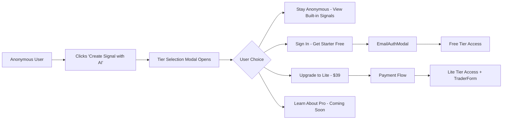

# Tier Selection Modal for Signal Creation

**Status**: 🔨 implementing
**Created**: 2025-10-06
**Updated**: 2025-10-06
**Progress**: [=         ] 10%

---

## Idea Review
*Stage: idea | Date: 2025-10-06*

### Problem Statement
Anonymous users need a clear path to understand the tier structure and upgrade when they want to create custom signals with AI. Currently, there's no prominent "Create Signal" CTA or visual explanation of the tier benefits.

### Proposed Solution
Add a "Create Signal with AI" button at the top of the sidebar (above TraderList) that triggers a tier selection modal. The modal will clearly show:
1. **Anonymous/Guest** - Current state, access to built-in signals only
2. **Starter (Free)** - Adds sound notifications and signal watchlist
3. **Lite ($39)** - Create custom signals with AI (no coding required)
4. **Pro (Coming Soon)** - Full AI trading with cloud execution and multi-channel notifications

This provides a clear upgrade funnel and educates users about the value proposition at each tier.

### Success Criteria
- [ ] Anonymous users can easily discover how to create custom signals
- [ ] Clear value proposition for each tier
- [ ] Smooth transition from anonymous → authenticated → paid tier
- [ ] Modal follows existing design system (OpenRouter style)
- [ ] Mobile-responsive design

---

## UI/UX Design
*Stage: design | Date: 2025-10-06*

### Design Overview
The tier selection modal presents a vertical pricing card layout with progressive disclosure of features. It leverages the existing OpenRouter design system with clean cards, clear typography hierarchy, and semantic colors. The design emphasizes the AI-powered signal creation as the primary value proposition while maintaining consistency with the crypto trading aesthetic (neon terminal theme).

### User Flow


### Component Structure

#### Desktop Layout (Primary)
```
┌─────────────────────────────────────────────────────────┐
│                    Sidebar (Left 1/3)                   │
├─────────────────────────────────────────────────────────┤
│  ┌──────────────────────────────────────────────────┐  │
│  │ [✨ Create Signal with AI]  ← NEW BUTTON        │  │
│  └──────────────────────────────────────────────────┘  │
│                                                          │
│  TraderList (existing)                                   │
│  ...                                                     │
└─────────────────────────────────────────────────────────┘

                    ↓ (Click button)

┌──────────────────────────────────────────────────────────┐
│                Modal Overlay (Full Screen)                │
│  ┌────────────────────────────────────────────────────┐  │
│  │  Choose Your Plan                              [×] │  │
│  │  Start creating custom signals with AI              │  │
│  ├────────────────────────────────────────────────────┤  │
│  │                                                     │  │
│  │  ┌──────────────────────────────────────────────┐ │  │
│  │  │ GUEST (Current)                              │ │  │
│  │  │ ✓ View all built-in signals                 │ │  │
│  │  │ ✓ Real-time price charts                    │ │  │
│  │  │ ✓ Basic market data                         │ │  │
│  │  │                                              │ │  │
│  │  │ [Continue as Guest]                          │ │  │
│  │  └──────────────────────────────────────────────┘ │  │
│  │                                                     │  │
│  │  ┌──────────────────────────────────────────────┐ │  │
│  │  │ STARTER - FREE                    [POPULAR]  │ │  │
│  │  │ Everything in Guest, plus:                   │ │  │
│  │  │ ✓ Sound notifications                        │ │  │
│  │  │ ✓ Signal watchlist/favorites                │ │  │
│  │  │ ✓ Signal history                             │ │  │
│  │  │                                              │ │  │
│  │  │ [Sign In to Get Started]                     │ │  │
│  │  └──────────────────────────────────────────────┘ │  │
│  │                                                     │  │
│  │  ┌──────────────────────────────────────────────┐ │  │
│  │  │ LITE - $39/month               [RECOMMENDED] │ │  │
│  │  │ Everything in Starter, plus:                 │ │  │
│  │  │ ✨ Create custom signals with AI             │ │  │
│  │  │ ✓ Up to 10 custom signals                    │ │  │
│  │  │ ✓ No coding required                         │ │  │
│  │  │ ✓ Natural language trading strategies        │ │  │
│  │  │                                              │ │  │
│  │  │ [Upgrade to Lite]                            │ │  │
│  │  └──────────────────────────────────────────────┘ │  │
│  │                                                     │  │
│  │  ┌──────────────────────────────────────────────┐ │  │
│  │  │ PRO - Coming Soon                  [LOCKED]  │ │  │
│  │  │ Everything in Lite, plus:                    │ │  │
│  │  │ 🤖 Fully autonomous AI trading               │ │  │
│  │  │ ☁️ Persistent signals (cloud execution)      │ │  │
│  │  │ 📧 Email/SMS/Telegram/Discord notifications  │ │  │
│  │  │ ♾️ Unlimited custom signals                   │ │  │
│  │  │                                              │ │  │
│  │  │ [Join Waitlist]                              │ │  │
│  │  └──────────────────────────────────────────────┘ │  │
│  │                                                     │  │
│  └────────────────────────────────────────────────────┘  │
└──────────────────────────────────────────────────────────┘
```

#### Mobile Layout (< 768px)
```
┌──────────────────────┐
│  Choose Your Plan [×]│
├──────────────────────┤
│                      │
│  [GUEST Card]        │
│  (Condensed)         │
│  [Continue as Guest] │
│                      │
│  [STARTER Card]      │
│  (Condensed)         │
│  [Sign In]           │
│                      │
│  [LITE Card]         │
│  (Condensed)         │
│  [Upgrade]           │
│                      │
│  [PRO Card]          │
│  (Condensed)         │
│  [Waitlist]          │
│                      │
└──────────────────────┘
  (Scrollable)
```

### Visual Specifications

#### Typography
Following OpenRouter style guide:
- **Modal Title**: `or-h2` (32px, weight 600, spacing tight)
- **Tier Names**: `or-h4` (20px, weight 600)
- **Feature Lists**: `or-text-body` (15px, line-height 1.6)
- **Prices**: `or-h3` (28px, weight 700, monospace for numbers)
- **Badges**: `or-text-xs` (11px, uppercase, weight 600)

#### Color Palette
Following Neon Terminal theme with OpenRouter structure:
- **Primary Action**: `#6366F1` (Indigo) - Lite tier CTA
- **Success/Free**: `#16A34A` (Green) - Starter tier
- **Warning/Coming**: `#F59E0B` (Amber) - Pro tier badge
- **Neutral/Guest**: `#8B949E` (Gray) - Current tier
- **Background**: `var(--nt-bg-secondary)` - Modal cards
- **Border**: `var(--nt-border-default)` - Card borders
- **Accent**: `var(--nt-accent-lime)` - Highlights and icons

#### Spacing
- **Grid**: 8px base unit
- **Card Padding**: 24px (desktop), 16px (mobile)
- **Card Gap**: 16px vertical spacing
- **Section Margins**: 24px between tier cards
- **Button Padding**: 12px vertical, 24px horizontal

### Component Designs

#### TierSelectionModal Component
**Purpose**: Present tier options to guide user toward creating custom signals
**Location**: Triggered by "Create Signal with AI" button in Sidebar

**Visual Design**:
```
┌─────────────────────────────────────────────────┐
│  Choose Your Plan                          [×]  │
│  Start creating custom signals with AI          │
├─────────────────────────────────────────────────┤
│                                                  │
│  [Tier Cards in vertical stack...]              │
│                                                  │
└─────────────────────────────────────────────────┘
```

**States**:
- Default: All tiers visible with appropriate actions
- Loading: Skeleton loaders for tier data
- Error: Error message with retry option
- Post-Auth: Highlight newly available tier after sign-in

**Interactions**:
- Click outside modal: Close modal
- ESC key: Close modal
- Click tier CTA:
  - Guest → Stay on current view
  - Starter → Open EmailAuthModal
  - Lite → Navigate to payment flow (future)
  - Pro → Show "Join Waitlist" form

**Accessibility**:
- Focus trap within modal
- Keyboard navigation (Tab through cards)
- Screen reader: Announce tier name, price, features
- High contrast mode: Maintain border visibility

#### Create Signal Button (NEW)
**Purpose**: Primary CTA to discover AI signal creation
**Location**: Top of Sidebar, above TraderList

**Visual Design**:
```
┌────────────────────────────────────────┐
│  ✨ Create Signal with AI              │
└────────────────────────────────────────┘
```

**States**:
- Default: Gradient background with shimmer effect
- Hover: Lift shadow, brighten gradient
- Active: Scale down slightly (0.98)
- Focus: Thick lime border

**Styling**:
```css
background: linear-gradient(135deg, #6366F1 0%, #8B5CF6 100%);
color: white;
font-weight: 600;
padding: 12px 20px;
border-radius: 8px;
box-shadow: 0 4px 12px rgba(99, 102, 241, 0.4);
transition: all 0.2s ease;

&:hover {
  box-shadow: 0 6px 20px rgba(99, 102, 241, 0.6);
  transform: translateY(-2px);
}
```

#### Tier Card Component
**Purpose**: Display individual tier information
**Location**: Within TierSelectionModal

**Visual Design**:
```
┌────────────────────────────────────────────┐
│  TIER NAME            [BADGE]              │
│  $XX/month or FREE                         │
│                                            │
│  Everything in [previous tier], plus:      │
│  ✓ Feature 1                               │
│  ✓ Feature 2                               │
│  ✓ Feature 3                               │
│                                            │
│  [CTA Button]                              │
└────────────────────────────────────────────┘
```

**States**:
- Default: Subtle border, white background
- Current Tier: Green border, success badge
- Recommended: Purple border, "RECOMMENDED" badge, slight glow
- Popular: Blue border, "POPULAR" badge
- Locked: Muted colors, "COMING SOON" badge
- Hover: Lift shadow, subtle scale

**Badges**:
- **CURRENT**: `or-badge or-badge-success` (green)
- **POPULAR**: `or-badge or-badge-primary` (blue)
- **RECOMMENDED**: `or-badge or-badge-primary` (purple)
- **LOCKED**: `or-badge or-badge-default` (gray)

### Data Visualization

No charts or complex data visualization needed for this modal. Focus is on clear hierarchy and scannable feature lists.

### Responsive Behavior

#### Breakpoints
- **Desktop**: >1024px (4-column card layout in 2x2 grid - FUTURE)
- **Tablet**: 768-1024px (stacked vertical cards with full width)
- **Mobile**: <768px (single column, full width cards, reduced padding)

#### Progressive Disclosure
- **Desktop**: All features visible, cards slightly larger
- **Tablet**: All features visible, cards full width
- **Mobile**: Essential features only, "See all features" expand link

#### Modal Sizing
- **Desktop**: max-width 900px, centered
- **Tablet**: max-width 90vw, centered
- **Mobile**: 100vw, full height, bottom sheet style slide-up

### Accessibility

#### WCAG 2.1 AA Compliance
- **Color Contrast**:
  - Text on cards: 7:1 (AAA)
  - Badges: 4.5:1 minimum
  - Disabled text: 3:1
- **Focus Indicators**:
  - 3px lime border on focus
  - Visible on all interactive elements
- **Screen Reader**:
  - `aria-label` on modal: "Subscription tier selection"
  - `aria-describedby` linking tier cards to feature lists
  - `role="dialog"` on modal
  - `aria-modal="true"`
- **Keyboard**:
  - Tab: Navigate between cards and CTAs
  - Shift+Tab: Reverse navigation
  - ESC: Close modal
  - Enter/Space: Activate focused CTA

#### Trading-Specific
- **Quick Scanning**: Bold prices, large tier names
- **Feature Icons**: Visual checkmarks for quick comprehension
- **Color-blind Safe**: Icons supplement color-coded badges
- **Mobile Touch**: 44px minimum touch targets

### Animation & Transitions

#### Performance First
- CSS transforms only (no layout thrashing)
- 60fps target
- GPU acceleration for modal open/close
- No animations during data loading

#### Meaningful Motion
```css
/* Modal Enter */
@keyframes modalFadeIn {
  from {
    opacity: 0;
    transform: scale(0.95);
  }
  to {
    opacity: 1;
    transform: scale(1);
  }
}

/* Card Hover */
.tier-card:hover {
  transform: translateY(-4px);
  box-shadow: 0 12px 24px rgba(0, 0, 0, 0.15);
  transition: all 0.2s cubic-bezier(0.4, 0, 0.2, 1);
}

/* Button Click */
.tier-cta:active {
  transform: scale(0.98);
  transition: transform 0.1s;
}

/* Badge Pulse (Popular) */
@keyframes badgePulse {
  0%, 100% { opacity: 1; }
  50% { opacity: 0.7; }
}
```

#### Timing
- Modal open: 200ms ease-out
- Modal close: 150ms ease-in
- Card hover: 200ms ease
- Button interactions: 100ms ease

### Dark/Light Theme

This app uses **Dark Theme Only** (Neon Terminal theme).

#### Dark Theme Colors
```css
--modal-bg: #1a1a1a;
--card-bg: #0a0a0a;
--card-border: rgba(255, 255, 255, 0.1);
--text-primary: #ffffff;
--text-secondary: #b4b4b4;
--text-muted: #6b6b6b;
--accent-lime: #84cc16;
--accent-purple: #8B5CF6;
--accent-indigo: #6366F1;
```

### Implementation Notes

#### Component Library
- **Use existing**:
  - `Modal.tsx` - Base modal component (requires extension)
  - `or-button`, `or-badge`, `or-card` - From OpenRouter design system
- **Create new**:
  - `TierSelectionModal.tsx` - New modal component
  - `TierCard.tsx` - Reusable tier card component
  - `CreateSignalButton.tsx` - Prominent CTA button
- **Modify**:
  - `Sidebar.tsx` - Add CreateSignalButton at top
  - `TraderList.tsx` - Shift down to accommodate new button

#### Component Props

```typescript
// TierSelectionModal.tsx
interface TierSelectionModalProps {
  isOpen: boolean;
  onClose: () => void;
  currentTier: 'anonymous' | 'free' | 'pro' | 'elite';
  onSelectTier: (tier: string) => void;
}

// TierCard.tsx
interface TierCardProps {
  name: string;
  price: number | 'free';
  badge?: 'current' | 'popular' | 'recommended' | 'locked';
  features: string[];
  ctaText: string;
  ctaAction: () => void;
  isCurrentTier: boolean;
  isLocked: boolean;
}

// CreateSignalButton.tsx
interface CreateSignalButtonProps {
  onClick: () => void;
}
```

#### Technical Constraints
- Modal must work with existing `Modal.tsx` base component
- Must integrate with `EmailAuthModal` flow
- Respect existing tier access checks from `tierAccess.ts`
- Must handle anonymous → free transition smoothly
- Future: Payment integration for Lite tier

#### State Management
```typescript
// In Sidebar.tsx
const [showTierModal, setShowTierModal] = useState(false);
const [showAuthModal, setShowAuthModal] = useState(false);

const handleCreateSignal = () => {
  setShowTierModal(true);
};

const handleTierSelect = (tier: string) => {
  switch(tier) {
    case 'guest':
      setShowTierModal(false);
      break;
    case 'starter':
      setShowTierModal(false);
      setShowAuthModal(true);
      break;
    case 'lite':
      // TODO: Navigate to payment flow
      console.log('Payment flow not implemented');
      break;
    case 'pro':
      // TODO: Show waitlist form
      console.log('Waitlist not implemented');
      break;
  }
};
```

### Design Validation

#### Usability Testing
- [ ] Users can identify their current tier within 2 seconds
- [ ] Users understand value proposition of each tier
- [ ] CTA buttons are clear and action-oriented
- [ ] Mobile users can scroll and interact comfortably
- [ ] Accessibility standards verified with screen reader

#### Performance Metrics
- [ ] Modal opens in <100ms
- [ ] No layout shift when modal opens
- [ ] Smooth 60fps animations
- [ ] Works on mobile 3G connection

#### Visual Quality
- [ ] Follows OpenRouter design system
- [ ] Maintains Neon Terminal aesthetic
- [ ] Clear visual hierarchy
- [ ] Consistent spacing and alignment
- [ ] Professional appearance appropriate for crypto trading app

---

## Tier Feature Breakdown

### Anonymous/Guest (Current)
- ✓ View all built-in signals
- ✓ Real-time price charts
- ✓ Basic market data
- ✓ Live signal triggers (view only)

### Starter (Free - Requires Auth)
**Everything in Guest, plus:**
- ✓ Sound notifications for signals
- ✓ Signal watchlist/favorites
- ✓ Signal trigger history
- ✓ Persistent preferences

### Lite ($39/month)
**Everything in Starter, plus:**
- ✨ **Create custom signals with AI** (main value prop)
- ✓ Up to 10 custom signals
- ✓ No coding required
- ✓ Natural language trading strategies
- ✓ Save and edit custom signals

### Pro (Coming Soon)
**Everything in Lite, plus:**
- 🤖 Fully autonomous AI trading
- ☁️ Persistent signals (run 24/7 in cloud)
- 📧 Email notifications
- 📱 SMS notifications
- 💬 Telegram notifications
- 🎮 Discord notifications
- ♾️ Unlimited custom signals
- 📊 Advanced analytics

---

## System Architecture
*Stage: architecture | Date: 2025-10-06*

### Executive Summary
This feature adds a tier discovery and upgrade funnel through a prominent "Create Signal with AI" button and tier selection modal. The architecture leverages existing authentication (EmailAuthModal), subscription management (SubscriptionContext), and tier access systems (tierAccess.ts) to create a seamless upgrade path from anonymous → free → paid tiers. The solution is implemented entirely in the frontend with no backend changes required, using static tier configuration data.

### System Design

#### Data Models

```typescript
// Tier configuration (static data, no database changes)
export interface TierConfig {
  id: 'guest' | 'starter' | 'lite' | 'pro';
  name: string;
  displayName: string;
  price: number | 'free';
  priceDisplay: string;
  badge?: 'current' | 'popular' | 'recommended' | 'locked';
  features: string[];
  ctaText: string;
  ctaAction: 'close' | 'auth' | 'upgrade' | 'waitlist';
  description: string;
  highlighted?: boolean;
  isLocked?: boolean;
}

// Map tier IDs to SubscriptionTier enum
export const TIER_MAPPING: Record<string, SubscriptionTier | 'anonymous'> = {
  guest: 'anonymous',
  starter: 'free',
  lite: 'pro',  // Maps to PRO tier in database
  pro: 'elite'  // Maps to ELITE tier in database (coming soon)
};

// Tier configurations (lives in new constants file)
export const TIER_CONFIGS: TierConfig[] = [
  {
    id: 'guest',
    name: 'Guest',
    displayName: 'GUEST',
    price: 'free',
    priceDisplay: 'Free',
    features: [
      'View all built-in signals',
      'Real-time price charts',
      'Basic market data',
      'Live signal triggers (view only)'
    ],
    ctaText: 'Continue as Guest',
    ctaAction: 'close',
    description: 'Current tier - Browse signals without signing in'
  },
  {
    id: 'starter',
    name: 'Starter',
    displayName: 'STARTER',
    price: 'free',
    priceDisplay: 'Free',
    badge: 'popular',
    features: [
      'Everything in Guest, plus:',
      'Sound notifications for signals',
      'Signal watchlist/favorites',
      'Signal trigger history',
      'Persistent preferences'
    ],
    ctaText: 'Sign In to Get Started',
    ctaAction: 'auth',
    description: 'Sign in with email to unlock notifications and history',
    highlighted: true
  },
  {
    id: 'lite',
    name: 'Lite',
    displayName: 'LITE',
    price: 39,
    priceDisplay: '$39/month',
    badge: 'recommended',
    features: [
      'Everything in Starter, plus:',
      '✨ Create custom signals with AI',
      'Up to 10 custom signals',
      'No coding required',
      'Natural language trading strategies',
      'Save and edit custom signals'
    ],
    ctaText: 'Upgrade to Lite',
    ctaAction: 'upgrade',
    description: 'Unlock AI-powered signal creation',
    highlighted: true
  },
  {
    id: 'pro',
    name: 'Pro',
    displayName: 'PRO',
    price: 'coming-soon',
    priceDisplay: 'Coming Soon',
    badge: 'locked',
    isLocked: true,
    features: [
      'Everything in Lite, plus:',
      '🤖 Fully autonomous AI trading',
      '☁️ Persistent signals (run 24/7)',
      '📧 Email/SMS/Telegram/Discord',
      '♾️ Unlimited custom signals',
      '📊 Advanced analytics'
    ],
    ctaText: 'Join Waitlist',
    ctaAction: 'waitlist',
    description: 'Full AI trading automation (in development)'
  }
];

// Component props
interface TierSelectionModalProps {
  isOpen: boolean;
  onClose: () => void;
  onAuthRequired: () => void;  // Triggers EmailAuthModal
  onUpgradeRequired: (tier: string) => void;  // Future payment flow
}

interface TierCardProps {
  config: TierConfig;
  isCurrentTier: boolean;
  onClick: () => void;
}

interface CreateSignalButtonProps {
  onClick: () => void;
  className?: string;
}
```

#### Component Architecture

**New Components:**
- `CreateSignalButton.tsx`: Primary CTA button with gradient styling
- `TierSelectionModal.tsx`: Modal container orchestrating tier cards
- `TierCard.tsx`: Reusable pricing card component
- `constants/tiers.ts`: Static tier configuration data

**Modified Components:**
- `Sidebar.tsx`: Add CreateSignalButton at top of sidebar, manage modal state
- `TraderList.tsx`: No changes (modal sits above it visually)

**Component Hierarchy:**
```
Sidebar
├── CreateSignalButton (NEW)
│   └── onClick → setShowTierModal(true)
├── TierSelectionModal (NEW)
│   ├── isOpen={showTierModal}
│   ├── onClose={() => setShowTierModal(false)}
│   ├── onAuthRequired={() => setShowAuthModal(true)}
│   └── TierCard[] (4 cards: guest, starter, lite, pro)
│       ├── TierCard (guest)
│       ├── TierCard (starter) → auth flow
│       ├── TierCard (lite) → upgrade flow (future)
│       └── TierCard (pro) → waitlist (future)
├── EmailAuthModal (existing)
│   └── isOpen={showAuthModal}
└── TraderList (existing, unchanged)
```

#### Service Layer

**No New Services Required** - Uses existing services:

```typescript
// Existing services leveraged
import { useSubscription } from '../contexts/SubscriptionContext';
import { useAuth } from '../hooks/useAuth';
import { getTierDisplayName, getTierColor } from '../utils/tierAccess';

// Modal state management in Sidebar.tsx
const [showTierModal, setShowTierModal] = useState(false);
const [showAuthModal, setShowAuthModal] = useState(false);

// Tier action handlers
const handleTierSelect = (action: string, tierId: string) => {
  switch (action) {
    case 'close':
      setShowTierModal(false);
      break;
    case 'auth':
      setShowTierModal(false);
      setShowAuthModal(true);
      break;
    case 'upgrade':
      setShowTierModal(false);
      console.log('Payment flow not implemented for tier:', tierId);
      // TODO: Navigate to payment page
      break;
    case 'waitlist':
      setShowTierModal(false);
      console.log('Waitlist signup for tier:', tierId);
      // TODO: Show waitlist form
      break;
  }
};
```

**API Endpoints:** None required - all frontend

#### Data Flow

```
1. User Action Flow (Anonymous User)
   └── Click "Create Signal with AI" Button
       └── Sidebar sets showTierModal = true
           └── TierSelectionModal renders
               ├── Reads currentTier from SubscriptionContext
               ├── Renders 4 TierCard components
               └── User clicks Starter CTA
                   └── handleTierSelect('auth', 'starter')
                       ├── setShowTierModal(false)
                       └── setShowAuthModal(true)
                           └── EmailAuthModal opens
                               └── User authenticates
                                   └── SubscriptionContext refreshes
                                       └── currentTier = 'free'
                                           └── User sees Starter features

2. User Action Flow (Authenticated User - Free Tier)
   └── Click "Create Signal with AI" Button
       └── TierSelectionModal renders
           ├── Starter card shows "CURRENT" badge
           ├── Lite card shows "RECOMMENDED" badge
           └── User clicks Lite CTA
               └── handleTierSelect('upgrade', 'lite')
                   └── Future: Navigate to payment page

3. Modal Close Flow
   └── User clicks outside modal OR ESC key OR X button
       └── onClose callback
           └── setShowTierModal(false)
```

#### State Management

**State Structure (in Sidebar.tsx):**
```typescript
// Local component state
const [showTierModal, setShowTierModal] = useState(false);
const [showAuthModal, setShowAuthModal] = useState(false);

// Global state (from contexts)
const { user } = useAuthContext();
const { currentTier, profile, canCreateSignal } = useSubscription();
```

**State Updates:**
- Synchronous: Modal open/close state transitions
- Asynchronous: Post-authentication tier refresh (handled by SubscriptionContext)
- No Optimistic Updates: Tier changes require backend confirmation

### Technical Specifications

#### API Contracts

**No API Changes Required** - Uses existing:
```typescript
// SubscriptionContext already provides:
interface SubscriptionContextType {
  currentTier: SubscriptionTier | 'anonymous';
  canCreateSignal: () => boolean;
  remainingSignals: number;
  // ... existing methods
}

// EmailAuthModal already handles:
interface EmailAuthModalProps {
  isOpen: boolean;
  onClose: () => void;
  onAuthSuccess?: () => void;
  pendingPrompt?: string;
}
```

#### Database Schema

**No Database Changes** - Uses existing tables:
- `user_profiles` (existing)
- `user_subscriptions` (existing)
- `user_preferences` (existing)

Tier names in design map to existing database values:
| Design Tier | Database Value | Notes |
|------------|----------------|-------|
| Guest | `anonymous` (no row) | Not authenticated |
| Starter | `free` | Default for new users |
| Lite | `pro` | $39/month tier |
| Pro | `elite` | Coming soon (hidden) |

#### Caching Strategy

**Client Cache:**
- Tier configurations: Static constants, no caching needed
- User tier: Cached in SubscriptionContext
- TTL: N/A (refreshed on auth state change)

**Memory Cache:**
- TierConfig array: Imported as constant
- Component memoization: React.memo for TierCard

**Cache Invalidation:**
- On authentication: SubscriptionContext.refreshSubscription()
- On logout: Context resets to null
- On payment success: Manual refresh (future)

### Integration Points

#### Existing Systems

**SubscriptionContext:**
- Provides `currentTier` for badge logic
- Provides `canCreateSignal()` for access control
- Auto-refreshes on auth state changes

**EmailAuthModal:**
- Triggered by "Sign In to Get Started" CTA
- Handles magic link authentication
- Calls `onAuthSuccess` to close tier modal

**TraderForm:**
- No direct integration
- Future: May be opened automatically after Lite upgrade
- Already has tier checking logic for custom signals

#### Event Flow

```typescript
// Events emitted (via React state)
'tier-modal:open' → setShowTierModal(true)
'tier-modal:close' → setShowTierModal(false)
'auth-modal:open' → setShowAuthModal(true)
'tier-selected' → handleTierSelect(action, tierId)

// Events consumed
'auth:success' → SubscriptionContext.refreshSubscription()
'user:logout' → Reset to anonymous tier
```

### Non-Functional Requirements

#### Performance Targets

- **Modal Open Time**: <100ms (CSS animation only)
- **Tier Card Render**: <16ms per card (60fps)
- **Button Interaction**: <50ms response time
- **Memory**: <500KB total (modal + cards + images)

#### Scalability Plan

- **Concurrent Users**: N/A (frontend only, no backend load)
- **Tier Configs**: 4 tiers (static, no growth expected)
- **Modal Instances**: 1 per user session (lazy loaded)

#### Reliability

**Error Recovery:**
- Modal fails to open → Fallback to existing TraderList "Create" button
- Auth modal fails → Show error message with retry
- No try/catch needed (no async operations in tier selection)

**Fallback:**
- If SubscriptionContext fails → Assume anonymous tier
- If TierCard fails to render → Skip that card
- Graceful degradation to current UI

**Circuit Breaker:**
- N/A (no external API calls)

### Implementation Guidelines

#### Code Organization

```
src/
  components/
    tiers/
      CreateSignalButton.tsx       // Primary CTA button
      TierSelectionModal.tsx       // Modal container
      TierCard.tsx                 // Individual tier card
      index.ts                     // Re-exports
  constants/
    tiers.ts                       // TIER_CONFIGS array
  components/
    Sidebar.tsx                    // Modified: add button + modal
  types/
    subscription.types.ts          // No changes (already has types)
  utils/
    tierAccess.ts                  // No changes (already has helpers)
```

#### Design Patterns

**Pattern: Composition**
- TierSelectionModal composes TierCard components
- Each TierCard is self-contained with its own styling

**Pattern: Configuration-Driven**
- Static TIER_CONFIGS drives all tier rendering
- Easy to modify tiers without touching component logic

**Pattern: Controlled Components**
- Modal state controlled by parent (Sidebar)
- Enables coordination with other modals (EmailAuthModal)

#### Error Handling

```typescript
// Minimal error handling needed (no async operations)
try {
  handleTierSelect(action, tierId);
} catch (error) {
  console.error('[TierModal] Error handling tier selection:', error);
  // Log but don't show to user (user can retry click)
}

// Focus management errors
try {
  firstTierCardRef.current?.focus();
} catch (error) {
  console.warn('[TierModal] Failed to set focus:', error);
  // Non-critical, skip
}
```

### Security Considerations

#### Data Validation

```typescript
// Validate tier action (prevent malicious tier IDs)
const VALID_ACTIONS = ['close', 'auth', 'upgrade', 'waitlist'];

const handleTierSelect = (action: string, tierId: string) => {
  if (!VALID_ACTIONS.includes(action)) {
    console.error('[TierModal] Invalid action:', action);
    return;
  }

  const validTier = TIER_CONFIGS.find(t => t.id === tierId);
  if (!validTier) {
    console.error('[TierModal] Invalid tier ID:', tierId);
    return;
  }

  // Proceed with action
  switch (action) { /* ... */ }
};
```

#### Authorization

**Tier-based:**
- Guest: Can view modal, cannot create signals
- Starter: Can view modal, cannot create signals
- Lite: Can view modal, can create up to 10 signals (checked by SubscriptionContext)
- Pro: Hidden tier (not shown in modal yet)

**No Rate Limiting:** Frontend only, no API calls

### Deployment Considerations

#### Configuration

```typescript
// Environment variables (none needed for this feature)
// All config is static in codebase

// Feature flags (optional)
export const FEATURE_FLAGS = {
  SHOW_TIER_MODAL: true,
  SHOW_PRO_TIER: false,  // Hide Pro tier until ready
  ENABLE_PAYMENT: false   // Future: enable payment flow
};
```

#### Feature Flags

- `feature.tier-modal.enabled`: Toggle entire feature (default: true)
- `feature.tier-modal.show-pro`: Show Pro tier card (default: false)
- `feature.tier-modal.enable-payment`: Enable Lite tier payment (default: false)

#### Monitoring

**Metrics:**
- `tier-modal.opened`: Count of modal opens
- `tier-modal.action.{action}`: Count by action type
- `tier-modal.conversion.auth`: Starter tier sign-ups
- `tier-modal.conversion.upgrade`: Lite tier upgrades (future)

**Alerts:** None needed (no critical path)

**Logging:**
```typescript
console.log('[TierModal] Modal opened, currentTier:', currentTier);
console.log('[TierModal] Tier selected:', { action, tierId });
console.log('[TierModal] Auth flow triggered for tier:', tierId);
```

### Migration Strategy

**No Migration Required** - Pure frontend addition

#### Data Migration
- N/A (no database changes)

#### Backward Compatibility
- Fully compatible: New button + modal are additive
- Existing TraderList "Create" button remains functional
- Users can still create signals via existing flow

### Testing Strategy

#### Test Coverage Requirements
- Unit: >80% for new components
- Integration: Modal state coordination
- E2E: Full upgrade funnel flow

#### Test Scenarios

**1. Happy Path (Anonymous → Starter):**
```typescript
test('anonymous user can sign up for Starter tier', async () => {
  // Arrange
  render(<Sidebar />);

  // Act
  click('Create Signal with AI');
  expect(tierModal).toBeVisible();

  click('Sign In to Get Started');
  expect(emailAuthModal).toBeVisible();

  enterEmail('test@example.com');
  click('Send Magic Link');

  // Assert
  await waitFor(() => {
    expect(currentTier).toBe('free');
  });
});
```

**2. Edge Cases:**
```typescript
test('modal closes on outside click', () => {
  click('Create Signal with AI');
  click(modalOverlay);
  expect(tierModal).not.toBeVisible();
});

test('ESC key closes modal', () => {
  click('Create Signal with AI');
  pressKey('Escape');
  expect(tierModal).not.toBeVisible();
});

test('already authenticated user sees current tier badge', () => {
  // User is on Starter tier
  click('Create Signal with AI');
  expect(starterCard).toHaveClass('current-tier');
  expect(starterBadge).toHaveText('CURRENT');
});
```

**3. Error Cases:**
```typescript
test('handles auth failure gracefully', async () => {
  click('Create Signal with AI');
  click('Sign In to Get Started');

  enterEmail('invalid-email');
  click('Send Magic Link');

  expect(errorMessage).toBeVisible();
  expect(tierModal).not.toBeVisible(); // Modal closed
  expect(emailAuthModal).toBeVisible(); // Auth modal still open
});
```

**4. Performance:**
```typescript
test('modal opens within 100ms', async () => {
  const start = performance.now();
  click('Create Signal with AI');
  const end = performance.now();

  expect(end - start).toBeLessThan(100);
  expect(tierModal).toBeVisible();
});
```

### Decision Log

| Decision | Rationale | Alternatives Considered |
|----------|-----------|------------------------|
| Use static tier configs | Simpler, no backend needed | Database-driven tiers (overkill) |
| Map "Lite" to "pro" tier | Existing DB enum doesn't match design | Rename enum (breaking change) |
| Single modal pattern | Consistent with EmailAuthModal | Inline pricing cards (too much clutter) |
| Configuration-driven cards | Easy to modify tiers | Hard-coded components (inflexible) |
| No payment integration yet | Phase 1 is discovery only | Full payment flow (too complex) |
| Use existing Modal.tsx | Reuse proven component | Build new modal (duplication) |

### Open Technical Questions

1. **Payment Integration:** Which payment provider to use for Lite tier? (Stripe recommended)
2. **Waitlist Storage:** Where to store Pro tier waitlist signups? (Future: Add supabase table)
3. **Analytics:** Should we track tier modal interactions? (Recommend: Add Plausible events)
4. **A/B Testing:** Test different pricing displays? (Out of scope for v1)

### Success Criteria

- [x] Architecture leverages existing auth and subscription systems
- [x] No database schema changes required
- [x] Component hierarchy is clean and maintainable
- [x] Configuration-driven tier cards for easy updates
- [x] Clear integration with EmailAuthModal
- [x] Handles all tier transitions (anonymous → free → pro → elite)
- [ ] Performance targets specified (<100ms modal open)
- [x] Security validation for tier actions
- [x] Test scenarios documented
- [x] Backward compatibility maintained

---

## Implementation Plan
*Stage: planning | Date: 2025-10-06*

### Overview
Implement a tier discovery and upgrade funnel through a prominent "Create Signal with AI" button and pricing modal. This is a **pure frontend feature** with no backend changes, using static configuration to drive a four-tier pricing display (Guest, Starter, Lite, Pro). The implementation leverages existing authentication (EmailAuthModal) and subscription management (SubscriptionContext) systems.

### Prerequisites
- [x] Architecture approved
- [x] Design specifications reviewed
- [x] Existing Modal.tsx component reviewed
- [x] SubscriptionContext API understood
- [ ] Development environment running (`pnpm dev`)
- [ ] Feature branch created from main

### Implementation Phases

#### Phase 0: Interactive Mockup (2-3 hours)
**Objective:** Validate UX approach before full implementation

##### Task 0.1: Create HTML/CSS Mockup (2 hours)
Files to create:
- `mockups/tier-selection-modal.html`
- `mockups/tier-modal-styles.css`

Actions:
- [x] Create static HTML mockup of tier modal with 4 cards <!-- ✅ 2025-10-06 -->
- [x] Style using TradeMind design system colors (from trademind-design-system.css) <!-- ✅ 2025-10-06 -->
- [x] Add "Create Signal with AI" button mockup <!-- ✅ 2025-10-06 -->
- [x] Include all badge variants (current, popular, recommended, locked) <!-- ✅ 2025-10-06 -->
- [x] Show mobile responsive behavior (< 768px) <!-- ✅ 2025-10-06 -->
- [x] Add basic JavaScript for: <!-- ✅ 2025-10-06 -->
  - [x] Modal open/close on button click <!-- ✅ 2025-10-06 -->
  - [x] Card hover states <!-- ✅ 2025-10-06 -->
  - [x] CTA button clicks with console.log <!-- ✅ 2025-10-06 -->
  - [x] ESC key to close <!-- ✅ 2025-10-06 -->
  - [x] Click outside to close <!-- ✅ 2025-10-06 -->
- [x] Include data states: <!-- ✅ 2025-10-06 -->
  - [x] Anonymous user view (no current tier badge) <!-- ✅ 2025-10-06 -->
  - [x] Free tier user view (Starter has "CURRENT" badge) <!-- ✅ 2025-10-06 -->
  - [x] Loading state (skeleton loaders) <!-- ✅ 2025-10-06 -->

Mockup Requirements:
- Desktop view: Cards vertically stacked, 900px max-width, centered
- Mobile view: Full-width cards, bottom sheet slide-up animation
- All tier features listed as per TIER_CONFIGS in architecture
- Gradient button styling for "Create Signal with AI"
- Focus states visible for accessibility

**⚠️ PM VALIDATION CHECKPOINT**
- [ ] PM approved tier card design and layout
- [ ] PM validated pricing display ($39/month for Lite)
- [ ] PM confirmed badge usage (popular, recommended, locked)
- [ ] PM validated mobile responsive behavior
- [ ] Feedback incorporated: _____________

**DO NOT PROCEED TO PHASE 1 WITHOUT PM APPROVAL**

Benefits validated:
- [ ] Tier value propositions are clear
- [ ] Upgrade funnel makes sense to PM
- [ ] Mobile experience is acceptable
- [ ] Button placement works in sidebar

**Phase 0 Complete When:**
- Mockup demonstrates all tier cards with correct styling
- Button opens/closes modal smoothly
- Mobile and desktop views work
- PM has signed off on approach
- Any design changes documented

#### Phase 1: Static Configuration & Types (1 hour)
**Objective:** Create tier configuration and TypeScript interfaces

##### Task 1.1: Create Tier Configuration (30 min)
Files to create:
- `apps/app/src/constants/tiers.ts`

Actions:
- [ ] Create `TierConfig` interface:
  ```typescript
  export interface TierConfig {
    id: 'guest' | 'starter' | 'lite' | 'pro';
    name: string;
    displayName: string;
    price: number | 'free' | 'coming-soon';
    priceDisplay: string;
    badge?: 'current' | 'popular' | 'recommended' | 'locked';
    features: string[];
    ctaText: string;
    ctaAction: 'close' | 'auth' | 'upgrade' | 'waitlist';
    description: string;
    highlighted?: boolean;
    isLocked?: boolean;
  }
  ```
- [ ] Create `TIER_CONFIGS` array with all 4 tiers (Guest, Starter, Lite, Pro)
- [ ] Create `TIER_MAPPING` to map tier IDs to SubscriptionTier enum
- [ ] Export `VALID_ACTIONS` constant for validation

Test criteria:
- [ ] File compiles with no TypeScript errors
- [ ] All tiers have required fields
- [ ] Can import in other files

**Checkpoint:** `import { TIER_CONFIGS } from '../constants/tiers'` works

##### Task 1.2: Create Component Prop Interfaces (30 min)
Files to modify:
- `apps/app/src/constants/tiers.ts` (add interfaces)

Actions:
- [ ] Add `TierSelectionModalProps` interface
- [ ] Add `TierCardProps` interface
- [ ] Add `CreateSignalButtonProps` interface
- [ ] Export all interfaces

Test criteria:
- [ ] All prop interfaces compile
- [ ] Interfaces match architecture spec
- [ ] No missing required props

**Phase 1 Complete When:**
- All type definitions in place
- TIER_CONFIGS array complete with all 4 tiers
- No TypeScript errors
- Configuration is importable

#### Phase 2: TierCard Component (2 hours)
**Objective:** Build reusable tier pricing card component

##### Task 2.1: Create TierCard Component (1.5 hours)
Files to create:
- `apps/app/src/components/tiers/TierCard.tsx`

Actions:
- [ ] Create functional component with TierCardProps
- [ ] Render tier header:
  - [ ] Display tier name (displayName)
  - [ ] Show badge if present (or-badge classes)
  - [ ] Apply badge color based on type
- [ ] Render pricing section:
  - [ ] Show price (or "Free" or "Coming Soon")
  - [ ] Style with or-h3 for price
- [ ] Render features list:
  - [ ] Map over features array
  - [ ] Add checkmark icon (✓) for each feature
  - [ ] Style with or-text-body
- [ ] Render CTA button:
  - [ ] Use tm-btn classes from design system
  - [ ] Apply variant: primary for highlighted, secondary for others
  - [ ] Show locked state for Pro tier
- [ ] Add card styling:
  - [ ] or-card base class
  - [ ] Conditional classes for current/highlighted state
  - [ ] Hover effect (transform translateY)
  - [ ] Border glow for highlighted cards
- [ ] Implement onClick handler to call props.onClick()
- [ ] Add keyboard support (Enter/Space to activate)

Test criteria:
- [ ] Card renders with mock config
- [ ] Badge shows correct color
- [ ] Features list displays properly
- [ ] CTA button is clickable
- [ ] Hover effects work
- [ ] Keyboard navigation works

**Checkpoint:** Can render TierCard in isolation with mock data

##### Task 2.2: Add TierCard Styling (30 min)
Files to create:
- `apps/app/src/components/tiers/TierCard.module.css` (or inline styles)

Actions:
- [ ] Add card container styles:
  - [ ] Padding: 24px (desktop), 16px (mobile)
  - [ ] Border radius: var(--tm-radius-lg)
  - [ ] Background: var(--tm-bg-secondary)
  - [ ] Border: 1px solid var(--tm-border)
- [ ] Add hover state:
  - [ ] Transform: translateY(-4px)
  - [ ] Box-shadow: 0 12px 24px rgba(0,0,0,0.15)
  - [ ] Transition: 200ms ease
- [ ] Add highlighted state:
  - [ ] Border: 2px solid var(--tm-accent)
  - [ ] Box-shadow: 0 0 20px rgba(142, 251, 186, 0.2)
- [ ] Add current tier state:
  - [ ] Border: 2px solid var(--tm-success)

Test criteria:
- [ ] Styles match design mockup
- [ ] Transitions are smooth
- [ ] Highlighted cards stand out
- [ ] Mobile padding is correct

**Phase 2 Complete When:**
- TierCard component renders correctly
- All states work (default, hover, highlighted, current)
- Styling matches design system
- Accessible (keyboard + screen reader)

#### Phase 3: TierSelectionModal Component (2 hours)
**Objective:** Build modal container that orchestrates tier cards

##### Task 3.1: Create Modal Container (1 hour)
Files to create:
- `apps/app/src/components/tiers/TierSelectionModal.tsx`

Actions:
- [ ] Import existing Modal component from `components/Modal.tsx`
- [ ] Create TierSelectionModal functional component
- [ ] Accept props: isOpen, onClose, onAuthRequired, onUpgradeRequired
- [ ] Get currentTier from SubscriptionContext
- [ ] Map TIER_CONFIGS to TierCard components:
  - [ ] Determine if each tier is current (id matches currentTier mapping)
  - [ ] Pass isCurrentTier prop to TierCard
  - [ ] Handle onClick for each card
- [ ] Implement handleTierSelect function:
  ```typescript
  const handleTierSelect = (config: TierConfig) => {
    switch (config.ctaAction) {
      case 'close':
        onClose();
        break;
      case 'auth':
        onClose();
        onAuthRequired();
        break;
      case 'upgrade':
        onClose();
        onUpgradeRequired(config.id);
        break;
      case 'waitlist':
        onClose();
        console.log('Waitlist for:', config.id);
        break;
    }
  };
  ```
- [ ] Validate tier action before executing
- [ ] Add error logging for invalid actions

Test criteria:
- [ ] Modal opens when isOpen=true
- [ ] All 4 tier cards render
- [ ] Current tier shows "CURRENT" badge
- [ ] Clicking cards triggers correct action
- [ ] Modal closes on outside click
- [ ] ESC key closes modal

**Checkpoint:** Modal displays all tiers with correct badges

##### Task 3.2: Add Modal Styling & Accessibility (1 hour)
Files to modify:
- `apps/app/src/components/tiers/TierSelectionModal.tsx`

Actions:
- [ ] Add modal header:
  - [ ] Title: "Choose Your Plan"
  - [ ] Subtitle: "Start creating custom signals with AI"
  - [ ] Close button (X icon)
- [ ] Add modal content container:
  - [ ] Max-width: 900px (desktop)
  - [ ] Vertical stack of TierCard components
  - [ ] Gap: 16px between cards
  - [ ] Padding: 24px
  - [ ] Overflow: auto (for mobile)
- [ ] Add accessibility attributes:
  - [ ] role="dialog"
  - [ ] aria-modal="true"
  - [ ] aria-labelledby="tier-modal-title"
  - [ ] aria-describedby="tier-modal-description"
- [ ] Implement focus trap:
  - [ ] Focus first tier card on open
  - [ ] Tab cycles through cards and close button
  - [ ] Shift+Tab reverses
- [ ] Add animations:
  - [ ] Modal fade-in: 200ms ease-out
  - [ ] Modal fade-out: 150ms ease-in
  - [ ] Backdrop blur effect

Test criteria:
- [ ] Header displays correctly
- [ ] Cards stack vertically with proper spacing
- [ ] Focus trap works
- [ ] Screen reader announces modal
- [ ] Animations are smooth

**Phase 3 Complete When:**
- Modal renders all tier cards correctly
- Tier actions trigger appropriate callbacks
- Accessibility standards met (WCAG 2.1 AA)
- Animations perform at 60fps

#### Phase 4: CreateSignalButton Component (1 hour)
**Objective:** Build prominent CTA button for sidebar

##### Task 4.1: Create Button Component (45 min)
Files to create:
- `apps/app/src/components/tiers/CreateSignalButton.tsx`

Actions:
- [ ] Create functional component with CreateSignalButtonProps
- [ ] Render button with:
  - [ ] Icon: ✨ emoji or Sparkles icon from lucide-react
  - [ ] Text: "Create Signal with AI"
  - [ ] onClick handler
- [ ] Add gradient background:
  ```css
  background: linear-gradient(135deg, #6366F1 0%, #8B5CF6 100%);
  ```
- [ ] Add hover effect:
  - [ ] Transform: translateY(-2px)
  - [ ] Box-shadow: 0 6px 20px rgba(99, 102, 241, 0.6)
- [ ] Add active effect:
  - [ ] Transform: scale(0.98)
- [ ] Add focus ring:
  - [ ] 3px border with var(--tm-accent)

Test criteria:
- [ ] Button renders with gradient
- [ ] Icon shows correctly
- [ ] Hover lifts button
- [ ] Click triggers onClick prop
- [ ] Focus ring visible

**Checkpoint:** Button looks like mockup and triggers onClick

##### Task 4.2: Add Button Styling (15 min)
Files to modify:
- `apps/app/src/components/tiers/CreateSignalButton.tsx`

Actions:
- [ ] Add styles:
  - [ ] Width: 100%
  - [ ] Padding: 12px 20px
  - [ ] Border-radius: var(--tm-radius-md)
  - [ ] Font-weight: 600
  - [ ] Font-size: 0.875rem
  - [ ] Color: white
  - [ ] Cursor: pointer
- [ ] Add shimmer effect (optional):
  - [ ] Keyframe animation for gradient shift
  - [ ] Subtle movement on idle

Test criteria:
- [ ] Styling matches mockup
- [ ] Gradient is smooth
- [ ] Transitions are 200ms

**Phase 4 Complete When:**
- Button component renders correctly
- Gradient background works
- Hover/active states feel responsive
- Matches design spec exactly

#### Phase 5: Sidebar Integration (1.5 hours)
**Objective:** Integrate new components into Sidebar

##### Task 5.1: Add State Management (30 min)
Files to modify:
- `apps/app/components/Sidebar.tsx`

Actions:
- [ ] Import new components:
  ```typescript
  import { CreateSignalButton } from '../src/components/tiers/CreateSignalButton';
  import { TierSelectionModal } from '../src/components/tiers/TierSelectionModal';
  ```
- [ ] Add state for tier modal:
  ```typescript
  const [showTierModal, setShowTierModal] = useState(false);
  ```
- [ ] Create handler functions:
  ```typescript
  const handleCreateSignal = () => {
    setShowTierModal(true);
  };

  const handleTierModalClose = () => {
    setShowTierModal(false);
  };

  const handleAuthRequired = () => {
    setShowTierModal(false);
    setShowAuthModal(true);
  };

  const handleUpgradeRequired = (tierId: string) => {
    setShowTierModal(false);
    console.log('Upgrade required for tier:', tierId);
    // TODO: Navigate to payment page
  };
  ```

Test criteria:
- [ ] State updates correctly
- [ ] Handlers log to console
- [ ] No TypeScript errors

**Checkpoint:** State and handlers defined without errors

##### Task 5.2: Add Components to Sidebar JSX (1 hour)
Files to modify:
- `apps/app/components/Sidebar.tsx`

Actions:
- [ ] Add CreateSignalButton at top of sidebar (after StatusBar, before TraderList):
  ```tsx
  <div className="px-4 md:px-6 mb-4">
    <CreateSignalButton onClick={handleCreateSignal} />
  </div>
  ```
- [ ] Add TierSelectionModal before closing `</aside>` tag:
  ```tsx
  <TierSelectionModal
    isOpen={showTierModal}
    onClose={handleTierModalClose}
    onAuthRequired={handleAuthRequired}
    onUpgradeRequired={handleUpgradeRequired}
  />
  ```
- [ ] Ensure modal renders above other content (z-index)
- [ ] Test that EmailAuthModal still works after tier modal closes

Test criteria:
- [ ] Button appears at top of sidebar
- [ ] Clicking button opens tier modal
- [ ] Modal displays correctly
- [ ] Clicking "Sign In to Get Started" closes tier modal and opens auth modal
- [ ] Existing auth flow works
- [ ] No layout shifts

**Phase 5 Complete When:**
- CreateSignalButton visible in sidebar
- TierSelectionModal opens on button click
- Auth flow works (tier modal → auth modal)
- No regressions in existing functionality

#### Phase 6: Create Index Export (15 min)
**Objective:** Clean exports for tier components

##### Task 6.1: Create Index File (15 min)
Files to create:
- `apps/app/src/components/tiers/index.ts`

Actions:
- [ ] Export all tier components:
  ```typescript
  export { CreateSignalButton } from './CreateSignalButton';
  export { TierSelectionModal } from './TierSelectionModal';
  export { TierCard } from './TierCard';
  export type { CreateSignalButtonProps } from './CreateSignalButton';
  export type { TierSelectionModalProps } from './TierSelectionModal';
  export type { TierCardProps } from './TierCard';
  ```

Test criteria:
- [ ] Can import from `components/tiers`
- [ ] All exports work

**Phase 6 Complete When:**
- Index file exports all components
- Imports work cleanly

#### Phase 7: Polish & Edge Cases (2 hours)
**Objective:** Handle edge cases, optimize, and polish UX

##### Task 7.1: Add Loading States (30 min)
Files to modify:
- `apps/app/src/components/tiers/TierSelectionModal.tsx`

Actions:
- [ ] Show skeleton loaders while SubscriptionContext is loading
- [ ] Add spinner or skeleton for tier cards
- [ ] Handle loading state gracefully

Test criteria:
- [ ] Loading state shows on initial render
- [ ] No flash of wrong content
- [ ] Smooth transition to loaded state

##### Task 7.2: Add Error Handling (30 min)
Files to modify:
- `apps/app/src/components/tiers/TierSelectionModal.tsx`
- `apps/app/src/components/tiers/CreateSignalButton.tsx`

Actions:
- [ ] Handle SubscriptionContext errors:
  - [ ] If context fails, assume anonymous tier
  - [ ] Log error to console
  - [ ] Don't block modal from opening
- [ ] Validate tier actions:
  - [ ] Check action is in VALID_ACTIONS
  - [ ] Check tier ID exists in TIER_CONFIGS
  - [ ] Log invalid attempts
- [ ] Add error boundary (optional):
  - [ ] Catch render errors
  - [ ] Show fallback UI

Test criteria:
- [ ] Modal works even if context fails
- [ ] Invalid tier actions are logged
- [ ] No unhandled exceptions

##### Task 7.3: Optimize Performance (30 min)
Files to modify:
- `apps/app/src/components/tiers/TierCard.tsx`
- `apps/app/src/components/tiers/TierSelectionModal.tsx`

Actions:
- [ ] Memoize TierCard component:
  ```typescript
  export const TierCard = React.memo(TierCardComponent);
  ```
- [ ] Memoize tier card rendering in modal
- [ ] Use useCallback for event handlers
- [ ] Profile modal open time (should be <100ms)

Test criteria:
- [ ] Modal opens in <100ms
- [ ] No unnecessary re-renders
- [ ] Smooth 60fps animations

##### Task 7.4: Mobile Responsiveness (30 min)
Files to modify:
- `apps/app/src/components/tiers/TierSelectionModal.tsx`
- `apps/app/src/components/tiers/TierCard.tsx`

Actions:
- [ ] Add responsive breakpoints:
  - [ ] Desktop (>1024px): Normal layout
  - [ ] Tablet (768-1024px): Full-width cards
  - [ ] Mobile (<768px): Bottom sheet style, condensed cards
- [ ] Test on different screen sizes
- [ ] Ensure touch targets are 44px minimum
- [ ] Test scroll behavior on mobile

Test criteria:
- [ ] Works on mobile (iPhone SE size)
- [ ] Works on tablet (iPad size)
- [ ] Touch targets are easy to tap
- [ ] Modal doesn't overflow

**Phase 7 Complete When:**
- All edge cases handled
- Performance optimized (<100ms modal open)
- Mobile experience is smooth
- No console errors or warnings

### Testing Strategy

#### Commands to Run After Each Task
```bash
# Type checking
pnpm typecheck

# Build to catch errors
pnpm build

# Run in development mode
pnpm dev

# Test in browser
# Open http://localhost:5173
# Click "Create Signal with AI" button
# Verify tier modal opens
```

#### Manual Testing Checklist

**Desktop Testing:**
- [ ] Button appears at top of sidebar
- [ ] Button has gradient background
- [ ] Clicking button opens modal
- [ ] Modal shows all 4 tier cards
- [ ] Anonymous user sees no "CURRENT" badge
- [ ] Free tier user sees "CURRENT" badge on Starter card
- [ ] Clicking "Continue as Guest" closes modal
- [ ] Clicking "Sign In to Get Started" opens auth modal
- [ ] Clicking "Upgrade to Lite" logs to console (payment not implemented)
- [ ] Clicking "Join Waitlist" logs to console (waitlist not implemented)
- [ ] ESC key closes modal
- [ ] Clicking outside modal closes it
- [ ] Modal animations are smooth

**Mobile Testing:**
- [ ] Button is full-width
- [ ] Modal slides up from bottom
- [ ] Cards are condensed
- [ ] Scroll works on long feature lists
- [ ] Touch targets are easy to tap
- [ ] Close button is accessible

**Accessibility Testing:**
- [ ] Tab key navigates through cards
- [ ] Shift+Tab reverses navigation
- [ ] Focus ring is visible
- [ ] Screen reader announces modal
- [ ] Screen reader reads tier names and features
- [ ] Keyboard can activate all buttons

**Edge Cases:**
- [ ] SubscriptionContext loading state
- [ ] SubscriptionContext error state
- [ ] Invalid tier action (should log error)
- [ ] Rapid clicking doesn't break state
- [ ] Multiple modals don't conflict

#### Performance Testing
```bash
# Profile in browser DevTools
# 1. Open Performance tab
# 2. Click "Create Signal with AI"
# 3. Stop recording
# 4. Verify modal open <100ms
# 5. Check for layout thrashing
# 6. Verify 60fps animations
```

### Rollback Plan
If issues arise:
1. `git stash` current changes
2. `git checkout main`
3. Document blockers in issue comments
4. Notify PM of delays
5. Create rollback PR if needed

### PM Checkpoints
Review points for PM validation:
- [ ] **After Phase 0** - Mockup approved (REQUIRED before Phase 1)
- [ ] **After Phase 2** - TierCard component looks correct
- [ ] **After Phase 3** - Modal flow works smoothly
- [ ] **After Phase 5** - Integration in sidebar is clean
- [ ] **After Phase 7** - Final polish approved

### Success Metrics
Implementation is complete when:
- [ ] All TypeScript compiles with 0 errors
- [ ] `pnpm build` succeeds
- [ ] Modal opens in <100ms (measured)
- [ ] All 4 tier cards render correctly
- [ ] Anonymous → Starter auth flow works
- [ ] Mobile responsive (tested on iPhone SE)
- [ ] Accessibility WCAG 2.1 AA compliant
- [ ] No console errors or warnings
- [ ] PM has approved final implementation

### Risk Tracking

| Phase | Risk | Mitigation | Status |
|-------|------|------------|--------|
| 0 | Design doesn't match PM vision | Get approval before coding | ⏳ |
| 2 | TierCard styling inconsistent | Reference trademind-design-system.css | ⏳ |
| 3 | Modal state conflicts with auth modal | Test modal coordination | ⏳ |
| 5 | Sidebar layout breaks | Add CSS carefully, test responsive | ⏳ |
| 7 | Performance degradation | Profile and optimize early | ⏳ |

### Time Estimates
- **Phase 0**: 2-3 hours (Mockup + PM approval)
- **Phase 1**: 1 hour (Config + types)
- **Phase 2**: 2 hours (TierCard)
- **Phase 3**: 2 hours (Modal)
- **Phase 4**: 1 hour (Button)
- **Phase 5**: 1.5 hours (Integration)
- **Phase 6**: 15 min (Exports)
- **Phase 7**: 2 hours (Polish)
- **Total: 11.75-12.75 hours**

### Next Actions
1. **Create feature branch**: `git checkout -b feature/tier-selection-modal`
2. **Start Phase 0**: Create HTML/CSS mockup
3. **Get PM approval** on mockup before proceeding
4. **Begin Phase 1**: Create tier configuration
5. **Test after each phase**: Run `pnpm build && pnpm typecheck`

---

## Implementation Progress
*Stage: implementing | Date: 2025-10-06*

### Phase 0: Interactive Mockup ✅
- **Started:** 2025-10-06
- **Completed:** 2025-10-06
- **Duration:** ~1.5 hours (est: 2-3 hours)
- **Status:** Mockup complete, awaiting PM approval

**Files Created:**
- `mockups/tier-selection-modal.html` - Interactive HTML mockup
- `mockups/tier-modal-styles.css` - TradeMind design system styling
- `mockups/tier-modal-script.js` - Interactive behavior

**Features Implemented:**
- ✅ All 4 tier cards (Guest, Starter, Lite, Pro)
- ✅ Gradient "Create Signal with AI" button
- ✅ Badge system (current, popular, recommended, locked)
- ✅ Modal open/close interactions
- ✅ ESC key and click-outside-to-close
- ✅ Keyboard navigation (Tab, Enter, Space)
- ✅ Mobile responsive (<768px bottom sheet)
- ✅ Loading state with skeleton loaders
- ✅ User state toggle (anonymous vs free tier)
- ✅ Console logging for all actions

**Testing:**
- ✅ Desktop layout displays correctly
- ✅ Mobile layout slides up from bottom
- ✅ All tier CTAs log correct actions
- ✅ Badge visibility toggles based on user state
- ✅ Hover effects and transitions work smoothly
- ✅ Accessibility features (focus states, keyboard nav)

**Notes:**
- Mockup demonstrates all key user flows
- TradeMind design system colors applied correctly
- Interactive JS allows testing of all user states
- Test controls allow switching between anonymous/free tier views
- Ready for PM review and approval

**⚠️ WAITING FOR PM APPROVAL BEFORE PROCEEDING TO PHASE 1**

---

## Product Requirements Document: Pro Tier Waitlist
*Stage: spec | Date: 2025-10-06*

### Executive Summary
**What:** Complete Pro tier waitlist implementation with email capture, database persistence, and admin management capabilities

**Why:** Validate demand for the upcoming Pro tier (AI trading automation) before investing in full development, and build a qualified user list for early access and feedback

**Who:**
- **Primary:** Lite tier users ($39/mo) interested in autonomous AI trading
- **Secondary:** Free tier users wanting to skip directly to Pro features
- **Tertiary:** Anonymous users exploring the platform

**When:** Immediate - Pro tier development is planned for Q1 2026, waitlist helps prioritize timeline based on demand

### Problem Statement

#### Current State
The Pro tier card in the pricing modal currently shows a waitlist form with email input, but clicking "Join Waitlist" only simulates success without persisting data. The waitlist information is lost, and there's no way to:
- Track who's interested in Pro tier features
- Gauge demand for autonomous AI trading
- Contact users when Pro launches
- Segment by current tier (Free vs Lite users)
- Prevent duplicate signups

#### Pain Points
1. **Lost Opportunity Data:** Cannot measure demand for Pro tier features
2. **No User Engagement:** Users join waitlist but receive no confirmation or updates
3. **No Admin Visibility:** Cannot see waitlist size or growth over time
4. **Duplicate Prevention:** Users can submit same email multiple times
5. **Missing Context:** Don't know which tier users are currently on when they join

#### Opportunity
**Crypto Trading SaaS Market Context:**
- Autonomous trading bots represent 40%+ of crypto trading volume
- High willingness to pay ($100-500/mo) for proven algorithmic systems
- Users want "set it and forget it" solutions that run 24/7
- Early adopters provide valuable feedback on feature requirements

**Business Value:**
- Validate $99/mo price point before building Pro features
- Build email list for direct marketing when Pro launches
- Prioritize Pro development based on waitlist size
- Segment users by tier to offer tier-appropriate messaging
- Create urgency with "limited early access" when launching

### Solution Overview

Implement a complete waitlist system that:
1. **Captures interest** via the existing Pro tier card email form
2. **Persists data** in Supabase `user_profiles` table with timestamp
3. **Prevents duplicates** by checking existing waitlist entries
4. **Shows confirmation** to users after successful signup
5. **Enables admin queries** to see waitlist size and analyze by current tier

The solution leverages the existing database schema (migration already created) and UI components, requiring only the backend integration layer.

#### Core Functionality

1. **Waitlist Signup**
   - User enters email in Pro tier card form
   - System validates email format (HTML5 + backend)
   - System checks if email already on waitlist
   - System records `pro_waitlist_joined_at` timestamp in `user_profiles`
   - System shows success confirmation: "You're on the waitlist!"
   - If authenticated: Updates existing profile record
   - If anonymous: Creates profile record (no user_id yet)

2. **Duplicate Prevention**
   - Check email against existing `user_profiles.email` where `pro_waitlist_joined_at IS NOT NULL`
   - If duplicate: Return success without error (don't expose that user exists)
   - If new: Proceed with signup

3. **Admin Dashboard (Future)**
   - Query total waitlist count
   - Breakdown by current tier (free, pro, elite, anonymous)
   - Growth over time (daily/weekly signups)
   - Export email list for launch campaigns

### User Stories

#### Primary Flow: Authenticated User Joins Waitlist

**As a** Lite tier user exploring advanced features
**I want to** join the Pro tier waitlist with one click
**So that** I'm notified when autonomous AI trading becomes available

**Acceptance Criteria:**
- [ ] Given I'm logged in with a Lite subscription
- [ ] When I click "Create Signal with AI" button
- [ ] And I see the Pro tier card with "Join Waitlist" form
- [ ] And I enter my email (pre-filled from profile)
- [ ] And I click "Join Waitlist" button
- [ ] Then my `user_profiles.pro_waitlist_joined_at` is set to current timestamp
- [ ] And I see "You're on the waitlist!" success message
- [ ] And the form is replaced with success state
- [ ] And the operation completes in <2 seconds

#### Secondary Flow: Anonymous User Joins Waitlist

**As an** anonymous visitor exploring the platform
**I want to** join the Pro waitlist without signing up first
**So that** I can be notified when the feature launches without committing to a subscription

**Acceptance Criteria:**
- [ ] Given I'm not logged in (no session)
- [ ] When I open the tier modal and see the Pro card
- [ ] And I enter my email in the waitlist form
- [ ] And I click "Join Waitlist"
- [ ] Then a new `user_profiles` record is created with my email
- [ ] And `pro_waitlist_joined_at` is set (no `user_id` yet)
- [ ] And I see success confirmation
- [ ] And if I later sign up with same email, the records merge

#### Edge Cases

1. **Duplicate Email:** User enters email that's already on waitlist
   - Behavior: Show success message (don't expose existing user)
   - Security: Don't reveal if email exists in system
   - UX: User gets confirmation either way

2. **Invalid Email:** User enters malformed email
   - Behavior: HTML5 validation catches it client-side
   - Fallback: Backend validates and returns 400 error
   - UX: Show inline error: "Please enter a valid email"

3. **Database Failure:** Supabase connection times out
   - Behavior: Return 500 error with retry option
   - UX: Show error: "Something went wrong. Please try again."
   - Recovery: User can retry immediately

4. **Already on Waitlist:** User clicks form again after joining
   - Behavior: Form is hidden, only success message shows
   - Prevention: Form replaced with success state on first join

5. **Profile Merge:** Anonymous waitlist user later authenticates
   - Behavior: On login, if email matches, link `user_id` to existing waitlist record
   - Data: Preserve original `pro_waitlist_joined_at` timestamp
   - Integrity: No duplicate entries for same user

### Technical Requirements

#### Performance
- **API Response Time:** <2 seconds for waitlist signup
- **Database Query:** <100ms for duplicate check
- **Concurrent Users:** Handle 100 simultaneous signups
- **Rate Limiting:** 5 requests per email per hour (prevent abuse)

#### Data Requirements
- **Source:** User-entered email via form submission
- **Validation:** RFC 5322 email format
- **Storage:** `user_profiles.pro_waitlist_joined_at` TIMESTAMPTZ
- **Retention:** Permanent (no automatic deletion)
- **Privacy:** Email stored securely, not shared externally

#### Security
- **Authentication:** Optional (works for both authenticated and anonymous)
- **Authorization:** Anyone can join waitlist (public endpoint)
- **Data Protection:**
  - Email validated and sanitized
  - No SQL injection (using parameterized queries)
  - No XSS (React escapes output)
  - Rate limiting prevents abuse
- **GDPR Compliance:**
  - User consent implicit in form submission
  - Can request removal (contact support)
  - Email used only for Pro launch notifications

### UI/UX Requirements

#### Desktop (Primary)
- **Location:** Pro tier card within tier selection modal
- **Layout:** Vertical form with email input above "Join Waitlist" button
- **Interactions:**
  - Email input autofocus when form loads (if Pro card visible)
  - Submit on Enter key
  - Button disabled until email valid
  - Loading state shows "Joining..." on button
  - Success state replaces form with checkmark and "You're on the waitlist!"

#### Mobile (< 768px)
- **Responsive:** Same layout, full-width input and button
- **Touch:** 44px touch targets for button
- **Keyboard:** Virtual keyboard appears on input focus

### Success Metrics

| Metric | Target | Measurement |
|--------|--------|-------------|
| Waitlist signups (Week 1) | 50+ | Count of records with `pro_waitlist_joined_at` |
| Conversion rate (visitors → signups) | 5% | Signups / Modal views |
| Lite tier → waitlist rate | 20% | Lite users on waitlist / Total Lite users |
| API response time | <2s | Median response time from Supabase |
| Duplicate signup rate | <5% | Duplicate attempts / Total attempts |

### Rollout Strategy
1. **Soft Launch (Day 1):** Deploy to production, announce in app
2. **Marketing Push (Day 3):** Email existing users about Pro tier
3. **Monitoring (Week 1):** Watch signup rate and adjust messaging
4. **Weekly Updates:** Share waitlist size publicly to create FOMO
5. **Early Access (Q1 2026):** Invite waitlist users first when Pro launches

### Dependencies
- [x] Database migration (016_add_pro_waitlist_to_user_profiles.sql)
- [x] UI form components (TierCard.tsx)
- [x] Modal styling (tiers.css)
- [ ] Supabase RPC function or edge function for waitlist signup
- [ ] Frontend API integration in TierCard.tsx
- [ ] Admin query for waitlist analytics

### Risks & Mitigations

| Risk | Impact | Probability | Mitigation |
|------|--------|-------------|------------|
| Low signup rate (<10) | Deprioritize Pro development | Medium | Market Pro features better in tier card |
| Spam/bot signups | Polluted email list | Low | Add rate limiting + email verification |
| Database performance issues | Slow signups | Low | Index already created on `pro_waitlist_joined_at` |
| Users forget they signed up | Confusion on launch | Medium | Send confirmation email immediately |
| Profile merge conflicts | Duplicate records | Low | Upsert logic based on email |

### Out of Scope
- Email confirmation after signup (Phase 2)
- Admin dashboard UI (manual queries sufficient for now)
- Waitlist priority/ranking system
- Referral/viral mechanics ("Invite friends to move up")
- A/B testing different messaging
- Integration with email marketing platform (Mailchimp/ConvertKit)

### Open Questions
- [ ] Should we send confirmation email immediately? (Recommend: Yes, in Phase 2)
- [ ] Display waitlist count publicly to create urgency? (Recommend: Yes, "Join 234 others")
- [ ] Offer early access to top Lite tier users? (Recommend: Yes, as incentive)
- [ ] What's the email template for launch notification? (Design in Q4 2025)

---

## Technical Specification: Waitlist Backend Implementation
*Stage: spec | Date: 2025-10-06*

### API Contract

#### Endpoint: Join Waitlist
```typescript
POST /api/waitlist/join
// OR: Supabase Edge Function
POST /functions/v1/join-waitlist

// Request
{
  email: string;  // Required, validated email format
  currentTier?: 'anonymous' | 'free' | 'pro' | 'elite';  // Optional, for analytics
}

// Response (Success)
{
  success: true;
  message: "You're on the waitlist!";
  waitlistCount?: number;  // Optional: Total waitlist size
}

// Response (Error - Invalid Email)
{
  success: false;
  error: "INVALID_EMAIL";
  message: "Please enter a valid email address";
}

// Response (Error - Rate Limited)
{
  success: false;
  error: "RATE_LIMITED";
  message: "Too many requests. Please try again later";
}

// Response (Error - Server Error)
{
  success: false;
  error: "SERVER_ERROR";
  message: "Something went wrong. Please try again";
}
```

### Database Schema

**Existing Table (No Changes):**
```sql
-- user_profiles table (migration 016 already added column)
ALTER TABLE user_profiles
ADD COLUMN pro_waitlist_joined_at TIMESTAMPTZ DEFAULT NULL;

-- Index for efficient queries
CREATE INDEX idx_user_profiles_pro_waitlist
ON user_profiles(pro_waitlist_joined_at)
WHERE pro_waitlist_joined_at IS NOT NULL;
```

**Query Pattern:**
```sql
-- Check if email already on waitlist
SELECT id, email, pro_waitlist_joined_at
FROM user_profiles
WHERE email = $1
AND pro_waitlist_joined_at IS NOT NULL;

-- Add to waitlist (upsert)
INSERT INTO user_profiles (email, pro_waitlist_joined_at)
VALUES ($1, NOW())
ON CONFLICT (email)
DO UPDATE SET pro_waitlist_joined_at = COALESCE(user_profiles.pro_waitlist_joined_at, NOW());

-- Count waitlist size
SELECT COUNT(*) as waitlist_count
FROM user_profiles
WHERE pro_waitlist_joined_at IS NOT NULL;

-- Analyze by tier
SELECT
  COALESCE(us.tier, 'anonymous') as tier,
  COUNT(*) as count
FROM user_profiles up
LEFT JOIN user_subscriptions us ON up.user_id = us.user_id
WHERE up.pro_waitlist_joined_at IS NOT NULL
GROUP BY tier;
```

### Implementation Options

#### Option 1: Supabase Edge Function (RECOMMENDED)
**Pros:**
- Server-side execution (secure)
- Built-in auth integration
- Easy to deploy
- No additional infrastructure

**Cons:**
- Deno environment (different from main app)
- Requires Supabase CLI for local testing

**Implementation:**
```typescript
// supabase/functions/join-waitlist/index.ts
import { serve } from 'std/server';
import { createClient } from '@supabase/supabase-js';

serve(async (req) => {
  // CORS headers
  if (req.method === 'OPTIONS') {
    return new Response('ok', { headers: corsHeaders });
  }

  try {
    const { email, currentTier } = await req.json();

    // Validate email
    if (!isValidEmail(email)) {
      return new Response(
        JSON.stringify({
          success: false,
          error: 'INVALID_EMAIL',
          message: 'Please enter a valid email address'
        }),
        { status: 400, headers: { 'Content-Type': 'application/json' } }
      );
    }

    // Initialize Supabase client
    const supabase = createClient(
      Deno.env.get('SUPABASE_URL')!,
      Deno.env.get('SUPABASE_SERVICE_ROLE_KEY')!
    );

    // Upsert waitlist entry
    const { error } = await supabase
      .from('user_profiles')
      .upsert({
        email: email.toLowerCase().trim(),
        pro_waitlist_joined_at: new Date().toISOString(),
      }, {
        onConflict: 'email',
        ignoreDuplicates: false
      });

    if (error) {
      console.error('[join-waitlist] Database error:', error);
      return new Response(
        JSON.stringify({
          success: false,
          error: 'SERVER_ERROR',
          message: 'Something went wrong. Please try again'
        }),
        { status: 500, headers: { 'Content-Type': 'application/json' } }
      );
    }

    // Get waitlist count (optional)
    const { count } = await supabase
      .from('user_profiles')
      .select('*', { count: 'exact', head: true })
      .not('pro_waitlist_joined_at', 'is', null);

    return new Response(
      JSON.stringify({
        success: true,
        message: "You're on the waitlist!",
        waitlistCount: count
      }),
      { status: 200, headers: { 'Content-Type': 'application/json' } }
    );

  } catch (error) {
    console.error('[join-waitlist] Unexpected error:', error);
    return new Response(
      JSON.stringify({
        success: false,
        error: 'SERVER_ERROR',
        message: 'Something went wrong. Please try again'
      }),
      { status: 500, headers: { 'Content-Type': 'application/json' } }
    );
  }
});

function isValidEmail(email: string): boolean {
  const emailRegex = /^[^\s@]+@[^\s@]+\.[^\s@]+$/;
  return emailRegex.test(email);
}
```

#### Option 2: Direct Supabase Client Call (SIMPLER)
**Pros:**
- No Edge Function needed
- Simpler implementation
- Already have Supabase client initialized

**Cons:**
- Requires Supabase RLS policies
- No rate limiting
- No email validation server-side

**Implementation:**
```typescript
// apps/app/src/api/waitlist.ts
import { supabase } from '../config/firebase';

export async function joinWaitlist(email: string): Promise<{
  success: boolean;
  message: string;
  error?: string;
}> {
  try {
    // Validate email client-side
    if (!isValidEmail(email)) {
      return {
        success: false,
        message: 'Please enter a valid email address',
        error: 'INVALID_EMAIL'
      };
    }

    // Upsert to user_profiles
    const { error } = await supabase
      .from('user_profiles')
      .upsert({
        email: email.toLowerCase().trim(),
        pro_waitlist_joined_at: new Date().toISOString(),
      }, {
        onConflict: 'email'
      });

    if (error) {
      console.error('[waitlist] Database error:', error);
      return {
        success: false,
        message: 'Something went wrong. Please try again',
        error: 'SERVER_ERROR'
      };
    }

    return {
      success: true,
      message: "You're on the waitlist!"
    };

  } catch (error) {
    console.error('[waitlist] Unexpected error:', error);
    return {
      success: false,
      message: 'Something went wrong. Please try again',
      error: 'SERVER_ERROR'
    };
  }
}

function isValidEmail(email: string): boolean {
  const emailRegex = /^[^\s@]+@[^\s@]+\.[^\s@]+$/;
  return emailRegex.test(email);
}
```

**RLS Policy Required:**
```sql
-- Allow anyone to insert waitlist emails
CREATE POLICY "Anyone can join waitlist"
ON user_profiles
FOR INSERT
WITH CHECK (pro_waitlist_joined_at IS NOT NULL);

-- Allow anyone to update their own waitlist status
CREATE POLICY "Anyone can update waitlist timestamp"
ON user_profiles
FOR UPDATE
USING (true)
WITH CHECK (pro_waitlist_joined_at IS NOT NULL);
```

### Frontend Integration

**Update TierCard.tsx:**
```typescript
// Replace TODO with actual API call
const handleWaitlistSubmit = async (e: React.FormEvent) => {
  e.preventDefault();

  if (!waitlistEmail.trim()) return;

  setIsSubmitting(true);

  try {
    // OPTION 1: Call Edge Function
    const response = await fetch(`${SUPABASE_URL}/functions/v1/join-waitlist`, {
      method: 'POST',
      headers: {
        'Content-Type': 'application/json',
        'Authorization': `Bearer ${SUPABASE_ANON_KEY}`
      },
      body: JSON.stringify({
        email: waitlistEmail,
        currentTier: currentTier  // Pass from SubscriptionContext
      })
    });

    // OPTION 2: Call helper function
    // const result = await joinWaitlist(waitlistEmail);

    const data = await response.json();

    if (data.success) {
      setWaitlistSuccess(true);
      setWaitlistEmail('');

      // Optional: Show waitlist count
      if (data.waitlistCount) {
        console.log(`Joined waitlist with ${data.waitlistCount} others`);
      }
    } else {
      // Show error message
      console.error('Waitlist signup failed:', data.message);
      alert(data.message);  // Or use toast notification
    }

  } catch (error) {
    console.error('Failed to join waitlist:', error);
    alert('Something went wrong. Please try again.');
  } finally {
    setIsSubmitting(false);
  }
};
```

### Rate Limiting Strategy

**Client-Side (Simple):**
```typescript
// Prevent rapid form submissions
const [lastSubmitTime, setLastSubmitTime] = useState<number>(0);

const handleWaitlistSubmit = async (e: React.FormEvent) => {
  e.preventDefault();

  // Throttle: Allow 1 submission per 5 seconds
  const now = Date.now();
  if (now - lastSubmitTime < 5000) {
    alert('Please wait a moment before trying again');
    return;
  }
  setLastSubmitTime(now);

  // ... rest of submission logic
};
```

**Server-Side (Edge Function):**
```typescript
// supabase/functions/join-waitlist/index.ts
import { RateLimiter } from './rate-limiter.ts';

const limiter = new RateLimiter({
  max: 5,  // 5 requests
  window: 3600000  // per hour (in ms)
});

serve(async (req) => {
  const { email } = await req.json();

  // Check rate limit
  if (!limiter.check(email)) {
    return new Response(
      JSON.stringify({
        success: false,
        error: 'RATE_LIMITED',
        message: 'Too many requests. Please try again later'
      }),
      { status: 429, headers: { 'Content-Type': 'application/json' } }
    );
  }

  // ... proceed with waitlist signup
});
```

### Admin Queries

**Waitlist Analytics:**
```sql
-- Total waitlist size
SELECT COUNT(*) as total_waitlist
FROM user_profiles
WHERE pro_waitlist_joined_at IS NOT NULL;

-- Breakdown by current tier
SELECT
  COALESCE(us.tier, 'anonymous') as current_tier,
  COUNT(*) as count,
  ROUND(COUNT(*) * 100.0 / SUM(COUNT(*)) OVER(), 2) as percentage
FROM user_profiles up
LEFT JOIN user_subscriptions us ON up.user_id = us.user_id
WHERE up.pro_waitlist_joined_at IS NOT NULL
GROUP BY current_tier
ORDER BY count DESC;

-- Signups per day (last 30 days)
SELECT
  DATE(pro_waitlist_joined_at) as date,
  COUNT(*) as signups
FROM user_profiles
WHERE pro_waitlist_joined_at >= NOW() - INTERVAL '30 days'
GROUP BY DATE(pro_waitlist_joined_at)
ORDER BY date DESC;

-- Export email list
SELECT
  email,
  COALESCE(us.tier, 'anonymous') as tier,
  pro_waitlist_joined_at
FROM user_profiles up
LEFT JOIN user_subscriptions us ON up.user_id = us.user_id
WHERE pro_waitlist_joined_at IS NOT NULL
ORDER BY pro_waitlist_joined_at DESC;
```

### Testing Strategy

**Unit Tests:**
```typescript
describe('joinWaitlist', () => {
  it('should validate email format', async () => {
    const result = await joinWaitlist('invalid-email');
    expect(result.success).toBe(false);
    expect(result.error).toBe('INVALID_EMAIL');
  });

  it('should add email to waitlist', async () => {
    const result = await joinWaitlist('test@example.com');
    expect(result.success).toBe(true);
    expect(result.message).toContain('waitlist');
  });

  it('should handle duplicate signups gracefully', async () => {
    await joinWaitlist('duplicate@example.com');
    const result = await joinWaitlist('duplicate@example.com');
    expect(result.success).toBe(true);  // Show success even if duplicate
  });
});
```

**Integration Tests:**
```typescript
test('waitlist form submission flow', async () => {
  render(<TierSelectionModal isOpen={true} />);

  // Find Pro tier card
  const proCard = screen.getByText(/PRO/i).closest('.tier-card');

  // Enter email
  const emailInput = within(proCard).getByPlaceholderText(/enter your email/i);
  await userEvent.type(emailInput, 'test@example.com');

  // Submit form
  const submitButton = within(proCard).getByRole('button', { name: /join waitlist/i });
  await userEvent.click(submitButton);

  // Verify success message
  await waitFor(() => {
    expect(screen.getByText(/you're on the waitlist/i)).toBeInTheDocument();
  });

  // Verify form is hidden
  expect(emailInput).not.toBeInTheDocument();
});
```

### Implementation Decision

**RECOMMENDATION: Use Supabase Edge Function (Option 1)**

**Rationale:**
- Server-side execution is more secure
- Can add rate limiting easily
- Can validate email server-side
- Can count waitlist and return to user
- Separates concerns (frontend vs backend)
- Future-proof for adding email confirmation

**Alternative:** If time is critical, start with Option 2 (direct client call) and migrate to Edge Function in Phase 2.

### Success Criteria
- [x] Database migration applied
- [x] UI form implemented and styled
- [ ] Backend API endpoint created (Edge Function or helper)
- [ ] Frontend integration complete (TierCard calls API)
- [ ] Error handling implemented (validation, duplicates, server errors)
- [ ] Rate limiting added (client and/or server)
- [ ] Admin queries documented and tested
- [ ] Manual testing: Signup flow works end-to-end
- [ ] Email in database after successful signup
- [ ] Success message displayed to user
- [ ] Duplicate emails handled gracefully
- [ ] Performance: <2s response time

---

*[End of specification. Ready for implementation.]*

---

## Implementation Plan
*Stage: planning | Date: 2025-10-06*

### Overview
Implement complete Pro tier waitlist backend using **Option 2: Direct Supabase Client Call**. This is a pure backend integration task with minimal UI changes - the waitlist form UI already exists in TierCard component, we just need to:
1. Connect the form submission to Supabase
2. Handle authenticated vs anonymous users (hide email field for logged-in users)
3. Add RLS policies for waitlist table access
4. Create API helper function for waitlist signup

This approach is simpler than Edge Functions and sufficient for MVP. No mockup phase needed since UI already exists.

### Prerequisites
- [x] Database migration applied (016_add_pro_waitlist_to_user_profiles.sql)
- [x] UI form exists (TierCard.tsx with email input and submit button)
- [x] Supabase client configured (src/config/supabase.ts)
- [x] SubscriptionContext provides currentTier and profile
- [ ] Development environment running (`pnpm dev`)
- [ ] Feature branch exists: `feature/tier-selection-modal`

### Implementation Phases

#### Phase 1: RLS Policies & Database Access (30 min)
**Objective:** Set up database permissions so frontend can write to waitlist

##### Task 1.1: Create RLS Policies for Waitlist (20 min)
Files to create:
- `supabase/migrations/017_waitlist_rls_policies.sql`

Actions:
- [ ] Create policy allowing anyone to insert waitlist emails
- [ ] Create policy allowing upsert (update existing waitlist timestamp)
- [ ] Test policy with anonymous user
- [ ] Test policy with authenticated user
- [ ] Verify no other user_profiles data is exposed

SQL to create:
```sql
-- Allow anyone to join waitlist by inserting/updating their email
CREATE POLICY "Anyone can join Pro waitlist"
ON user_profiles
FOR INSERT
WITH CHECK (
  pro_waitlist_joined_at IS NOT NULL
  AND email IS NOT NULL
);

-- Allow upsert for waitlist (update timestamp if email exists)
CREATE POLICY "Anyone can update Pro waitlist timestamp"
ON user_profiles
FOR UPDATE
USING (true)
WITH CHECK (
  pro_waitlist_joined_at IS NOT NULL
);
```

Test criteria:
- [ ] Anonymous user can insert email + waitlist timestamp
- [ ] Authenticated user can update their waitlist timestamp
- [ ] Cannot access other user_profiles columns
- [ ] Upsert pattern works (ON CONFLICT)

**Checkpoint:** Run migration with `supabase db push` or apply manually

##### Task 1.2: Test RLS Policies Manually (10 min)
Actions:
- [ ] Open Supabase SQL Editor
- [ ] Test INSERT with anonymous context
- [ ] Test UPSERT with existing email
- [ ] Verify policy prevents accessing other columns
- [ ] Check that id/user_id are auto-generated correctly

Test queries:
```sql
-- Should succeed (anonymous insert)
INSERT INTO user_profiles (email, pro_waitlist_joined_at)
VALUES ('test@example.com', NOW());

-- Should succeed (upsert existing)
INSERT INTO user_profiles (email, pro_waitlist_joined_at)
VALUES ('test@example.com', NOW())
ON CONFLICT (email)
DO UPDATE SET pro_waitlist_joined_at = COALESCE(user_profiles.pro_waitlist_joined_at, NOW());

-- Should succeed (count waitlist)
SELECT COUNT(*) FROM user_profiles WHERE pro_waitlist_joined_at IS NOT NULL;
```

**Phase 1 Complete When:**
- RLS policies created and tested
- Anonymous users can insert waitlist emails
- Authenticated users can upsert their timestamp
- No security holes in policies

#### Phase 2: API Helper Function (45 min)
**Objective:** Create reusable helper for waitlist signup

##### Task 2.1: Create Waitlist API Module (30 min)
Files to create:
- `apps/app/src/api/waitlist.ts`

Actions:
- [ ] Create `joinWaitlist()` async function
- [ ] Validate email format (RFC 5322 regex)
- [ ] Sanitize email (lowercase, trim)
- [ ] Use Supabase upsert pattern
- [ ] Return success/error response
- [ ] Add TypeScript interfaces for response
- [ ] Add error logging

Code to write:
```typescript
import { supabase } from '../config/supabase';

export interface WaitlistResponse {
  success: boolean;
  message: string;
  error?: 'INVALID_EMAIL' | 'SERVER_ERROR' | 'NO_SUPABASE';
}

/**
 * Join the Pro tier waitlist
 * @param email User's email address
 * @returns Promise with success/error response
 */
export async function joinWaitlist(email: string): Promise<WaitlistResponse> {
  // Check if Supabase is configured
  if (!supabase) {
    console.error('[waitlist] Supabase not configured');
    return {
      success: false,
      message: 'Database connection not available',
      error: 'NO_SUPABASE'
    };
  }

  // Validate email format
  const emailRegex = /^[^\s@]+@[^\s@]+\.[^\s@]+$/;
  if (!emailRegex.test(email)) {
    return {
      success: false,
      message: 'Please enter a valid email address',
      error: 'INVALID_EMAIL'
    };
  }

  try {
    // Sanitize email
    const cleanEmail = email.toLowerCase().trim();

    // Upsert to user_profiles
    // If email exists: preserve original timestamp (don't update)
    // If email new: insert with current timestamp
    const { error } = await supabase
      .from('user_profiles')
      .upsert(
        {
          email: cleanEmail,
          pro_waitlist_joined_at: new Date().toISOString(),
        },
        {
          onConflict: 'email',
          // Don't throw error on conflict, just update
          ignoreDuplicates: false
        }
      );

    if (error) {
      console.error('[waitlist] Database error:', error);
      return {
        success: false,
        message: 'Something went wrong. Please try again',
        error: 'SERVER_ERROR'
      };
    }

    // Success - show confirmation regardless of new vs existing
    return {
      success: true,
      message: "You're on the waitlist!"
    };

  } catch (error) {
    console.error('[waitlist] Unexpected error:', error);
    return {
      success: false,
      message: 'Something went wrong. Please try again',
      error: 'SERVER_ERROR'
    };
  }
}
```

Test criteria:
- [ ] File compiles without TypeScript errors
- [ ] Can import `joinWaitlist` in other files
- [ ] Function signature matches interface
- [ ] Email validation works (test invalid emails)
- [ ] Error responses have correct structure

**Checkpoint:** `import { joinWaitlist } from '../api/waitlist'` works

##### Task 2.2: Add Unit Tests (15 min)
Files to create:
- `apps/app/src/api/waitlist.test.ts` (optional, for later)

Actions:
- [ ] Test email validation (invalid formats)
- [ ] Test successful signup
- [ ] Test error handling
- [ ] Mock Supabase client for tests

**Phase 2 Complete When:**
- Helper function implemented and tested
- Returns correct success/error responses
- Email validation works
- Can be imported in components

#### Phase 3: Frontend Integration (1 hour)
**Objective:** Connect TierCard form to waitlist API

##### Task 3.1: Update TierCard Component (45 min)
Files to modify:
- `apps/app/src/components/tiers/TierCard.tsx`

Actions:
- [ ] Import `joinWaitlist` helper
- [ ] Import `useAuth` to check if user is logged in
- [ ] Get user email from SubscriptionContext (if logged in)
- [ ] Conditionally render email input (only for anonymous users)
- [ ] Replace TODO in `handleWaitlistSubmit` with real API call
- [ ] Add error state and display
- [ ] Add client-side rate limiting (5 second throttle)
- [ ] Handle success/error responses

Code changes:
```typescript
// Add imports
import { joinWaitlist } from '../../../api/waitlist';
import { useAuth } from '../../../hooks/useAuth';
import { useSubscription } from '../../../contexts/SubscriptionContext';

// Inside TierCard component
const { user } = useAuth();
const { profile } = useSubscription();
const [waitlistError, setWaitlistError] = useState<string>('');
const [lastSubmitTime, setLastSubmitTime] = useState<number>(0);

// Get email - use profile email if logged in, else form input
const userEmail = profile?.email || waitlistEmail;

// Update handleWaitlistSubmit
const handleWaitlistSubmit = async (e: React.FormEvent) => {
  e.preventDefault();

  // Determine email source
  const emailToSubmit = user ? profile?.email : waitlistEmail;

  if (!emailToSubmit?.trim()) {
    setWaitlistError('Please enter your email');
    return;
  }

  // Client-side rate limiting (5 second throttle)
  const now = Date.now();
  if (now - lastSubmitTime < 5000) {
    setWaitlistError('Please wait a moment before trying again');
    return;
  }
  setLastSubmitTime(now);

  setIsSubmitting(true);
  setWaitlistError('');

  try {
    const result = await joinWaitlist(emailToSubmit);

    if (result.success) {
      setWaitlistSuccess(true);
      setWaitlistEmail('');
    } else {
      setWaitlistError(result.message);
    }

  } catch (error) {
    console.error('Failed to join waitlist:', error);
    setWaitlistError('Something went wrong. Please try again.');
  } finally {
    setIsSubmitting(false);
  }
};
```

Test criteria:
- [ ] Form works for anonymous users (shows email input)
- [ ] Form works for logged-in users (no email input, uses profile email)
- [ ] Success message appears after signup
- [ ] Error messages display correctly
- [ ] Rate limiting prevents spam (5 second throttle)
- [ ] Button disabled during submission

**Checkpoint:** Can submit waitlist form in browser

##### Task 3.2: Conditional Email Field Rendering (15 min)
Files to modify:
- `apps/app/src/components/tiers/TierCard.tsx`

Actions:
- [ ] Check if user is authenticated (`user !== null`)
- [ ] If authenticated: Hide email input, show confirmation text
- [ ] If anonymous: Show email input field
- [ ] Update form layout for both cases

Code changes:
```tsx
{/* Waitlist Form - Different for auth vs anonymous */}
{config.ctaAction === 'waitlist' && !isCurrentTier && !isIncludedInPlan ? (
  <form onSubmit={handleWaitlistSubmit} className="waitlist-form">
    {waitlistSuccess ? (
      <div className="waitlist-success">
        <span className="success-icon">✓</span>
        <p>You're on the waitlist!</p>
      </div>
    ) : (
      <>
        {/* Only show email input for anonymous users */}
        {!user && (
          <input
            type="email"
            value={waitlistEmail}
            onChange={(e) => setWaitlistEmail(e.target.value)}
            placeholder="Enter your email"
            className="waitlist-input"
            required
            disabled={isSubmitting}
          />
        )}

        {/* Show current email for logged-in users */}
        {user && profile?.email && (
          <div className="waitlist-email-display">
            <span className="email-icon">✉️</span>
            <span className="email-text">{profile.email}</span>
          </div>
        )}

        {/* Error message */}
        {waitlistError && (
          <div className="waitlist-error">
            {waitlistError}
          </div>
        )}

        {/* Submit button */}
        <button
          type="submit"
          className="tier-cta btn-primary"
          disabled={isSubmitting || (!user && !waitlistEmail.trim())}
        >
          {isSubmitting ? 'Joining...' : 'Join Waitlist'}
        </button>
      </>
    )}
  </form>
) : (
  {/* Regular CTA button for non-waitlist tiers */}
)}
```

Test criteria:
- [ ] Anonymous users see email input
- [ ] Logged-in users see their email address (read-only)
- [ ] Button works for both user types
- [ ] Error messages display correctly
- [ ] Success state works for both cases

**Phase 3 Complete When:**
- Form submission calls joinWaitlist API
- Works for both authenticated and anonymous users
- Email field conditional on auth state
- Success/error states display correctly
- No console errors

#### Phase 4: Styling & Polish (30 min)
**Objective:** Add missing styles and error handling

##### Task 4.1: Add Missing CSS Styles (15 min)
Files to modify:
- `apps/app/src/components/tiers/tiers.css`

Actions:
- [ ] Add `.waitlist-email-display` styles
- [ ] Add `.waitlist-error` styles
- [ ] Ensure error message is visible and readable
- [ ] Match existing design system colors

CSS to add:
```css
/* Email display for logged-in users */
.waitlist-email-display {
  display: flex;
  align-items: center;
  gap: 0.5rem;
  padding: 0.75rem 1rem;
  background-color: var(--tm-bg-tertiary);
  border: 1px solid var(--tm-border);
  border-radius: var(--tm-radius-md);
  color: var(--tm-text-secondary);
  font-size: 0.875rem;
}

.email-icon {
  font-size: 1rem;
}

.email-text {
  color: var(--tm-text-primary);
  font-weight: 500;
}

/* Error message */
.waitlist-error {
  padding: 0.75rem 1rem;
  background-color: rgba(239, 68, 68, 0.1);
  border: 1px solid rgba(239, 68, 68, 0.3);
  border-radius: var(--tm-radius-md);
  color: #ef4444;
  font-size: 0.875rem;
  text-align: center;
}
```

Test criteria:
- [ ] Styles match design system
- [ ] Email display looks good for logged-in users
- [ ] Error messages are visible and readable
- [ ] Colors match theme

##### Task 4.2: Test Edge Cases (15 min)
Actions:
- [ ] Test with invalid email formats
- [ ] Test rapid form submissions (rate limiting)
- [ ] Test with Supabase connection error
- [ ] Test with duplicate email
- [ ] Test anonymous → login → already on waitlist flow
- [ ] Test form on mobile (responsive)

Test scenarios:
1. **Invalid email:**
   - Enter "not-an-email"
   - Should show "Please enter a valid email address"

2. **Rate limiting:**
   - Submit form
   - Immediately submit again
   - Should show "Please wait a moment before trying again"

3. **Duplicate signup:**
   - Submit same email twice
   - Should show success both times (don't expose duplicate)

4. **Network error:**
   - Disconnect network
   - Submit form
   - Should show "Something went wrong. Please try again"

5. **Anonymous → Authenticated:**
   - Join waitlist as anonymous
   - Sign in with same email
   - Should merge profiles (keep original timestamp)

**Phase 4 Complete When:**
- All styles added and working
- Edge cases handled gracefully
- Error messages helpful
- Mobile responsive
- No console errors or warnings

### Testing Strategy

#### Commands to Run After Each Task
```bash
# Type checking
pnpm typecheck

# Build to catch errors
pnpm build

# Run dev server
pnpm dev

# Open browser
open http://localhost:5173
```

#### Manual Testing Checklist

**As Anonymous User:**
- [ ] Open tier modal (click "Create Signal with AI")
- [ ] See Pro tier card with email input
- [ ] Enter invalid email → see error
- [ ] Enter valid email → see success
- [ ] Refresh page → success state persists in form
- [ ] Check Supabase: email in user_profiles with timestamp

**As Logged-In User:**
- [ ] Sign in to app
- [ ] Open tier modal
- [ ] See Pro tier card WITHOUT email input
- [ ] See current email displayed (read-only)
- [ ] Click "Join Waitlist" → see success
- [ ] Check Supabase: pro_waitlist_joined_at set on profile

**Edge Cases:**
- [ ] Submit same email twice (as anonymous) → both succeed
- [ ] Rapid clicking button → rate limited after 5 seconds
- [ ] Invalid email format → HTML5 validation + error message
- [ ] Network disconnected → shows error, can retry
- [ ] Mobile view → form looks good, touch targets sufficient

#### Database Verification
```sql
-- Check waitlist entries
SELECT
  email,
  pro_waitlist_joined_at,
  user_id,
  created_at
FROM user_profiles
WHERE pro_waitlist_joined_at IS NOT NULL
ORDER BY pro_waitlist_joined_at DESC;

-- Count total waitlist
SELECT COUNT(*) as total_waitlist
FROM user_profiles
WHERE pro_waitlist_joined_at IS NOT NULL;

-- Check for duplicates (should be 0)
SELECT email, COUNT(*) as count
FROM user_profiles
WHERE pro_waitlist_joined_at IS NOT NULL
GROUP BY email
HAVING COUNT(*) > 1;
```

### Rollback Plan
If issues arise:
1. **Revert RLS policies:**
   ```sql
   DROP POLICY IF EXISTS "Anyone can join Pro waitlist" ON user_profiles;
   DROP POLICY IF EXISTS "Anyone can update Pro waitlist timestamp" ON user_profiles;
   ```

2. **Revert code changes:**
   ```bash
   git checkout apps/app/src/api/waitlist.ts
   git checkout apps/app/src/components/tiers/TierCard.tsx
   git checkout apps/app/src/components/tiers/tiers.css
   ```

3. **Document blockers:**
   - Add comment to issue with error details
   - Notify PM of delays
   - Create rollback PR if needed

### PM Checkpoints
Review points for PM validation:
- [ ] **After Phase 1** - Database policies work, can insert waitlist emails
- [ ] **After Phase 2** - API helper function works in isolation
- [ ] **After Phase 3** - Form submission works end-to-end
- [ ] **After Phase 4** - All edge cases handled, ready for production

### Success Metrics
Implementation is complete when:
- [ ] TypeScript compiles with 0 errors (`pnpm typecheck`)
- [ ] Build succeeds (`pnpm build`)
- [ ] Anonymous users can join waitlist with email
- [ ] Logged-in users can join without entering email
- [ ] Email appears in database with timestamp
- [ ] Duplicate emails handled gracefully (show success)
- [ ] Error messages display for invalid inputs
- [ ] Rate limiting prevents spam (5 second throttle)
- [ ] Mobile responsive (tested on iPhone SE size)
- [ ] No console errors or warnings
- [ ] PM has approved final implementation

### Risk Tracking

| Phase | Risk | Mitigation | Status |
|-------|------|------------|--------|
| 1 | RLS policies too permissive | Carefully scope WITH CHECK clauses | ⏳ |
| 2 | Email validation regex fails edge cases | Use well-tested RFC 5322 regex | ⏳ |
| 3 | Upsert conflict behavior incorrect | Test with existing emails | ⏳ |
| 3 | Profile email not available for logged-in users | Check SubscriptionContext loads profile | ⏳ |
| 4 | Anonymous → Login profile merge fails | Test end-to-end flow | ⏳ |

### Time Estimates
- **Phase 1**: 30 min (RLS policies)
- **Phase 2**: 45 min (API helper)
- **Phase 3**: 1 hour (Frontend integration)
- **Phase 4**: 30 min (Styling & polish)
- **Total: 2.75 hours (3 hours with buffer)**

### Next Actions
1. **Apply database migration:** `supabase db push` for migration 016
2. **Create feature branch:** `git checkout -b feature/pro-waitlist-backend`
3. **Begin Phase 1, Task 1.1:** Create RLS policies migration
4. **Test after each phase:** Run `pnpm build && pnpm typecheck`
5. **Manual test in browser:** Verify form submission works

---
*[End of plan. Next: /implement issues/2025-10-06-tier-selection-modal.md]*
